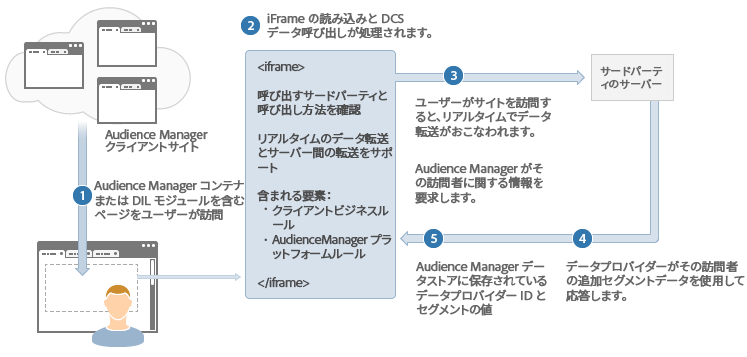
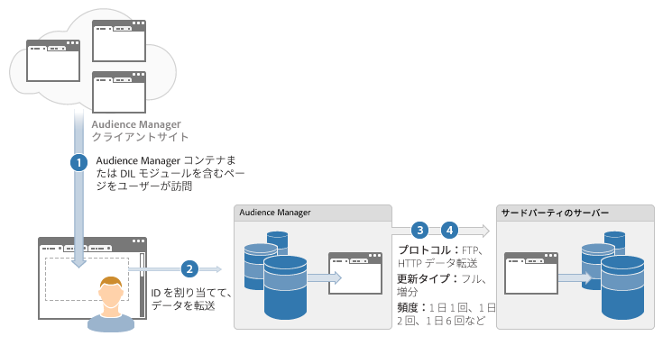

# データ統合方法 {#data-integration-methods}

Audience Manager が他のデータプロバイダーおよびシステムと情報を交換する方法の概要です。

## サポートされるデータ統合方法：リアルタイムおよび [!DNL Server-to-Server] {#supported-methods}

適切な統合方法の選択は、ビジネス要件とデータパートナーの技術力の組み合わせによって決まります。Audience Manager では、以下のどちらかの方法で他のデータプロバイダーと訪問者情報を交換します。

* **リアルタイム：**&#x200B;ユーザーがサイトを訪問するとすぐにデータを転送します。この方法は、*`synchronous`* 統合とも呼ばれます。
* **バッチ（[!DNL Server-to-Server]）：**&#x200B;訪問者がページを離れた後、設定されたスケジュールでサーバー間でデータを転送します。この方法は、*`out-of-band`*&#x200B;または&#x200B;*`asynchronous`*&#x200B;統合とも呼ばれます。

## 前提条件：特性分類の作成 {#prereqs}

統合プロセスの開始前に、必ず [!DNL Audience Manager] UI で[特性](../features/traits/create-onboarded-rule-based-traits.md)と[フォルダー構造](../features/traits/trait-storage.md#create-trait-storage-folder)を作成してください。分類には、すべての[!UICONTROL traits]が論理階層で整理された状態で含まれます。

## 統合のユースケース {#integration-use-cases}

Audience Manager データ統合方法のユースケースの概要と、それぞれのメリットおよびデメリットです。

### リアルタイム[!DNL Server-to-Server]統合

<!-- c_int_types_use_cases.xml -->

リアルタイム[!DNL server-to-server]データ統合は、Audience Manager サーバーと他のターゲティングシステムとの間でユーザーデータをすばやく同期します。ほとんどの場合、データ交換は、ターゲティングシステムの更新間隔に応じて数秒または数分以内におこなわれます。ただし、Audience Manager ではなく、ターゲティングシステムがこの更新間隔を決定します。さらに、更新間隔はシステムごとに異なることがあります。リアルタイムでの[!UICONTROL server-to-server]統合は、データ交換にお勧めの統合のタイプです。Audience Manager は、ターゲティングパートナーがサポートできる場合は常に、この方法を使用します。

<table id="simpletable_5307DEC378E5486CB92A354287F33AD8"> 
 <tr class="strow">
  <td class="stentry"> 
メリット： 
</td>
  <td class="stentry"> 
   <ul id="ul_F251AFF8A2FA49D0849E36D7FAE87DE7"> 
    <li id="li_1737EBB1AD8844BD87E736BB4D8080EF">ページ上、ビデオプレーヤー内などで再確認せずに、ユーザーをセグメントの対象として認定できます。 </li>
    <li id="li_1C1F346CB7BD40508AA5A6918C6B8514"> ページからの HTTP 呼び出し回数を減らします。呼び出し回数が減ると、ユーザーエクスペリエンスを維持するのに役立ちます。 </li>
    <li id="li_046BF4568B104F53A0E5372568C957CD">時間的制約のあるターゲティングに役立つので、すばやく認定ユーザーに対するアクションをおこなうことができます。 </li>
    <li id="li_70F7AB19AC5D4A9AB80216A2B05163B8">オフサイトターゲティングのために DSP に移行する際に有用です。 </li>
   </ul></td>
 </tr>
 <tr class="strow">
  <td class="stentry"> デメリット：</td>
  <td class="stentry"> そのセグメントへのユーザー認定に基づいて、同じページ上、または次のページのユーザーをターゲティングする必要がある場合は、オンサイトターゲティングへの有用性が低くなります。</td>
 </tr>
</table>

### [!DNL Server-to-Server]バッチ統合

[!DNL server-to-server] バッチ統合は、データをまとめて、ほぼリアルタイムではなく、設定した間隔で他のシステムに送信します。データ転送間隔は、24 時間から始まります。一部のデータプロバイダーは、この統合のタイプのみをサポートします。ただし、一般的な傾向としては、バッチ統合からリアルタイム統合に移っています。

<table id="simpletable_6878241639114DE68E61A251486C6317"> 
 <tr class="strow">
  <td class="stentry"> 
メリット： 
</td>
  <td class="stentry"> 
   <ul id="ul_1E9B48B06E764D3AB6F2D702EB4922DC"> 
    <li id="li_1CF0E018660347B3A5AF79160F74FBDB">ページ上、ビデオプレーヤー内などで再確認せずに、ユーザーをセグメントの対象として認定できます。 </li> 
    <li id="li_B6A9DF9C0D8B44A48F032F2FDB5B3956">時間的制約のないターゲティングに有用です。 </li>
   </ul></td>
 </tr>
 <tr class="strow">
  <td class="stentry"> デメリット：</td>
  <td class="stentry"> 同期間隔によっては、最新データに対するターゲティングが遅れるおそれがあります。</td>
 </tr>
</table>

### リアルタイム呼び出し

リアルタイム呼び出しでは、ユーザーがサイトに訪問するかページ上でアクションを起こすたびに、即座に Audience Manager とデータを交換します。この方法では、ターゲティングシステムは、最も更新されたセグメント資格認定データを取得し、コンテンツまたは広告配信を決定する際に、その情報を考慮に入れることができます。また、このプロセスでは、パブリッシャー広告サーバーと連携し、広告呼び出しにキー値ペアとして読み込まれるファーストパーティ Cookie に応じて認定済みセグメントを更新できます。現在、Audience Manager は、[!DNL Adobe Target] や他のコンテンツ管理システムと統合するために、リアルタイム呼び出しを使用しています。

<table> 
 <tr>
  <td> 
メリット： 
</td>
  <td> 
 最新のセグメント資格認定に基づいて、次のページ、コンテンツ領域または広告インプレッションをターゲティングできます。 
</td> 
 </tr> 
 <tr>
  <td> 
デメリット： 
</td>
  <td> 
ページから Audience Manager に対する呼び出しを追加します。
</td>
 </tr> 
</table>

### ターゲティングシステムに対するピクセル同期

ピクセル同期は、セグメントをページ上のピクセルにマッピングします。ピクセルは、ユーザーが特定のセグメントの対象として認定されると発動し、データを送信します。ピクセル同期は、初歩的で、信頼性のないデータ転送メカニズムです。主要なデータプロバイダーおよびシステムでは、ほとんど使用されません。

<table id="simpletable_39E4CD139CCF4417842AA28CDFFB6EB1"> 
 <tr class="strow">
  <td class="stentry"> 
メリット： 
</td>
  <td class="stentry"> 
 リアルタイムのデータ転送。 
</td> 
 </tr> 
 <tr class="strow">
  <td class="stentry"> 
デメリット： 
</td>
  <td class="stentry"> 
   <ul id="ul_5217EDC82434401493C2C96823C068E9"> 
    <li id="li_26EB0458CA1844908C005A47F55E50AC">ページからのクライアント側呼び出しが大幅に増加する可能性があります。 </li>
    <li id="li_CD91F3DC92F2429293787D61506E5E04">データ送信に対する信頼性がありません。5％～20％の損失は普通です。 </li>
   </ul></td>
 </tr> 
</table>

## データ配信方法の選択方法 {#data-delivery-choices}

同期（リアルタイム）または非同期（サーバー間）の方法でデータを送信する技術上およびビジネス上の理由について説明します。

<!-- c_int_delivery_choices.xml -->

### データ配信タイプの選択

* **技術上の考慮事項：**&#x200B;データ配信は、データパートナーの技術力に依存します。Audience Manager は、ブラウザーからリアルタイムでデータを送受信したり、オフラインのサーバー間通信処理によるバッチ更新でデータを送受信したりできます。
* **ビジネス上の考慮事項：**&#x200B;配信方法を選択するうえでのビジネス上の理由は、宛先パートナーの技術力と、このデータの使用方法に依存します。通常、同期データ転送は、ユーザーデータに対してアクションを即座に取る必要がある場合に有用です。非同期データ転送は、即座のアクションが必要ではなく、後で使用するために、より詳細なユーザープロファイルを構築する時間がある場合に有用です。

## リアルタイムデータ転送プロセス {#real-time-data-transfer-process}

Audience Manager がサードパーティベンダーと同期データ交換を実行する方法の一般的な概要です。

### リアルタイムデータ転送

<!-- c_int_overview_sync.xml -->

リアルタイムデータ転送では、ユーザーがサイトに訪問するかサイトでアクションを起こすたびに、セグメント ID を送受信します。通常、同期データ転送は、ユーザーがインベントリを検索する際にユーザーを即座に認定したりセグメント化したりする必要がある場合に有用です。

### リアルタイムデータの統合手順

リアルタイムデータ統合プロセスは、次のように機能します。

1. ユーザーが Audience Manager コードを含む顧客のサイトを訪問します。
1. Audience Manager が iframe を読み込んで、アドビの[!UICONTROL Data Collection Server]（[!DNL DCS]）への呼び出しをおこないます。
1. [!DNL DCS] がサードパーティサーバーを（リアルタイムで）呼び出して、ベンダーがユーザーに関するセグメント情報を持っているかどうかをチェックします。
1. サードパーティは、そのユーザーに関するセグメント情報を Audience Manager に返します。
1. Audience Manager は、セグメント情報を取り込んで、ターゲティングで使用できるようにします。

## バッチデータ転送プロセス  {#batch-data-transfer-process}

Audience Manager がサードパーティベンダーと同期的に（リアルタイムで）データを交換する方法の一般的な概要です。

### バッチデータの統合

<!-- c_int_overview_async.xml -->

バッチ（[!DNL server-to-server]）データ統合プロセスは、リアルタイムデータ転送プロセスで説明したほとんどの手順に従います。ただし、セグメント ID を即座に返す代わりに、ユーザー情報がアドビのサーバーに保存されて、定期的にサードパーティデータプロバイダーと同期されます。非同期のデータ転送プロセスは次の場合に便利です。

* すぐにデータ転送する必要がない場合。
* セグメント化されたユーザーの大規模なプールを作成するためにデータを収集する場合。
* データの相違およびブラウザーからの `HTTP` 呼び出しを減らしたい場合。

### バッチデータの統合手順

1. ユーザーが顧客サイトを訪問します。
1. Audience Manager およびサードパーティのデータプロバイダーは訪問者に対して一意の ID （通常 Cookie に基づく）を割り当てます。
1. Audience Manager はサードパーティのデータプロバイダーを呼び出し、訪問者 ID と照合します。
1. スケジュールされた要求によって、通常 1 日ごとに、Audience Manager とサードパーティのデータプロバイダーとの間で訪問者のセグメントデータが送受信されます。

Audience Manager が受信および送信 [!DNL Server-to-Server]（[!UICONTROL S2S]）ファイル転送を処理するときの時間枠について詳しくは、[レポートとファイル転送時間枠のガイドライン](../reference/reporting-file-transfer-timeframe.md)を参照してください。
