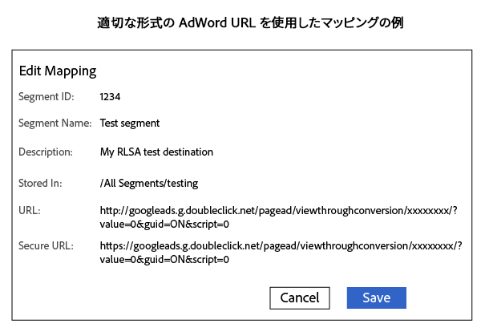

# Google Ads リマーケティングリストへのセグメントの送信 {#send-segments-to-a-google-adwords-remarketing-list}

以下の手順には、[!DNL Google Ads] リマーケティングリスト、ピクセルコード、Audience Manager の [!DNL URL] が必要です。[!DNL destination]検索連動型広告のリマーケティングリスト（[!DNL RLSA]）との統合とも呼ばれます。有料検索にのみ適用されます。

>[!IMPORTANT]
>これは、2 つのシステムの製品化された統合ではありません。

[!DNL Google Ads] リマーケティングリストを [!DNL Audience Manager] の [!DNL URL destination]として設定するには：

1. [!DNL Google Ads] アカウントで、[Web サイトのリマーケティングリストを作成](https://support.google.com/adwords/answer/2454064?hl=ja)し、コンバージョン ID を書き出します。
1. ベース URL およびセキュア URL のテンプレートとして、次の URL を使用します。xxxxxxxx セクションをコンバージョン ID に置き換えます。

   ```
    //googleads.g.doubleclick.net/pagead/viewthroughconversion/xxxxxxxx/?value=0&guid=ON&script=0&data=%ALIAS%
   ```

1. Audience Manager で、[ [!DNL URL destination]](../../features/destinations/create-url-destination.md)を作成するか、既存の[!DNL destination]を編集します。[!DNL destination]を作成する際には、次の設定を使用します。
   * Type：URL
   * Serialize：Enabled
   * Delimiter：Semicolon（;）

1. セクションで、[!DNL URL] [!DNL destination] の[!UICONTROL Segment Mappings]セクションで、手順 2 のコードを [!DNL URL] および [!DNL Secure URL] フィールドに追加します。[!DNL URL] および [!DNL Secure URL] フィールドで、コードにそれぞれ `http:` と `https:` のプレフィックスを付けます。

   >[!IMPORTANT]
   >
   >エンコードされているアンパサンド（`&`）は、エンコードされていないアンパサンド（`&`）に置き換えます。

   安全でない [!DNL URL] コード：

   ```
    http://googleads.g.doubleclick.net/pagead/viewthroughconversion/xxxxxxxx/?
    value=0&guid=ON&script=0&data=%ALIAS%
   ```

   セキュア [!DNL URL] コード：

   ```
    https://googleads.g.doubleclick.net/pagead/viewthroughconversion/xxxxxxxx/?
    value=0&guid=ON&script=0&data=%ALIAS%
   ```

1. 「**[!UICONTROL Save]**」をクリックします。

   >[!NOTE]
   >
   >複数のセグメントを操作している場合、先[!DNL Google Ads] の[!DNL destination]にマッピングする各セグメントの新しいピクセルを取得します。これにより、データが所定のリマーケティングリストに適用されます。

1. 新しいセグメントをこの[!DNL destination]にマッピングする際は、マッピングを `aam=segmentID` として定義し、`segmentID` をセグメントの ID に置き換えます。
1. [!DNL Google Ads] でバケットを定義する際には、手順 6 で定義したマッピングを照合するルールrを作成します。

マッピングが完了すると、次のようになります。



>[!MORELIKETHIS]
>
>* [[!DNL Destinations]](../../features/destinations/destinations.md)
>* [ [!DNL URL Destination]](../../features/destinations/create-url-destination.md) の作成
>* [AdWords リマーケティングリストについて](https://support.google.com/adwords/answer/2472738?hl=ja)
>* [AdWords リマーケティングの仕組み](https://support.google.com/adwords/answer/2454000)

