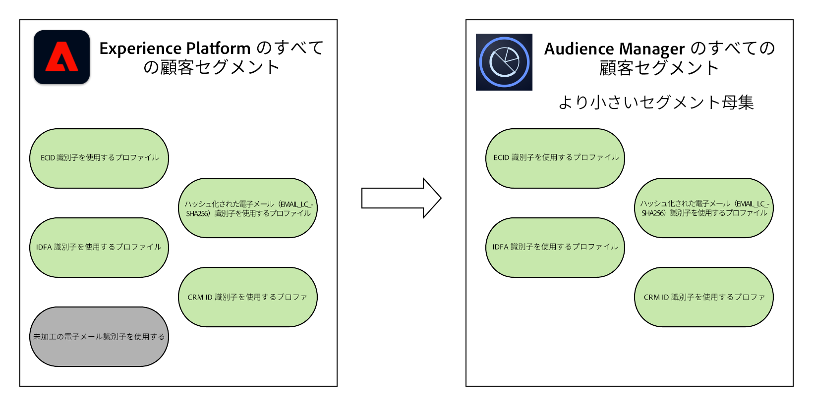

# Audience Manager およびその他の Experience Cloud ソリューションを使用した Experience Platform セグメント共有 {#aam-aep-audience-sharing}

>[!NOTE]
>
> この機能へのアクセスをロック解除したい場合は、アドビの販売担当者にお問い合わせください。

## 概要 {#overview}

Audience Manager と Adobe Experience Platform の間でオーディエンス共有機能を使用すると、Audience Manager の特性とセグメントを Adobe Experience Platform と共有できます。また、その逆も可能です。Audience Manager と Adobe Experience Platform の間でオーディエンス共有を有効にするには、[[!DNL Audience Manager Connector]](https://docs.adobe.com/content/help/ja-JP/experience-platform/sources/connectors/adobe-applications/audience-manager.html) が必要です。

Experience Platform で Audience Manager の特性とセグメントを使用して、Audience Manager データを顧客プロファイルに追加し、Experience Platform の[セグメント化サービス](https://www.adobe.io/apis/experienceplatform/home/profile-identity-segmentation/profile-identity-segmentation-services.html#!api-specification/markdown/narrative/technical_overview/segmentation/segmentation-overview.md)を活用することができます。

Audience Manager では、次のように、Data Management Platform のユースケースに対して Experience Platform セグメントを使用できます。
* [サードパーティデータ](/help/using/overview/data-types-collected.md#third-party-data)をセグメントに追加する
* [アルゴリズムモデリング](/help/using/features/algorithmic-models/understanding-models.md)
* Experience Platform の[宛先カタログ](https://docs.adobe.com/content/help/ja-JP/experience-platform/rtcdp/destinations/destinations-cat/destinations-catalog.html)でまだサポートされていない宛先に対してセグメントをアクティブ化します。

さらに、Experience Platform のセグメントは、[コアサービス](https://docs.adobe.com/content/help/ja-JP/core-services/interface/experience-cloud.html)を介して他の Experience Cloud ソリューションと共有されます。

>[!IMPORTANT]
>
> * 上記のデータ管理プラットフォームのユースケースを可能にするには、Audience Manager ライセンスが必要です。
> * コアサービスの統合を通じて、Adobe Advertising Cloud、Adobe Target、Marketo およびその他の Experience Cloud ソリューションと Experience Platform セグメントを共有する場合、Audience Manager ライセンスは&#x200B;*必要ありません*。

オーディエンス共有のユースケースの概要については、次の表を参照してください。

| **ユースケース** | **Adobe Experience Platform** | **Audience Manager** | **コアサービス** |
---------|----------|---------|---------|
| **オーディエンス共有** | <ul><li>Audience Manager データを使用した顧客プロファイルの強化</li><li>Experience Platform セグメントでの Audience Manager データの使用</li></ul> | <ul><li>セグメントへのサードパーティデータの追加</li><li>アルゴリズムモデリング</li><li>追加の宛先へのアクティブ化</li></ul> | Adobe Target や Advertising Cloud、Marketo など、他の Experience Cloud ソリューションで Experience Platform セグメントを使用します。 |

{style=&quot;table-layout:auto&quot;}

## Adobe Experience Platform での Audience Manager のセグメントと特性 {#aam-segments-traits-in-aep}

Audience Manager の特性とセグメントは、セグメントワークフローの&#x200B;**オーディエンス**&#x200B;として Experience Platform に表示されます。Experience Platform での Audience Manager のセグメントと特性について詳しくは、次を参照してください。

* [セグメント化サービスの概要](https://docs.adobe.com/content/help/ja-JP/experience-platform/segmentation/home.html#audiences)
* [Experience Platform セグメントビルダーユーザーガイド](https://docs.adobe.com/content/help/ja-JP/experience-platform/segmentation/ui/overview.html#audiences)
* [Audience Manager コネクタ](https://docs.adobe.com/content/help/en/experience-platform/sources/connectors/adobe-applications/audience-manager.html)

## Audience Manager の Adobe Experience Platform セグメント {#aep-segments-in-aam}

Experience Platform で作成したセグメントは、次の複合ルールを使用し、シグナル、特性、およびセグメントとして Audience Manager インターフェイスに表示されます。

* シグナル：各 Experience Platform セグメント対し、フォーム `segID = segment ID` にシグナルが表示されます。
* 特性：特性ルールは、Experience Platform セグメントの ID です。
* セグメント：このセグメントは、上記の特性で構成されます。

### シグナル {#aep-segments-as-aam-signals}

**[!UICONTROL Audience Data > Signals > General Online Data]** を選択し、`SegId` で Experience Platform から来るシグナルを探します。この画面をデバッグ目的で使用し、Experience Platform と Audience Manager の統合が正しく設定されているかどうかを確認できます。

### 特性 {#aep-segments-as-aam-traits}

Audience Manager は、特性ストレージに「**Experience Platform 特性**」という特性フォルダーを自動的に作成します。

自動的に作成された特性を、他の特性とともにセグメントで使用できます。例えば、Experience Platform セグメントから作成した特性と、[Audience Marketplace](/help/using/features/audience-marketplace/audience-marketplace.md) で取得したサードパーティの特性を混在させることができます。

Experience Platform セグメントから自動的に作成された特性の例については、以下のスクリーンショットを参照してください。

| 項目番号 | 名前 | 説明 |
---------|----------|---------|
| 1 | [!UICONTROL Trait Type] | Experience Platform セグメントから作成された特徴は、Audience Manager でオンボードの特性として作成されます。 |
| 2 | [!UICONTROL Data Source] | 自動的に作成されます。Experience Platform セグメントから自動的に作成されたすべての特性とセグメントは、**[!UICONTROL Adobe Experience Platform Audience Sharing]** のデータソースに保存されます。 |
| 3 | [!UICONTROL Integration Code] | 統合コードは、Experience Platform のセグメント ID に対応します。 |
| 4 | [!UICONTROL Trait Expression] | 特性の式は `segID = segment ID in Experience Platform` です。 |
| 5 | [!UICONTROL Segments with this Trait] | この特性を構成として使用する、自動的に作成されたセグメント。 |

{style=&quot;table-layout:auto&quot;}

### セグメント {#aep-segments-as-aam-segments}

Audience Manager は、セグメントストレージに「**Experience Platform セグメント**」というセグメントフォルダーを自動的に作成します。

Experience Platform セグメントから自動的に作成されたセグメントの例については、以下のスクリーンショットを参照してください。

| 項目番号 | 名前 | 説明 |
---------|----------|---------|
| 1 | [!UICONTROL Integration Code] | 統合コードは、Experience Platform のセグメント ID に対応します。 |
| 2 | [!UICONTROL Data Source] | 自動的に作成されます。Experience Platform セグメントから自動的に作成されたすべての特性とセグメントは、**[!DNL Adobe Experience Platform Audience Sharing]** のデータソースに保存されます。 |
| 1 | [!UICONTROL Profile Merge Rule] | **[!UICONTROL External Merge Policy]** は、自動的に作成されたセグメントが、Experience Platform で設定された結合ポリシーに従うことを示します。 |
| 4 | [!UICONTROL Segment Rule] | このセグメントは、[特性](#aep-segments-as-aam-traits)の節で説明されている特性で構成されます。 |

{style=&quot;table-layout:auto&quot;}

## Experience Platform での Audience Manager データ書き出しコントロールのサポート {#aam-data-export-control-in-aep}

Experience Platform でのデータ使用量のコンプライアンスを強化するために、該当するすべてのデータセットおよびフィールドに適切な[データラベル](https://docs.adobe.com/content/help/ja-JP/experience-platform/data-governance/labels/overview.html)を付与する必要があります。さらに、[Data Usage Labeling and Enforcement（DULE）フレームワーク](https://docs.adobe.com/content/help/ja-JP/experience-platform/data-governance/home.html#dule-framework)で概要を説明しているように、これらのラベルに対する特定のマーケティングアクションに対して、[データポリシー](https://docs.adobe.com/content/help/ja-JP/experience-platform/data-governance/policies/overview.html)を有効にする必要があります。

Audience Manager と Experience Platform の間でオーディエンスを共有するプロセスでは、Audience Manager セグメントに適用されたデータ書き出しコントロールは、Experience Platform データガバナンスで認識される同等のラベルやマーケティングアクションに変換されます。また、その逆も可能です。

>[!NOTE]
>
>データ書き出しコントロールの詳細については、[データ書き出しコントロールのドキュメント](https://docs.adobe.com/content/help/ja-JP/audience-manager/user-guide/features/data-export-controls.html)を参照してください。
>
>このドキュメントでは、特定の Audience Manager データの書き出しコントロールを、Platform のデータラベルおよびマーケティングアクションにどのようにマッピングするかについて説明します。

### データ使用ラベルに対するデータ書き出しコントロール

次の表に、特定のデータ書き出しコントロールが、認識されるデータラベルにどのように対応しているかを示します。

| データ書き出しコントロール | データラベル |
| --- | --- |
| 個人情報と共に使用することはできません。 | C3：データを組み合わせたり、直接識別できる情報と組み合わせて使用することはできません。 |
| オフサイトの広告ターゲティングには使用できません。 | C5：コンテンツや広告の、関心に基づたクロスサイトターゲティングにデータを使用することはできません。 |
| オンサイトの広告ターゲティングには使用できません。 | C6：データをオンサイトのターゲティングには使用できません。 |
| オンサイトのパーソナライズ機能には使用できません。 | C7：データをコンテンツのオンサイトターゲティングに使用することはできません。 |

{style=&quot;table-layout:auto&quot;}

### マーケティングアクションへのデータ書き出しコントロール

次の表は、特定のデータ書き出しラベルを、認識されているマーケティングアクションにマッピングする仕組みの概要を示しています。

| データ書き出しラベル | マーケティングのアクション |
| --- | --- |
| この宛先は個人情報（PII）との組み合わせを有効にすることができます | PII と組み合わせる |
| この宛先はオフサイト広告ターゲティングに使用できます | クロスサイトターゲティング |
| この宛先はオンサイト広告ターゲティングに使用できます | オンサイト広告 |
| この宛先は、オンサイト広告パーソナライズ機能に使用できます | オンサイトのパーソナライズ機能 |

{style=&quot;table-layout:auto&quot;}

## Audience Manager と Experience Platform の間のセグメント母集団の違いの理解 {#aep-aam-segment-population-differences}

セグメント母集団の数は、Audience Manager と Experience Platform のセグメント間で異なる可能性があります。類似または同一のオーディエンスのセグメント数が近づくのに対して、母集団の違いは、次の要因による可能性があります。

### Experience Platform でのセグメントの評価

Audience Manager は、インターフェイスのレポート番号を 1 日に 1 回更新します。この更新のタイミングが、Experience Platform のセグメント評価の時間に合致することはほとんどありません。

### プロファイルの結合ルールと結合ポリシーの違い

Audience Manager の[[!UICONTROL Profile Merge Rules]](/help/using/features/profile-merge-rules/merge-rules-overview.md)と Experience Platform の[[!UICONTROL Merge Policies]](https://docs.adobe.com/content/help/ja-JP/experience-platform/profile/ui/merge-policies.html)の動作は異なり、それぞれで使用される ID グラフは異なります。これにより、セグメント母集団間でのいくつかの違いが想定されます。

### Experience Platform でのセグメントの構成

Adobe Experience Platform と Audience Manager の統合では、すべての顧客に対して多くの標準 [ID 名前空間](https://docs.adobe.com/content/help/ja-JP/experience-platform/identity/namespaces.html#identity-types)を共有します。これには、ECID、IDFA、GAID、ハッシュ化された電子メールアドレス（EMAIL_LC_SHA256）、AdCloud ID などが含まれます。Experience Platform セグメントで、認定されたプロファイルのプライマリ ID としてこれらのいずれかを使用している場合、プロファイルは Audience Manager の特性およびセグメントにカウントされます。

>[!NOTE]
>
> ID が生の電子メールをキーに設定している Experience Platform のオーディエンスは、Audience Manager には表示されません。

例えば、「すべての顧客」という Experience Platform セグメントがあり、認定プロファイルが CRM ID、ECID、IDFA、生の電子メールアドレスおよびハッシュ化された電子メールアドレスの場合、Audience Manager 内の対応するセグメントには、ECID、IDFA およびハッシュ化された電子メールアドレスのキーオフされたプロファイルのみが含まれます。 Audience Manager のセグメントの母集団は、Experience Platform のセグメントの母集団よりも小さくなります。

<!--

If you created a data source in Audience Manager for the CRM IDs in Experience Platform, then the qualified profiles keyed off those CRM IDs would appear in Audience Manager and the segment population in Audience Manager would increase.

-->

>[!MORELIKETHIS]
>
>* [セグメント化サービスの概要](https://docs.adobe.com/content/help/en/experience-platform/segmentation/home.html#audiences)
>* [Experience Platform セグメントビルダーユーザーガイド](https://docs.adobe.com/content/help/en/experience-platform/segmentation/ui/overview.html#audiences)
>* [Audience Manager コネクタ](https://docs.adobe.com/content/help/en/experience-platform/sources/connectors/adobe-applications/audience-manager.html)

