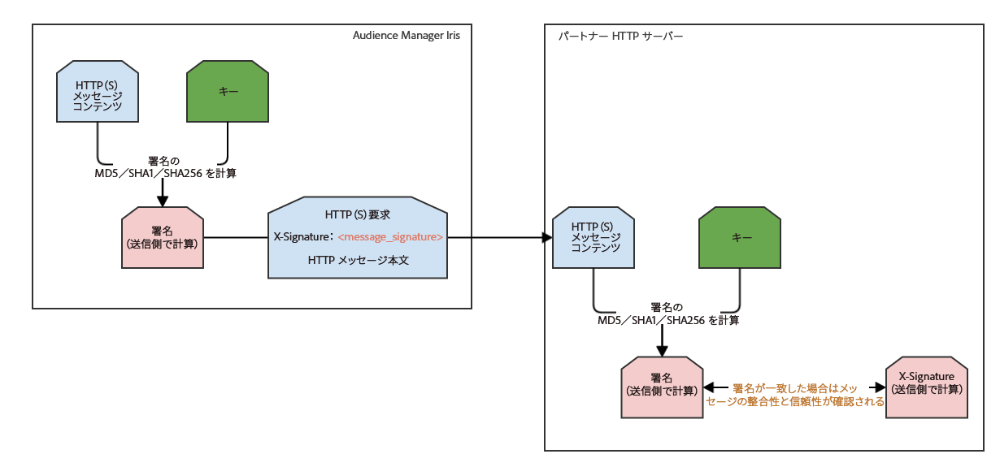

# デジタル署名された `HTTP(S)`要求 {#digitally-signed-http-requests}

Audience Manager では、`HTTP(S)` サーバー間要求をデジタル署名して有効性を確保する必要があります。ここでは、`HTTP(S)` 要求に秘密鍵で署名する方法について説明します。

## 概要 {#overview}

<!-- digitally_signed_http_requests.xml -->

ユーザーから提供され [!DNL Audience Manager] と共有される秘密鍵を使用して、[IRIS](../../../reference/system-components/components-data-action.md#iris) と HTTP(S) サーバーの間で送信される `HTTP(S)` 要求にデジタル署名することができます。これにより、以下が保証されます。

* **信頼性**：秘密鍵を持っている送信側（[!UICONTROL IRIS]）だけが、有効な `HTTP(S)` メッセージをパートナーに送信できます。
* **メッセージの整合性**：このアプローチにより、`HTTP` の場合でも、中間者攻撃でメッセージが改変されるのを防ぐことができます。

[秘密鍵のローテーション](../../../integration/receiving-audience-data/real-time-outbound-transfers/digitally-signed-http-requests.md#rotate-private-key)の節で示すように、[!UICONTROL IRIS] には、ダウンタイムなしで鍵をローテーションする機能が組み込まれています。

## 提供する必要がある情報 {#info-to-provide}

`HTTP(S)` リアルタイムサーバー間宛先の場合は、担当の [!DNL Audience Manager] コンサルタントに連絡して、次の情報を指定してください。

* 要求に署名するための鍵。
* 生成された署名を格納する `HTTP(S)` ヘッダーの名前（以下のヘッダー例では X-Signature）。
* オプション：署名に使用するハッシュのタイプ（md5、sha1、sha256）。

```
* Connected to partner.website.com (127.0.0.1) port 80 (#0)
> POST /webpage HTTP/1.1
> Host: partner.host.com
> Accept: */*
> Content-Type: application/json
> Content-Length: 20
> X-Signature: +wFdR/afZNoVqtGl8/e1KJ4ykPU=
POST message content
```

## 仕組み {#how-it-works}

1. パートナーに送信する `HTTP(S)` メッセージを [!UICONTROL IRIS] が作成します。
1. パートナーから連絡された `HTTP(S)` メッセージと秘密鍵に基づいて、[!UICONTROL IRIS] が署名を作成します。
1. [!UICONTROL IRIS] が `HTTP(S)` 要求をパートナーに送信します。このメッセージには、上記の例に示すように、署名と実際のメッセージが含まれています。
1. パートナーサーバーが `HTTP(S)` 要求を受信します。[!UICONTROL IRIS] から受信したメッセージ本文と署名を読み取ります。
1. 秘密鍵と受信したメッセージ本文に基づいて、パートナーサーバーが署名を再計算します。この方法については、すぐ後の[署名の計算方法](../../../integration/receiving-audience-data/real-time-outbound-transfers/digitally-signed-http-requests.md#calculate-signature)の節を参照してください。
1. パートナーサーバー（受信側）で作成した署名と、[!UICONTROL IRIS]（送信側）から受信した署名を比較します。
1. 両方の署名が一致した場合は、**信頼性**&#x200B;と&#x200B;**メッセージの整合性**&#x200B;が確認されました。秘密鍵を持っている送信側だけが、有効な署名を送信できます（信頼性）。さらに、中間者は秘密鍵を持っていないので、メッセージを改変することも、有効な署名を新たに生成することもできません（メッセージの整合性）。



## 署名の計算方法 {#calculate-signature}

[!UICONTROL IRIS] でメッセージ署名に使用されている方法は、[!DNL HMAC]（ハッシュベースのメッセージ認証コード）です。実装とライブラリは、基本的にどのようなプログラミング言語でも入手可能です。[!DNL HMAC] に対する既知の長さ拡張攻撃はありません。次の [!DNL Java] コードの例を参照してください。

```
// Message to be signed.
// For GET type HTTP(S) destinations, the message used for signing will be the REQUEST_PATH + QUERY_STRING
// For POST type HTTP(S) destinations, the message used for signing will be the REQUEST_BODY.
// String getData = "/from-aam-s2s?sids=1,2,3";
String postData = "POST message content";
// Algorithm used. Currently supported: HmacSHA1, HmacSHA256, HmacMD5.
String algorithm = "HmacSHA1";
// Private key shared between the partner and Adobe Audience Manager.
String key = "sample_partner_private_key";
  
// Perform signing.
SecretKeySpec signingKey = new SecretKeySpec(key.getBytes(), algorithm);
Mac mac = Mac.getInstance(algorithm);
mac.init(signingKey);
byte[] result = mac.doFinal(postData.getBytes());
  
String signature = Base64.encodeBase64String(result).trim(); 
// signature = +wFdR/afZNoVqtGl8/e1KJ4ykPU=
```

[!DNL HMAC]ハッシュ実装の RFC は [https://www.ietf.org/rfc/rfc2104.txt](https://www.ietf.org/rfc/rfc2104.txt) です。テストサイトは [https://asecuritysite.com/encryption/hmac](https://asecuritysite.com/encryption/hmac) です（Hex エンコーディングを base64 に[変換](https://tomeko.net/online_tools/hex_to_base64.php?lang=en)する必要があることに注意してください）。

## 秘密鍵のローテーション {#rotate-private-key}

秘密鍵のローテーションをおこなうため、パートナーは、新しい秘密鍵を [!DNL Adobe Audience Manager] コンサルタントに伝える必要があります。古い鍵は [!DNL Audience Manager] から削除され、[!UICONTROL IRIS] は新しい署名ヘッダーのみ送信します。これで鍵がローテーションされました。

## 署名に使用するデータ {#data-signing}

`GET` タイプの宛先の場合、署名に使用するメッセージは *REQUEST_PATH + QUERY STRING*（例：*/from-aam-s2s？=1,2,3*）になります。IRIS ではホスト名や `HTTP(S)` ヘッダーを考慮しません。これらは、経路の途中で改変されたり誤って設定されたりするおそれがあります。また、間違って通知される可能性もあります。

`POST` タイプの宛先の場合、署名に使用されるメッセージは *REQUEST_BODY* になります。この場合もやはり、ヘッダーやその他の要求パラメーターは無視されます。
