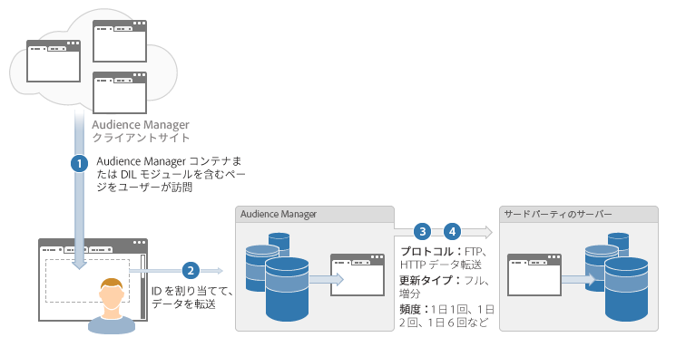

# バッチデータ転送プロセスの説明 {#batch-data-transfer-process-described}

[!DNL Audience Manager] におけるサードパーティベンダーとの非同期のバッチデータ交換に関する全般的な概要です。

## バッチデータの統合

<!-- c_async.xml -->

バッチデータの統合プロセスでは、訪問者情報をアドビのサーバーに保存し、プロバイダーから送信されたデータとの同期を定期的におこないます。非同期のデータ転送プロセスは次の場合に便利です。

* すぐにデータ転送する必要がない場合。
* セグメント化されたユーザーの大規模なプールを作成するためにデータを収集する場合。
* データの相違およびブラウザーからの `HTTP` 呼び出しを減らしたい場合。

## データ統合手順

1. ユーザーが顧客サイトを訪問します。
1. [!DNL Audience Manager] およびサードパーティのデータプロバイダーは訪問者に対して一意の ID （通常 Cookie に基づく）を割り当てます。
1. [!DNL Audience Manager] はサードパーティのデータプロバイダーを呼び出し、訪問者 ID と照合します。
1. スケジュールされた要求によって、通常 1 日ごとに、[!DNL Audience Manager] とサードパーティのデータプロバイダーとの間で訪問者のセグメントデータが送受信されます。
1. インバウンドの [!UICONTROL Server-to-Server] ファイルが処理されるたびに、パートナーソリューションに対してレシートが電子メールで送信されます。また、設定によってはパートナーにも送信されます。詳しくは、[受信処理後パートナーに送信されるメッセージの例](../../../integration/sending-audience-data/batch-data-transfer-explained/inbound-receipt-message.md)を参照してください。
