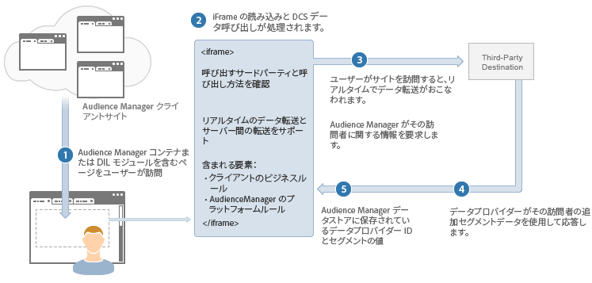

# リアルタイムデータ転送プロセスの説明 {#real-time-data-transfer-process-described}

Audience Manager がサードパーティコンテンツプロバイダーとの間でリアルタイムデータ転送を実行する方法の一般的な概要です。

<!-- real-time-data-transfer-explained.xml -->

## リアルタイムデータ転送

リアルタイムデータ転送では、ユーザーがサイトに訪問するかサイトでアクションを起こすたびに、セグメント ID を送受信します。通常、同期データ転送は、ユーザーがインベントリを検索する際にユーザーを即座に認定したりセグメント化したりする必要がある場合に有用です。

## データ統合手順

リアルタイムデータ統合プロセスは、次のように機能します。

1. ユーザーが Audience Manager コードを含む顧客のサイトを訪問します。
1. Audience Manager が iframe を読み込んで、アドビの[!UICONTROL Data Collection Server]（[!DNL DCS]）への呼び出しをおこないます。
1. [!DNL DCS] がサードパーティサーバーを（リアルタイムで）呼び出して、ベンダーがユーザーに関するセグメント情報を持っているかどうかをチェックします。
1. コンテンツプロバイダーは、そのユーザーに関するセグメント情報を Audience Manager に返します。
1. Audience Manager は、このセグメント情報を受信し、新しい特性およびセグメントのターゲティングと作成に使用できるようにします。

