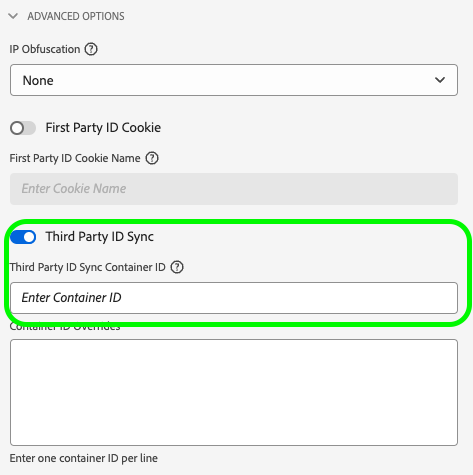
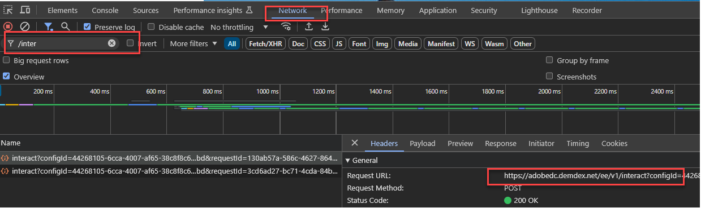
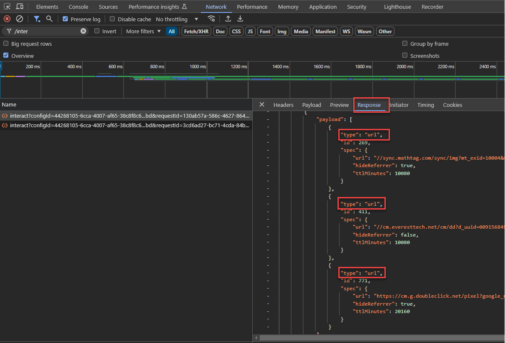
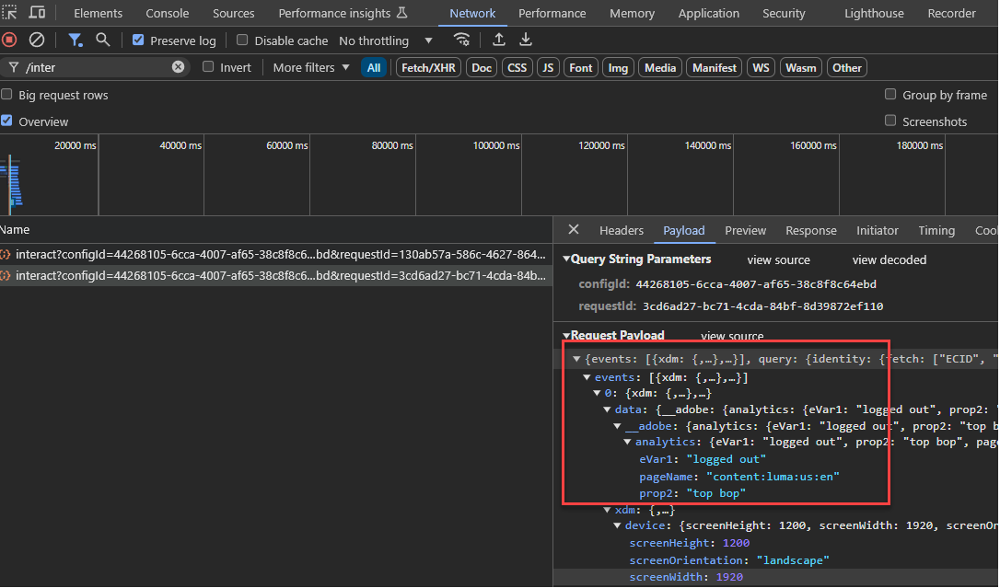
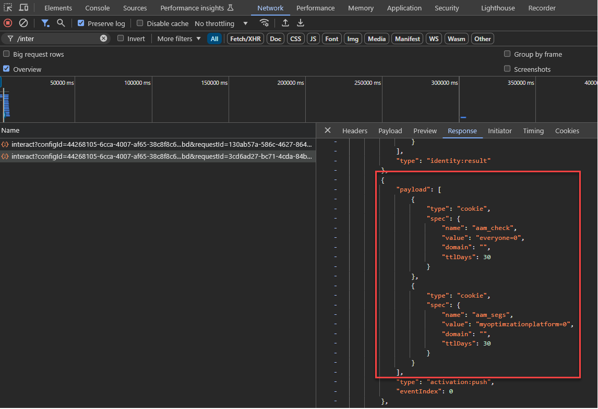
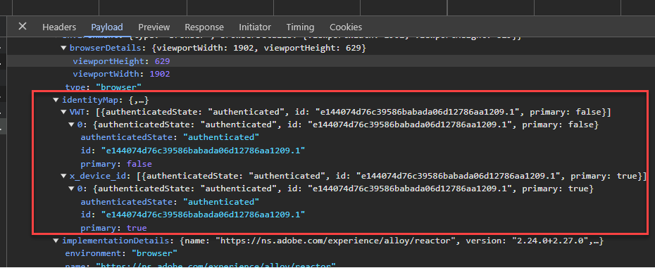

# Audience Managerのデータ収集ライブラリをAppMeasurementからWeb SDKに更新する

## 対象オーディエンス {#intended-audience}

このページは、[!DNL AppMeasurement] JavaScript ライブラリを使用してweb データをAudience Managerに送信するAudience ManagerおよびAdobe Analyticsのお客様向けです。

現在のデータ収集方法に応じて、Web SDKへの移行手順に関するガイダンスについては、次の表を参照してください。

| 既存のデータ収集方法 | Web SDKの移行手順 |
|---------|----------|
| AudienceManagement モジュールを含む[!DNL AppMeasurement] JavaScript ライブラリ | このガイドの指示に従ってください。 |
| [!DNL Audience Manager] [&#x200B; タグ拡張機能](https://experienceleague.adobe.com/ja/docs/experience-platform/tags/extensions/client/audience-manager/overview) | 「[Audience Manager タグ拡張機能からWeb SDK タグ拡張機能へのデータ収集ライブラリの更新](dil-extension-to-web-sdk.md)」の手順に従います。 |
| [!DNL AppMeasurement] JavaScript library + スタンドアロン [!DNL Audience Manager] [DIL library](../dil/dil-overview.md) | 「[Audience Manager タグ拡張機能からWeb SDK タグ拡張機能へのデータ収集ライブラリの更新](dil-extension-to-web-sdk.md)」の手順に従います。 |

## 移行の概要 {#overview}

[!DNL AppMeasurement]から[Web SDK](https://experienceleague.adobe.com/ja/docs/experience-platform/web-sdk/home)への移行は、主にAdobe Analyticsの移行です。 Audience Managerのお客様の場合、この移行にはAudience Managerも含まれます。 両方を一緒に移行する必要があります。 主にAudience Managerを使用している場合は、必ずAnalytics チームと連携して移行してください。

Audience Manager データ収集に[!DNL AppMeasurement]を使用している場合は、現在[!DNL Server-side Forwarding (SSF)] アプローチを使用してAnalytics データをAudience Managerに送信しています。 この設定では、Analytics データ収集リクエストがAudience Managerに転送され、ページに対するAudience Manager レスポンスも処理されます。

これは、長年にわたって標準的なアプローチであり、おそらく現在の設定です。 お使いの[!DNL AppMeasurement] ライブラリに`AudienceManagement` モジュールが含まれており、データ収集の呼び出しに`/10/` パスがリクエスト （`/b/ss/examplereportsuite/10/`）に含まれている場合は、このガイドをお読みください。

## サーバーサイド転送（SSF）とWeb SDKデータフローの比較 {#data-flows}

Web SDK（およびEdge Network）に移行する際のAnalyticsとAudience Managerのデータフローの違いを理解することは、次の手順で重要です。

サーバーサイド転送では、Analytics リージョンのデータ収集ノードがデータを収集し、Audience Managerが受け入れる信号に変換してAudience Managerに送信し、Audience Managerのレスポンスをページに返します。 次に、[!DNL AudienceManagement] ライブラリの[!DNL AppMeasurement] モジュールが応答を処理します（Cookieの削除、URL宛先の送信など）。 このプロセスは、AnalyticsがAdobe サーバーを使用してデータをAudience Managerに転送するため、サーバーサイド転送と呼ばれます。

Web SDKでは、Edge NetworkがAnalyticsとAudience Managerに別々のアクションでデータを送信します。 Web SDKは、あらゆるソリューションにデータを送信する単一のライブラリです。Edge Networkは、ソリューションに依存しないデータポイントを、ソリューション固有のフォーマットに変換します。

この新しいデータフローでは、すべてのデータがEdge Network [&#x200B; データストリーム &#x200B;](https://experienceleague.adobe.com/ja/docs/experience-platform/datastreams/overview)に送信され、必要に応じて[configure](https://experienceleague.adobe.com/ja/docs/experience-platform/datastreams/configure)でAdobe ソリューションにデータを送信できます。 Audience Managerの場合、データストリームでAudience Manager サービスを有効にすると、[!DNL XDM]とAnalytics データがAudience Managerで受け入れられるシグナルに変換されます。 Edge Networkは、[!DNL AppMeasurement]と[!DNL AudienceManagement] モジュールが行った方法と同様に、Web SDKが応答を処理するページに対するAudience Manager応答も返します。

## タグとタグ以外の移行 {#tags-vs-non-tags}

拡張機能が[!DNL AppMeasurement]のタグ、別のタグ管理システムの[!DNL AppMeasurement] ライブラリ、またはページに[!DNL AppMeasurement]を直接配置する場合でも、Audience ManagerをWeb SDKに移行する手順は同じです。 Audience Managerの移行はAnalyticsの移行に依存するため、Analyticsの移行中に[!DNL AppMeasurement]からWeb SDKに移行する手順を決定します。

この情報については、[&#x200B; タグ &#x200B;](https://experienceleague.adobe.com/ja/docs/analytics/implementation/aep-edge/web-sdk/analytics-extension-to-web-sdk)または[JavaScript](https://experienceleague.adobe.com/ja/docs/analytics/implementation/aep-edge/web-sdk/appmeasurement-to-web-sdk) ベースの実装に関するAnalytics ドキュメントで説明しています。

## XDMと`data.__adobe.` ノード {#xdm-data-nodes}

[Web SDK](https://experienceleague.adobe.com/ja/docs/experience-platform/web-sdk/home)の主な機能の1つは、[Real-Time Customer Data Platform（RTCDP） &#x200B;](https://experienceleague.adobe.com/ja/docs/experience-platform/rtcdp/home)にデータを送信することです。 これを実現するために、完全な再実装を行うことなく、他のExperience Cloud ソリューションのデータを収集するために、ソリューション固有のデータはデータ収集サーバーコール内でコンパートメント化されます。 この呼び出しは、[Experience Data Model （XDM） &#x200B;](https://experienceleague.adobe.com/ja/docs/experience-platform/xdm/home)と呼ばれる標準化されたJSON スキーマを使用します

ブラウザーやデバイスに関する情報など、ソリューションに依存しない要素は、所定のXDM構造でEdge Networkに送信されます。 Edge Networkは、このデータをソリューション固有のフォーマットに変換します。 ただし、Target、Analytics、Audience Managerに固有のデータは、XDM ペイロード内の専用の`data.__adobe` ノードに保存されます。

例：

* Analytics変数`s.eVar1`は、XDM ペイロードで`data.__adobe.analytics.evar1`として表されます。
* 顧客ロイヤルティの状態に関連するTarget パラメーターは`data.__adobe.target.loyaltyStatus`として保存されます。

`__adobe` ノードのデータは、データストリームでExperience Platform サービスが有効になっている場合でも、Experience Platformに送信されることなく、それぞれのソリューション（AnalyticsやAudience Managerなど）に送信されます。 つまり、AnalyticsとAudience Managerの現在の設定を維持しながら、必要なデータ要素をXDM スキーマ要素に柔軟にマッピングして、データ収集用の[&#x200B; データ準備](https://experienceleague.adobe.com/ja/docs/experience-platform/datastreams/data-prep)を使用してExperience Platformのリアルタイムのユースケースに使用できます。

例えば、チェックアウト時にカートの内容をレポートするために使用されるAnalytics `s.products`文字列は、引き続きAnalyticsおよびAudience Managerに元のフォーマットで送信できます。 同時に、この文字列の要素を使用して、Experience Platformのユースケース向けに、より直感的なXDM カートスキーマを作成できます。

Audience Managerのほとんどの実装は、Audience Managerに転送されるAnalytics データに依存しているため、Audience Manager特性の多くはAnalytics変数（`c_evar#`、`c_prop#`、および`c_events`）に基づいています。 移行時にXDM フォーマットを使用して特性式を再構築しないようにするため、Edge Networkはデフォルトで、`data.__adobe.analytics` ノードにあるAnalytics変数をAudience Manager シグナルに変換するように設定されています。 サーバーサイド転送ワークフローでも、同様の変換プロセスが発生します。

Edge Networkでは、ページから1回のデータ収集呼び出しが、複数のAdobe ソリューションをフィードする1つのデータストリームに送信されるので、この変換を実行できます。 したがって、[!DNL AppMeasurement]からWeb SDKへのAnalyticsとAudience Managerの両方への移行では、主に`data.__adobe.analytics` ノードが使用されます。

Edge Networkは、XDM ペイロードとパケットヘッダーからデバイスとブラウザーのデータをAudience Manager信号に変換します。 これにより、`h_`および`d_`個のプラットフォームキーを引き続きAudience Managerの特性式で使用できます。

## `data.__adobe.audiencemanager` ノード {#data-note}

`data.__adobe.audiencemanager` ノードは、Analyticsに依存しないAudience Manager実装に使用されます。 [&#x200B; タグ拡張機能の移行ガイド &#x200B;](../dil/dil-overview.md)で説明されているように、[DIL library](dil-extension-to-web-sdk.md) ライブラリを介して以前に送信されたカスタム Audience Manager キーと値のペアが保存されます。

このガイドで説明した移行に`data.__adobe.audiencemanager` ノードは必要ありませんが、ここで説明する新しいデータフローでは、Analyticsに記録されずにデータをAudience Managerに送信できます。

Analyticsに含めずにカスタムキーと値のペアをAudience Managerに送信する必要がある場合は、`data.__adobe.audiencemanager` ノードを使用できます。 このノード内のデータセットは、Data Collection Server呼び出しでAudience Managerで変換されたAnalytics データに追加されます。

## この実装パスの利点と欠点

この移行アプローチを使用すると、利点と欠点の両方があります。 各オプションを慎重に検討し、自社に最適なアプローチを選びましょう。

| メリット | 欠点 |
| --- | --- |
| <ul><li>**既存の実装を使用**：このアプローチでは、一部の実装の変更が必要ですが、完全に新しい実装をゼロから実装する必要はありません。 実装ロジックの変更を最小限に抑えながら、既存のデータレイヤーとコードを使用できます。</li><li>**スキーマは必要ありません**: Web SDKに移行するこの段階では、XDM スキーマは必要ありません。 代わりに、`data` オブジェクトを設定して、データをAudience Managerに直接送信できます。 Web SDKへの移行が完了したら、組織のスキーマを作成し、データストリームマッピングを使用して該当するXDM フィールドに入力できます。 移行プロセスのこの段階でスキーマが必要な場合、Audience Manager XDM スキーマの使用が強制されます。 このスキーマを使用すると、組織が将来、独自のスキーマを使用することがより困難になります。</li></ul> | <ul><li>**実装の技術的負債**：このアプローチでは、既存の実装の変更された形式を使用するため、実装ロジックを追跡したり、必要に応じて将来の変更を実行したりすることが困難になる可能性があります。</li><li>**Platformにデータを送信するにはマッピングが必要です**：組織でReal-Time CDPを使用する準備ができたら、Adobe Experience Platformのデータセットにデータを送信する必要があります。 このアクションでは、`data` オブジェクトのすべてのフィールドが、XDM スキーマフィールドに割り当てるデータストリームマッピングツールのエントリである必要があります。 マッピングは、このワークフローに対して1回だけ実行する必要があり、実装の変更は必要ありません。 ただし、XDM オブジェクトでデータを送信する場合は、この手順は必要ありません。</li></ul> |

Adobeでは、次のシナリオでこの実装パスに従うことをお勧めします。

* Adobe Analytics AppMeasurement JavaScript ライブラリを使用した既存の実装があります。 Audience Manager タグ拡張機能を使用して実装を行う場合は、代わりに[Audience Manager タグ拡張機能からWeb SDK タグ拡張機能](dil-extension-to-web-sdk.md)に移行します。
* 今後Real-Time CDPを使用する予定ですが、Audience Managerの実装をゼロからWeb SDKの実装に置き換えることはお勧めしません。 実装をゼロからWeb SDKに置き換える代わりに、XDM形式のデータを探すために、すべてのAudience Manager特性を再構築する必要があるため、最も労力が必要です。 ただし、長期にわたって最も有効な実装アーキテクチャでもあります。 クリーンなWeb SDKの実装に取り組む場合は、このガイドを使用する代わりに[Web SDK ドキュメント &#x200B;](https://experienceleague.adobe.com/ja/docs/experience-platform/web-sdk/home)を参照してください。

## Web SDKへの移行に必要な手順

Web SDKにデータ収集の統合を移行するには、次の手順に従います。

+++**1.Analyticsの移行を計画します**。

Analytics チームと協力して、[Tags](https://experienceleague.adobe.com/ja/docs/analytics/implementation/aep-edge/web-sdk/analytics-extension-to-web-sdk)または[JavaScript](https://experienceleague.adobe.com/ja/docs/analytics/implementation/aep-edge/web-sdk/appmeasurement-to-web-sdk) ベースの実装でのAnalytics移行の手順に従います。 Analyticsへの移行を計画したら、このガイドに戻ってAudience Managerの手順に進み、AnalyticsとAudience Managerへの移行を一緒にデプロイできるように、Audience Managerに対して何をすべきかを決定します。

+++

+++**2.データストリームにAudience Manager サービスを追加します**

手順1で説明したAnalyticsの移行で使用しているデータストリームにAudience Manager サービスを追加します。

1. [experience.adobe.com](https://experience.adobe.com)に移動し、資格情報を使用してログインします。
1. 右上のホームページまたは製品セレクターを使用して、**[!UICONTROL Data Collection]**&#x200B;に移動します。
1. 左側のナビゲーションで、**[!UICONTROL Datastreams]**&#x200B;を選択します。
1. 手順1でAnalyticsの移行の一環として作成したデータストリームを選択します。
1. **[!UICONTROL Add Service]**&#x200B;を選択します。
1. サービス ドロップダウンメニューで、**[!UICONTROL Audience Manager]**&#x200B;を選択します。
1. **[!UICONTROL Cookie Destinations Enabled]**&#x200B;と&#x200B;**[!UICONTROL URL Destinations Enabled]**&#x200B;のオプションを確認してください。 これらのオプションを使用すると、Edge NetworkはこれらのAudience Managerの宛先タイプをページに返すことができます。
1. **[!UICONTROL Enable XDM Flattened Fields]**&#x200B;が無効になっていることを確認してください。 このオプションを選択すると、Analytics変数をAudience Manager シグナルに自動変換できなくなります。 このオプションは、Edge NetworkがAnalytics データをAudience Manager シグナルに自動的に変換する前にWeb SDKに移行したユーザーの下位互換性を維持するように設計されています。

   >[!NOTE]
   >
   >「**[!UICONTROL Enabled XDM Flattened Fields]**」オプションを有効にしてWeb SDKに移行するには、Audience Managerで必要なデータをXDMとしてフォーマットし、prop、eVar、またはイベントを使用するすべてのAudience Manager特性を更新して、代わりにXDM形式のデータを検索する必要があります。 Adobeでは、このオプションを無効にすることをお勧めします。

    {style="border:1px solid lightslategray"}

1. データストリーム設定を保存するには、**[!UICONTROL Save]**&#x200B;を選択します。

これで、データストリームがAudience Managerにデータを受け取って渡す準備が整いました。 コードでWeb SDKを設定する場合は、このIDが必要なので、データストリーム IDに注意してください。

+++

+++**3.サードパーティ IDの同期を有効にし、Audience Manager Container ID**&#x200B;を設定します

1. [experience.adobe.com](https://experience.adobe.com)に移動し、資格情報を使用してログインします。
1. 右上のホームページまたは製品セレクターを使用して、**[!UICONTROL Data Collection]**&#x200B;に移動します。
1. 左側のナビゲーションで、**[!UICONTROL Datastreams]**&#x200B;を選択します。
1. 手順1でAnalyticsの移行の一環として作成したデータストリームを選択します。
1. データストリーム設定ページの右上隅にある「**[!UICONTROL Edit]**」を選択します。
1. **[!UICONTROL Advanced Options]** ドロップダウンメニューを展開し、まだ有効になっていない場合は&#x200B;**[!UICONTROL Third Party ID Sync]**&#x200B;機能を有効にします。 このオプションは、Edge Networkに対して、Audience ManagerおよびExperience Platform データパートナーのパートナーID同期を返すように指示します。

    {style="border:1px solid lightslategray"}

1. ほとんどの場合、**[!UICONTROL Third Party ID Sync Container ID]** フィールドは空白のままにできます。 デフォルトは`0`になります。 ただし、適切なコンテナ IDを使用する場合は、次の手順に従います。
   * シークレットモードまたはプライベートモードでブラウザーウィンドウを開き、移行の一部であるページに移動します。
   * ブラウザーの開発者ツールを使用して、`dpm.demdex.net/id`へのネットワーク呼び出しをフィルタリングします。 この呼び出しは、最初の訪問の最初のページでのみ実行されます。そのため、シークレットまたはプライベートブラウザーが必要です。
   * リクエストのペイロードを表示します。 `d_nsid` パラメーターが0と異なる場合は、**[!UICONTROL Third Party ID Sync Container ID]** フィールドにコピーします。

1. **[!UICONTROL Save]**&#x200B;を選択します。

これで、データストリームは、データをAudience Managerに送信し、Audience Managerの応答をWeb SDKに渡す準備が整いました。

+++

+++**4.ID マップに顧客IDを追加**

ほとんどのAudience Managerの実装では、クロスデバイスのパーソナライゼーションのシナリオで[Profile Merge Rules](../features/profile-merge-rules/merge-rules-overview.md)を使用し、訪問者が認証状態（ログインまたはログアウト）に応じて選定できるセグメントを制御するのに役立ちます。 プロファイル結合ルールでは、認証後のすべてのデータ収集呼び出しで、顧客所有のID （CRM ID、アカウント番号など）をAudience Managerに送信する必要があります。 以前は、訪問者ID サービス （`setCustomerIDs`）の[!DNL visitor.js]関数を使用して、Analytics データ収集の各呼び出しに顧客IDを追加し、その後Audience Managerに転送されていました。

Web SDKでは、これらのIDを[IdentityMap](https://experienceleague.adobe.com/ja/docs/experience-platform/xdm/field-groups/profile/identitymap)という特殊なXDM コンストラクトを使用してEdge Networkに送信する必要があります。

ID マップでIDを正しく渡すには、[ID名前空間](https://experienceleague.adobe.com/ja/docs/experience-platform/identity/features/namespaces)を理解し、特にExperience Platform サンドボックスにデータを送信する際に、どのIDを渡すかを慎重に検討する必要があります。 [この記事](https://experienceleague.adobe.com/ja/docs/experience-cloud-kcs/kbarticles/ka-21305)では、これらの考慮事項と手順について説明します。

どのIDをどのタイミングで渡すかを決めたら、[!UICONTROL Identity map] **[!UICONTROL Identity map]** [&#x200B; データ要素](https://experienceleague.adobe.com/ja/docs/experience-platform/tags/extensions/client/web-sdk/data-element-types#identity-map)をタグ内で使用するためのガイドに従うか、[ID データの概要](https://experienceleague.adobe.com/ja/docs/experience-platform/web-sdk/identity/overview)に記載されている方法で手動で設定して、Web SDKのデプロイメント戦略に合わせます。

+++

+++**5.（オプション） 1st パーティ `aam_uuid` Cookie**&#x200B;を設定

長年の標準的な方法は、Audience Manager UUID （サードパーティのdemdex Cookieの値）を通常は`aam_uuid`という名前のファーストパーティ Cookieに配置することでした。

Cookieを設定するには、Analytics タグ拡張機能の&#x200B;**[!UICONTROL Name]** セクションの&#x200B;**[!UICONTROL Unique User ID Cookie]** フィールドまたは`uuidCookie`の設定時に`audienceManagementModule` フィールドにCookie名を入力する必要があります。 Audience ManagerのUUID値は、広告プラットフォームで使用されるデバイス固有のクロスドメイン識別子であり、ファーストパーティ識別子としての価値はほとんどないため、コードで一般的に設定されていましたが、Cookieはほとんど使用されませんでした。

Web SDKへの移行後も、この`aam_uuid` Cookieを引き続き設定する必要がある実装が見つかった場合は、2つの方法でAudience Manager UUIDを取得できます。

1. [Edge Network インタラクション エンドポイント &#x200B;](https://developer.adobe.com/data-collection-apis/docs/endpoints/interact/)からの応答ごとに、`id`個のノードを持つペイロードが含まれています。 `id`名前空間ペイロードの`CORE` ノードには、Audience Manager UUIDが含まれています。

2. Web SDKの[getIdentity](https://experienceleague.adobe.com/ja/docs/experience-platform/web-sdk/commands/getidentity) コマンドを使用して取得します。 ドキュメントに記載されている`CORE`名前空間を使用し、応答の`identity.CORE` フィールドから値を取得します。

Audience Manager UUIDの取得に使用されるメソッドに関係なく、応答を解析し、UUIDを取得し、Cookieを設定するのは開発チームの責任です。 Web SDKを介してこのCookieを自動的に設定する方法はありません。

+++

## Analytics Report Suite Manager UIでのサーバーサイド転送とAudience Analyticsの設定 {#configure-ssf-analytics}

Analytics [&#x200B; サーバーサイド転送機能](https://experienceleague.adobe.com/ja/docs/analytics/admin/admin-tools/manage-report-suites/edit-report-suite/report-suite-general/server-side-forwarding/ssf)をご存知の方は、「*Analytics Report Suite Manager UIでサーバーサイド転送設定を無効にして、Analytics データをAudience Managerに2回送信しないようにすべきですか？*」と思われるかもしれません。

答えは「いいえ」です。次の理由により、この設定を無効にしないでください。

1. データストリームでAudience Manager サービスが有効になっている場合、Edge Networkは、Analyticsに送信されたすべてのデータ収集リクエストに`cm.ssf`変数を追加します。 これにより、Analytics データもAudience Managerに送信されなくなります。 Analyticsへの移行を検証するために使用されるAssurance ログでは、データストリームでAudience Manager サービスが有効になっている場合に`cm.ssf=1`変数が表示されます。 詳しくは、[&#x200B; サーバーサイド転送に焦点を当てた分析とGDPRの準拠に関するページ &#x200B;](https://experienceleague.adobe.com/ja/docs/analytics/admin/admin-tools/manage-report-suites/edit-report-suite/report-suite-general/server-side-forwarding/ssf-gdpr)を参照してください。

1. この設定は、[!DNL Audience Analytics]統合のデータのフローも有効にします。 [Audience Analyticsの概要](https://experienceleague.adobe.com/ja/docs/analytics/integration/audience-analytics/mc-audiences-aam)で説明しているように、Analytics データ収集サーバーに対するAudience Manager レスポンスがAnalytics ヒットに追加され、処理が行われるため、この統合にはサーバーサイド転送が必要です。 同様のプロセスは、Edge Networkでも発生します。 サーバーサイド転送が有効になっている場合、Edge Networkは、Analyticsに送信されたデータにAudience Manager レスポンスから必要なセグメントを追加します。

まとめると、Audience AnalyticsがWeb SDKの実装で引き続き機能し、Audience Managerでデータが二重カウントされないように、この設定を有効にすることが重要です。

## 移行の検証 {#validation}

現在、すべてのAdobe ソリューションが1回のWeb SDK呼び出しによってサービスを受けていますが、Web SDKが提供するソリューションによって検証の手順が変わる場合があります。

Adobe TargetまたはAdobe Journey Optimizer（[!DNL Decisioning]を含む）が導入によってサービスを提供されるソリューション スタックの一部である場合、ページ上でEdge Networkに対する複数のネットワーク呼び出しが行われます。 これらの中には、パーソナライゼーションやオファーの取得用のものもあれば、データの収集とレポート用のものもあります。

実装に関係なく、次の一般原則は、Web SDKを介してAudience Managerとの間でデータが正しく流れていることを検証するために適用されます。

1. 最初のページの初回訪問者に対する最初のネットワーク呼び出しは、`adobedc.demdex.net` ドメインと`/interact` エンドポイントに対して行われます。 Web ブラウザーで「開発者」タブを開き、「ネットワーク」タブをクリックして、`/interact`のフィルタリングを行うことで、Web SDKによって行われたネットワーク呼び出しを確認できます。
Web SDK呼び出しには他の種類がありますが、`interact`呼び出しのみがEdge Networkにデータを送信し、応答ペイロードを取得します。

   

1. 最初のネットワーク呼び出しに対する応答には、複数のペイロードがあります。 これらのペイロードノードの1つに、タイプ `url`の複数のサブノードが含まれています。 これらの`url` ノードは、過去に[!DNL Visitor ID] サービスによって実行されたサードパーティ ID同期です。 コンテナで設定されているサードパーティ ID同期ごとに1つの`url` ノードが必要です（上記の手順3を参照）。

   

   さらに、`demdex`でフィルタリングすると、ペイロードで参照されている各URLが、[!DNL Visitor ID] サービスと同じようにID同期のために独自のネットワークリクエストを実行したことがわかります。 これらのID同期は、初回訪問者の最初のページでのみ実行し、その後14日ごとに1回のみ実行する必要があります。

1. AnalyticsおよびAudience Manager データ収集に使用されるその後の`/interact` リクエストには、ペイロードに`data.__adobe.analytics` ノードを含める必要があります。

   

   これらのAnalytics変数に依存するAudience Manager特性と、`h_`または`d_` プラットフォームキーを使用する特性は、引き続き入力する必要があります。

   >[!TIP]
   >
   >Web SDK データが収集されている場合にのみ表現できるルール式を使用して、テスト特性を作成することもできます。 Audience Managerには開発環境はなく、複数のサイトが同じAudience Manager インスタンスにデータを送信している可能性があるため、全体的な母集団数を確認するだけでは、必要な検証を実行できない場合があります。

1. Analytics変数が渡されるのと同じ`/interact`呼び出しで、任意のCookieまたはURLの宛先が応答のペイロードノードに見つかります。 URL宛先はタイプ `url`のペイロードに含まれ（サードパーティ ID同期と同様）、Cookie宛先はタイプ `cookie`のペイロードに含まれます。

   

   また、CookieがブラウザーのCookie ストレージにドロップされたことも確認する必要があります。

   >[!TIP]
   >
   >前の検証ステップと同様に、Cookieの宛先を返す必要があるセグメントの選定は、Audience Managerとの間でデータが流れていることを確認するための特定の方法です。

1. ID マップを介して追加の顧客IDを渡す必要がある場合は、サイトで認証し、IDと関連するパラメーターがリクエストペイロードのID マップノードで渡されるようにします。

   

   >[!TIP]
   >
   >Adobe Targetが受け取り側のソリューションの1つであり、適切なIDの渡しが必要なAudience Manager セグメントに依存するTarget アクティビティがある場合は、データ収集呼び出しだけでなく、パーソナライゼーションの取得に使用される`/interact`呼び出しにID マップが渡されるようにします。 Adobe Targetは、セグメント情報を取得する際に、Audience Managerへのサーバーサイド呼び出しでこれらのIDを使用します。

