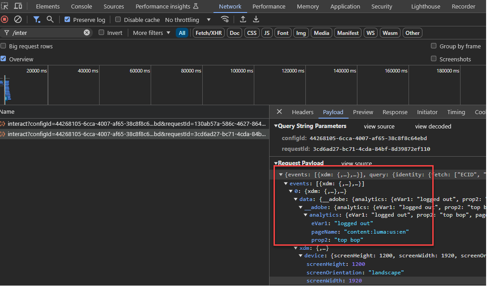

# Audience Managerのデータ収集ライブラリをAppMeasurementから Web SDKに更新する

## 対象読者 {#intended-audience}

このページは、[!DNL AppMeasurement] JavaScript ライブラリを使用して web データをAudience Managerに送信するAudience ManagerおよびAdobe Analyticsのお客様向けです。

現在のデータ収集方式に応じて、web SDKへの移行手順に関するガイダンスについては、次の表を参照してください。

| 既存のデータ収集方法 | Web SDKの移行手順 |
|---------|----------|
| AudienceManagement モジュ [!DNL AppMeasurement] ルを使用したJavaScript ライブラリ | このガイドの手順に従ってください。 |
| [!DNL Audience Manager] [ タグ拡張機能 ](https://experienceleague.adobe.com/en/docs/experience-platform/tags/extensions/client/audience-manager/overview) | [Audience Manager タグ拡張機能から web SDK タグ拡張機能へのデータ収集ライブラリの更新 ](dil-extension-to-web-sdk.md) の手順に従います。 |
| [!DNL AppMeasurement] JavaScript ライブラリ + スタンドアロン [!DNL Audience Manager] [DIL ライブラリ ](../dil/dil-overview.md) | [Audience Manager タグ拡張機能から web SDK タグ拡張機能へのデータ収集ライブラリの更新 ](dil-extension-to-web-sdk.md) の手順に従います。 |

## 移行の概要 {#overview}

[!DNL AppMeasurement] から [Web SDK](https://experienceleague.adobe.com/en/docs/experience-platform/web-sdk/home) への移行は、主にAdobe Analyticsの移行です。 Audience Managerのお客様の場合、この移行にはAudience Managerも含まれます。 両方を一緒に移行する必要があります。 主にAudience Managerを使用する場合は、この移行に Analytics チームを関与させます。

[!DNL AppMeasurement] for Audience Manager Data Collection を使用している場合は、現在、Analytics データをAudience Managerに送信する [!DNL Server-side Forwarding (SSF)] アプローチを使用しています。 この設定では、Analytics データ収集リクエストがAudience Managerに転送され、ページに対するAudience Manager応答も処理します。

これは長年にわたる標準的なアプローチであり、現在の設定である可能性があります。 [!DNL AppMeasurement] ライブラリに `AudienceManagement` モジュールが含まれ、データ収集呼び出しにリクエスト（`/b/ss/examplereportsuite/10/`）の `/10/` パスが含まれている場合、このガイドは役に立ちます。

## サーバーサイド転送（SSF）と Web SDKのデータフロー {#data-flows}

Web SDK（およびEdge Network）への移行時に、Analytics とAudience Managerの間で発生するデータフローの違いを理解することは、以下の手順で重要です。

サーバーサイド転送では、Analytics 地域データ収集ノードがデータを収集し、Audience Managerが受け入れるシグナルに変換してAudience Managerに送信し、Audience Manager応答をページに返します。 次に、[!DNL AppMeasurement] ライブラリの [!DNL AudienceManagement] モジュールが応答を処理します（Cookie の削除、URL の宛先の送信など）。 Analytics がAdobe サーバーを使用してAudience Managerにデータを転送するため、このプロセスはサーバーサイド転送と呼ばれます。

Web SDKを使用すると、Edge Networkは、Analytics とAudience Managerに別々のアクションでデータを送信します。 Web SDKは、データをすべてのソリューションに送信する単一のライブラリであり、Edge Networkは、ソリューションに依存しないデータポイントをソリューション固有の形式に変換します。

この新しいデータフローでは、すべてのデータがEdge Network [ データストリーム ](https://experienceleague.adobe.com/en/docs/experience-platform/datastreams/overview) に送信されます。必要に応じて、これを設定 ](https://experienceleague.adobe.com/en/docs/experience-platform/datastreams/configure) してAdobe ソリューションにデータを送信 [ できます。 Audience Managerについては、データストリームでAudience Manager サービスを有効にすると、[!DNL XDM] および Analytics データがAudience Managerで受け入れられるシグナルに変換されます。 また、Edge Networkはページに対するAudience Manager応答も返します。Web SDKは、[!DNL AppMeasurement] や [!DNL AudienceManagement] モジュールと同様に応答を処理します。

## タグとタグ以外の移行 {#tags-vs-non-tags}

[!DNL AppMeasurement] 拡張機能を使用してタグを使用する場合でも、別のタグ管理システムで [!DNL AppMeasurement] ライブラリを使用する場合でも、ページに直接 [!DNL AppMeasurement] ージを配置する場合でも、Audience Managerから web SDKに移行する手順は同じです。 Audience Managerの移行は Analytics の移行に依存するので、[!DNL AppMeasurement] から Web SDKへの移行手順は Analytics の移行中に決定されます。

この情報については、{Tags](https://experienceleague.adobe.com/en/docs/analytics/implementation/aep-edge/web-sdk/analytics-extension-to-web-sdk) または [2}JavaScript](https://experienceleague.adobe.com/en/docs/analytics/implementation/aep-edge/web-sdk/appmeasurement-to-web-sdk) ベースの実装に関する Analytics ドキュメントで説明しています。[

## XDM と `data.__adobe.` ノード {#xdm-data-nodes}

[Web SDK](https://experienceleague.adobe.com/en/docs/experience-platform/web-sdk/home) の主な機能の 1 つは、[Real-Time Customer Data Platform（RTCDP） ](https://experienceleague.adobe.com/en/docs/experience-platform/rtcdp/home) にデータを送信することです。 これを実現しつつ、完全な再実装を行わずに他のExperience Cloud ソリューションのデータを収集するには、データ収集サーバー呼び出し内でソリューション固有のデータを区分化します。 この呼び出しでは、[ エクスペリエンスデータモデル（XDM） ](https://experienceleague.adobe.com/en/docs/experience-platform/xdm/home) と呼ばれる、標準化された JSON スキーマを使用します。

ブラウザーやデバイスに関する情報など、ソリューションに依存しない要素は、所定の XDM 構造でEdge Networkに送信されます。 Edge Networkは、このデータをソリューション固有の形式に変換します。 ただし、Target、Analytics、Audience Managerに固有のデータは、XDM ペイロード内の専用の `data.__adobe` ノードに保存されます。

例：

* Analytics 変数 `s.eVar1` は、XDM ペイロードで `data.__adobe.analytics.evar1` のように表されます。
* 顧客のロイヤルティステータスに関連する Target パラメーターは、`data.__adobe.target.loyaltyStatus` として保存されます。

データストリームでExperience Platform サービスが有効になっている場合でも、`__adobe` ノード内のデータは、Experience Platformに送信されずに、それぞれのソリューション（Analytics やAudience Managerなど）に送信されます。 つまり、Analytics とAudience Managerの現在の設定を維持しながら、[ データ収集のためのデータ準備 ](https://experienceleague.adobe.com/en/docs/experience-platform/datastreams/data-prep) を使用して、Experience Platformのリアルタイムユースケースに必要なデータ要素を XDM スキーマ要素に柔軟にマッピングできます。

例えば、チェックアウト時に買い物かごのコンテンツをレポートするために使用される Analytics `s.products` 文字列は、元の形式で Analytics とAudience Managerに引き続き送信できます。 同時に、この文字列の要素を使用して、Experience Platformのユースケース向けにより直感的な XDM カートスキーマを作成できます。

ほとんどのAudience Manager実装はAudience Managerに転送される Analytics データに依存しているので、Audience Manager特性の式の多くは Analytics 変数（`c_evar#`、`c_prop#` および `c_events`）に基づいている可能性が高くなります。 移行時に XDM 形式を使用して特性式が再構築されるのを防ぐため、Edge Networkはデフォルトで、`data.__adobe.analytics` ノードにある Analytics 変数をAudience Manager シグナルに変換するように設定されています。 サーバーサイド転送のワークフローでも同様の変換プロセスが行われます。

Edge Networkがこの変換を実行できるのは、ページからの 1 回のデータ収集呼び出しが、複数のAdobe ソリューションをフィードする 1 つのデータストリームに送信されるからです。 したがって、Analytics とAudience Managerの両方について、[!DNL AppMeasurement] から Web SDKへの移行のほとんどは、主に `data.__adobe.analytics` ノードを使用します。

Edge Networkは、XDM ペイロードおよびパケットヘッダーからのデバイスおよびブラウザーデータをAudience Manager信号に変換します。 これにより、Audience Manager特性の式で `h_` および `d_` platform キーを引き続き使用できます。

## `data.__adobe.audiencemanager` ノード {#data-note}

`data.__adobe.audiencemanager` ノードは、Analytics に依存しないAudience Manager実装に使用されます。 [tag extension migration guide](dil-extension-to-web-sdk.md) に記載されているように、[Audience Manager ライブラリ ](../dil/dil-overview.md) ライブラリを介して以前に送信されたカスタム DILのキーと値のペアを格納します。

このガイドで概要を説明する移行には `data.__adobe.audiencemanager` ノードは必要ありませんが、ここで説明する新しいデータフローにより、Analytics に記録されることなくデータをAudience Managerに送信できます。

Analytics に含めずにカスタムのキーと値のペアをAudience Managerに送信する必要がある場合は、`data.__adobe.audiencemanager` ノードを使用できます。 このノードのデータセットは、データ収集サーバー呼び出しでAudience Manager変換された Analytics データに追加されます。

## この実装パスのメリットとデメリット

この移行アプローチを使用すると、メリットとデメリットの両方が生じます。 各オプションを慎重に検討し、組織に最適なアプローチを決定します。

| メリット | デメリット |
| --- | --- |
| <ul><li>**既存の実装を使用**：このアプローチには実装の変更が必要ですが、まったく新しい実装を最初から行う必要はありません。 実装ロジックへの最小限の変更で、既存のデータレイヤーとコードを使用できます。</li><li>**スキーマは必要ありません**:Web SDKへの移行のこの段階では、XDM スキーマは必要ありません。 代わりに、`data` オブジェクトにデータを入力し、Audience Managerにデータを直接送信することができます。 Web SDKへの移行が完了したら、組織のスキーマを作成し、データストリームマッピングを使用して該当する XDM フィールドに値を入力できます。 移行プロセスのこの段階でスキーマが必要だった場合、組織はAudience Manager XDM スキーマの使用を強制されます。 このスキーマを使用すると、組織が今後独自のスキーマを使用するのが難しくなります。</li></ul> | <ul><li>**実装の技術的負債**：このアプローチは既存の実装を変更した形式を使用するので、実装ロジックを追跡し、必要に応じて将来変更を実行するのは難しい場合があります。</li><li>**Platform にデータを送信するにはマッピングが必要**：組織でAdobe Experience Platformを使用する準備が整ったら、Real-Time CDPのデータセットにデータを送信する必要があります。 このアクションでは、`data` オブジェクトのすべてのフィールドが、XDM スキーマフィールドに割り当てるデータストリームマッピングツールのエントリである必要があります。 マッピングは、このワークフローに対して 1 回だけ行う必要があります。実装の変更は必要ありません。 ただし、XDM オブジェクトでデータを送信する場合に必要ない追加の手順です。</li></ul> |

Adobeでは、次のシナリオでこの実装パスを使用することをお勧めします。

* 既存の実装がある場合は、Adobe Analytics AppMeasurement JavaScript ライブラリを使用します。 Audience Manager タグ拡張機能を使用した実装がある場合は、代わりに [Audience Manager タグ拡張機能から web SDK タグ拡張機能に移行 ](dil-extension-to-web-sdk.md) に従います。
* 今後Real-Time CDPを使用するが、Audience Managerの実装を web SDKの実装に最初から置き換える必要がない。 実装を一から Web SDKに置き換える代わりに、最も労力が必要なのは、XDM 形式のデータを探すために、すべてのAudience Manager特性を再構築する必要があるからです。 ただし、これは最も実行可能な長期実装アーキテクチャでもあります。 Web SDKのクリーンな実装に積極的に取り組む場合は、このガイドを使用する代わりに [Web SDKのドキュメント ](https://experienceleague.adobe.com/en/docs/experience-platform/web-sdk/home) を参照してください。

## Web SDKへの移行に必要な手順

データ収集統合を web SDKに移行するには、次の手順に従います。

+++**1.Analytics の移行を計画する**.

Analytics チームと協力して、{Tags[ または ](https://experienceleague.adobe.com/en/docs/analytics/implementation/aep-edge/web-sdk/analytics-extension-to-web-sdk)2}JavaScript](https://experienceleague.adobe.com/en/docs/analytics/implementation/aep-edge/web-sdk/appmeasurement-to-web-sdk) ベースの実装で Analytics の移行手順に従います。 [Analytics の移行を計画したら、このガイドに戻り、引き続きAudience Managerの手順を参照して、Analytics とAudience ManagerAudience Managerの移行を一緒にデプロイするために必要な作業を確認します。

+++

+++**2.データストリームにAudience Manager サービスを追加し** す。

手順 1 で説明した Analytics の移行で使用しているデータストリームにAudience Manager サービスを追加します。

1. [experience.adobe.com](https://experience.adobe.com) に移動し、資格情報を使用してログインします。
1. 右上のホームページまたは製品セレクターを使用して、**[!UICONTROL Data Collection]** に移動します。
1. 左側のナビゲーションで、「**[!UICONTROL Datastreams]**」を選択します。
1. 手順 1 の Analytics 移行の一部として作成したデータストリームを選択します。
1. 「**[!UICONTROL Add Service]**」を選択します。
1. サービス ドロップダウンメニューで、「**[!UICONTROL Audience Manager]**」を選択します。
1. 「**[!UICONTROL Cookie Destinations Enabled]**」オプションと「**[!UICONTROL URL Destinations Enabled]**」オプションをオンにします。 これらのオプションを使用すると、Edge Networkは、これらのAudience Managerの宛先タイプをページに返すことができます。
1. **[!UICONTROL Enable XDM Flattened Fields]** が無効になっていることを確認します。 このオプションを選択すると、Analytics 変数からAudience Manager シグナルへの自動変換が無効になります。 このオプションは、Edge Networkが Analytics データをAudience Manager シグナルに自動変換する前に Web SDKに移行したユーザーとの下位互換性を保つように設計されています。

   >[!NOTE]
   >
   >**[!UICONTROL Enabled XDM Flattened Fields]** オプションを有効にして web SDKに移行する場合は、XDM 形式のAudience Managerに必要なデータと、prop、eVar またはイベントを使用するすべてのAudience Manager特性を、XDM 形式のデータを検索するように更新する必要があります。 Adobeでは、このオプションを無効のままにすることをお勧めします。

    {style="border:1px solid lightslategray"}

1. 「**[!UICONTROL Save]**」を選択して、データストリーム設定を保存します。

これで、データストリームがデータを受け取り、Audience Managerに渡す準備が整いました。 データストリーム ID に注意してください。この ID は、コードで web SDKを設定する際に必要になるからです。

+++

+++**3.サードパーティ ID 同期を有効にし、Audience Manager コンテナ ID を設定し** す。

1. [experience.adobe.com](https://experience.adobe.com) に移動し、資格情報を使用してログインします。
1. 右上のホームページまたは製品セレクターを使用して、**[!UICONTROL Data Collection]** に移動します。
1. 左側のナビゲーションで、「**[!UICONTROL Datastreams]**」を選択します。
1. 手順 1 の Analytics 移行の一部として作成したデータストリームを選択します。
1. データストリーム設定ページの右上隅にある「**[!UICONTROL Edit]**」を選択します。
1. **[!UICONTROL Advanced Options]** ドロップダウンメニューを展開し、**[!UICONTROL Third Party ID Sync]** 機能がまだ有効になっていない場合は有効にします。 このオプションは、Edge NetworkとExperience Platformのデータパートナーに対してパートナー ID 同期を返すようにAudience Managerに指示します。

    {style="border:1px solid lightslategray"}

1. ほとんどの場合、「**[!UICONTROL Third Party ID Sync Container ID]**」フィールドは空白のままにできます。 デフォルトで `0` になります。 ただし、適切なコンテナ ID を使用する場合は、次の手順に従います。
   * ブラウザーウィンドウを匿名モードまたはプライベートモードで開き、移行の一部であるページに移動します。
   * ブラウザーの開発者ツールを使用して、`dpm.demdex.net/id` へのネットワーク呼び出しについてフィルタリングします。 この呼び出しは、最初の訪問の最初のページでのみ実行されるので、匿名ブラウザーまたはプライベートブラウザーが必要になります。
   * リクエストのペイロードを表示します。 `d_nsid` パラメーターが 0 とは異なる場合は、**[!UICONTROL Third Party ID Sync Container ID]** フィールドにコピーします。

1. 「**[!UICONTROL Save]**」を選択します。

これで、データをAudience Managerに送信し、Audience Managerの応答を web SDKに渡す準備が整いました。

+++

+++**4.顧客 ID を ID マップに追加する**

ほとんどのAudience Manager実装では、クロスデバイスのパーソナライゼーションシナリオおよびが、認証状態（ログインまたはログアウト）に応じて訪問者が選定できるセグメントを制御するのに役立つ [ プロファイル結合ルール ](../features/profile-merge-rules/merge-rules-overview.md) が使用されています。 プロファイル結合ルールでは、認証後のすべてのデータ収集呼び出しで、顧客が所有する ID （CRM ID、アカウント番号など）をAudience Managerに送信する必要があります。 以前は、訪問者 ID サービス（[!DNL visitor.js]）の `setCustomerIDs` 関数を使用して、各 Analytics データ収集呼び出しに顧客 ID を追加してから、Audience Managerに転送されていました。

Web SDKでは、[IdentityMap](https://experienceleague.adobe.com/en/docs/experience-platform/xdm/field-groups/profile/identitymap) と呼ばれる特別な XDM 構造を使用して、これらの ID をEdge Networkに送信する必要があります。

ID マップで ID を正しく渡すには、[ID 名前空間 ](https://experienceleague.adobe.com/ja/docs/experience-platform/identity/features/namespaces) を理解し、特にExperience Platform サンドボックスにデータを送信する際に渡す ID を慎重に検討する必要があります。 [ この記事 ](https://experienceleague.adobe.com/en/docs/experience-cloud-kcs/kbarticles/ka-21305) では、これらの考慮事項と手順の概要を説明します。

渡す ID とタイミングを決定したら、タグ内の [!UICONTROL Identity map] **[!UICONTROL Identity map]** [ データ要素 ](https://experienceleague.adobe.com/en/docs/experience-platform/tags/extensions/client/web-sdk/data-element-types#identity-map) の使用に関するガイドに従うか、[ID データの概要 ](https://experienceleague.adobe.com/en/docs/experience-platform/web-sdk/identity/overview) に記載されている通りに手動で設定して、Web SDKのデプロイメント戦略に合わせます。

+++

+++**5.（オプション）ファーストパーティ `aam_uuid` cookie を設定し** す。

長年の標準的な方法は、Audience Manager UUID （サードパーティ demdex cookie の値）を、通常 `aam_uuid` という名前のファーストパーティ cookie に配置することでした。

cookie を設定するには、Analytics タグ拡張機能の「**[!UICONTROL Unique User ID Cookie]**」セクションの「**[!UICONTROL Name]**」フィールドまたは「`uuidCookie`」フィールドに cookie 名を入力して、`audienceManagementModule` を設定する必要があります。 Audience Manager UUID の値は、広告プラットフォームで使用される、デバイス固有のクロスドメイン識別情報で、ファーストパーティの識別情報としてはほとんど価値がないので、コードで一般的に設定されていますが、cookie はほとんど使用されませんでした。

Web SDKへの移行後も、この `aam_uuid` Cookie を引き続き設定する必要がある実装の場合は、2 とおりの方法でAudience Manager UUID を取得できます。

1. [Edge Network インタラクトエンドポイント ](https://developer.adobe.com/data-collection-apis/docs/endpoints/interact/) からのすべての応答には、`id` ノードのペイロードが含まれます。 `CORE` 名前空間ペイロードの `id` ノードには、Audience Manager UUID が含まれます。

2. Web SDKの [getIdentity](https://experienceleague.adobe.com/en/docs/experience-platform/web-sdk/commands/getidentity) コマンドを使用して取得します。 ドキュメントで説明されている `CORE` 名前空間を使用して、応答の `identity.CORE` フィールドから値を取得します。

Audience Manager UUID の取得に使用されるメソッドに関係なく、レスポンスの解析、UUID の取得、cookie の設定は、開発チームの責任です。 Web SDKを使用してこの Cookie を自動的に設定する方法はありません。

+++

## Analytics Report Suite Manager UI でのサーバーサイド転送とAudience Analyticsの設定 {#configure-ssf-analytics}

Analytics の [ サーバーサイド転送 ](https://experienceleague.adobe.com/en/docs/analytics/admin/admin-tools/manage-report-suites/edit-report-suite/report-suite-general/server-side-forwarding/ssf) 機能を熟知している場合は、「*Analytics データがAudience Managerに 2 回送信されないようにするには、Analytics レポートスイートマネージャー UI のサーバーサイド転送設定を無効にする必要がありますか？*」と疑問に思うかもしれません。

答えは「いいえ」です。次の理由から、この設定を無効にしないでください。

1. Audience Manager サービスがデータストリームで有効になっている場合、Edge Networkは、Analytics に送信されるすべてのデータ収集リクエストに `cm.ssf` 変数を追加します。 これにより、Analytics データがAudience Managerにも送信されなくなります。 Audience Managerの移行を検証するために使用されるAssurance ログでは、データストリームで Analytics サービスが有効になっている場合に `cm.ssf=1` 変数が表示されます。 詳しくは、サーバーサイド転送に重点を置いた [Analytics と GDPR のコンプライアンスページ ](https://experienceleague.adobe.com/en/docs/analytics/admin/admin-tools/manage-report-suites/edit-report-suite/report-suite-general/server-side-forwarding/ssf-gdpr) を参照してください。

1. また、この設定により、[!DNL Audience Analytics] 統合のデータフローが有効になります。 [Analytics の概要 ](https://experienceleague.adobe.com/en/docs/analytics/integration/audience-analytics/mc-audiences-aam) で説明しているように、Audience Analytics データ収集サーバーに対するAudience Manager応答は処理前に Analytics ヒットに追加されるので、この統合にはサーバーサイド転送が必要です。 Edge Networkでも同様のプロセスが行われます。 サーバーサイド転送が有効な場合、Edge Networkは Analytics のレスポンスからAudience Managerに送信されるデータに必要なセグメントを追加します。

まとめると、Audience Analyticsが引き続き Web SDKで機能し、Audience Managerでデータが二重にカウントされないように、この設定を有効にしておくことが重要です。

## 移行の検証 {#validation}

すべてのAdobe ソリューションが 1 回の Web SDK呼び出しで提供されるようになったため、検証の手順は Web SDKが提供するソリューションによって異なる場合があります。

Adobe TargetまたはAdobe Journey Optimizer（[!DNL Decisioning] を含む）が実装で提供されるソリューションスタックの一部である場合は、ページ上でEdge Networkへの複数のネットワーク呼び出しがあります。 パーソナライゼーションやオファーを取得するためのものもあれば、データ収集やレポートを目的とするものもあります。

実装に関係なく、以下の一般原則が、Web SDKを介してAudience Managerとの間でデータが正しく送受信されていることを検証するために適用されます。

1. 最初のページの初回訪問者に対する最初のネットワーク呼び出しは、`adobedc.demdex.net` ドメインと `/interact` エンドポイントに対してになります。 Web ブラウザーでデベロッパータブを開き、「Network」タブをクリックし、`/interact` でフィルタリングすると、Web SDKによるネットワーク呼び出しを確認できます。
他のタイプの Web SDK呼び出しもありますが、Edge Networkからデータを送信して応答ペイロードを取得するのは `interact` 呼び出しのみです。

   

1. 最初のネットワーク呼び出しに対する応答には、複数のペイロードがあります。 これらのペイロードノードの 1 つに、タイプ `url` の複数のサブノードが含まれます。 これらの `url` ノードは、これまで [!DNL Visitor ID] サービスによって実行されたサードパーティ ID 同期です。 コンテナで設定したサードパーティ ID 同期ごとに 1 つの `url` ノードが必要です（上記の手順 3 を参照）。

   

   さらに、`demdex` でフィルタリングすると、ペイロードで参照される各 URL が、[!DNL Visitor ID] サービスと同様に、ID 同期のための独自のネットワークリクエストを送信したことが分かります。 これらの ID 同期は、初回訪問者の最初のページでのみ、その後 14 日ごとに 1 回だけ実行する必要があります。

1. Analytics およびAudience Manager データ収集に使用する後続の `/interact` リクエストには、ペイロードに `data.__adobe.analytics` ノードが含まれている必要があります。

   

   これらの Analytics 変数に依存するAudience Manager特性と、`h_` または `d_` platform のキーを使用する特性は、引き続き入力する必要があります。

   >[!TIP]
   >
   >Web SDKのデータを収集する場合にのみ表現できるルール式を使用して、テスト特性を作成できます。 Audience Manager開発環境はなく、複数のサイトが同じAudience Manager インスタンスにデータを送信する可能性があるので、母集団数全体を調べるだけでは、必要な検証が得られない場合があります。

1. Analytics 変数が渡されるのと同じ `/interact` 呼び出しで、Cookie または URL の宛先を応答のペイロードノードで見つけることができます。 URL 宛先は、サードパーティ ID 同期と同様に、タイプ `url` のペイロードにあり、cookie 宛先は、タイプ `cookie` のペイロードにあります。

   

   また、cookie がブラウザーの cookie ストレージにドロップされたことを確認する必要があります。

   >[!TIP]
   >
   >前の検証ステップと同様に、Cookie の宛先を返す必要があるセグメントの選定は、Audience Managerとの間でデータが確実に送受信されるようにするための特定の方法です。

1. ID マップを介して追加の顧客 ID を渡す必要がある場合は、サイトに対して認証を行い、ID とそれに関連するパラメーターがリクエストペイロードの ID マップノードに渡されていることを確認します。

   

   >[!TIP]
   >
   >Adobe Targetが受信側のソリューションの 1 つであり、正しい ID を渡す必要があるAudience Manager セグメントに依存する Target アクティビティがある場合は、データ収集呼び出しだけでなく、パーソナライゼーションの取得に使用する `/interact` 呼び出しで ID マップが渡されていることを確認します。 Adobe Targetは、セグメント情報を取得する際に、Audience Managerへのサーバーサイド呼び出しでこれらの ID を使用します。

