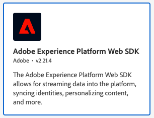
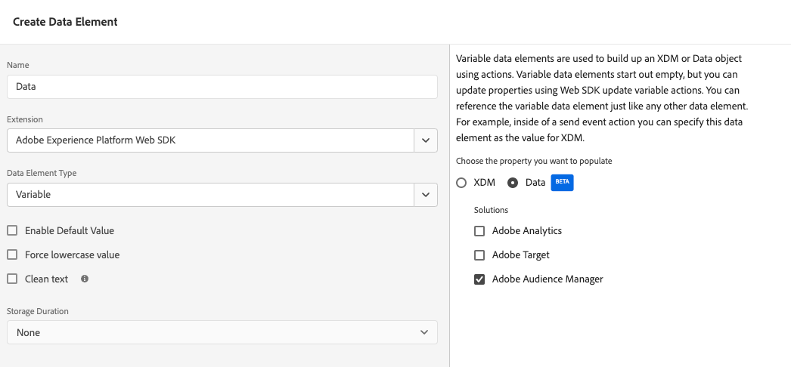
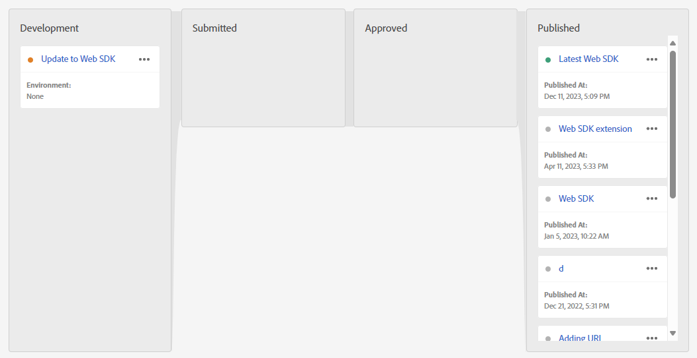

# Audience Managerのデータ収集ライブラリをAudience Manager タグ拡張機能から Web SDK タグ拡張機能に更新します

## 対象読者

このページは、[Audience Manager タグ拡張機能 ](https://experienceleague.adobe.com/en/docs/experience-platform/tags/extensions/client/audience-manager/overview) を使用して web 収集データをAudience Managerに取り込むAudience Managerのお客様を対象としています。 AppMeasurement JavaScript ライブラリを使用しているお客様の場合は、Audience Managerのデータ収集ライブラリを更新する方法に関するガイドを参照してください [AppMeasurement JavaScript ライブラリから web SDK JavaScript ライブラリに ](appmeasurement-to-web-sdk.md)。

## この実装パスのメリットとデメリット

この移行アプローチを使用すると、メリットとデメリットの両方が生じます。 各オプションを慎重に検討し、組織に最適なアプローチを決定します。

| メリット | デメリット |
| --- | --- |
| <ul><li>**サイトにコードの変更はありません**：実装には既にタグがインストールされているので、すべての移行の更新をタグインターフェイスで行うことができます。</li><li>**既存の実装を使用**：このアプローチでは、まったく新しい実装は必要ありません。 新しいルールのアクションが必要になる場合でも、最小限の変更で、既存のデータ要素とルール条件を再利用できます。</li><li>**スキーマは必要ありません**:Web SDKへの移行のこの段階では、XDM スキーマは必要ありません。 代わりに、`data` オブジェクトにデータを入力し、Adobe Audience Managerにデータを直接送信することができます。 Web SDKへの移行が完了したら、組織のスキーマを作成し、データストリームマッピングを使用して該当する XDM フィールドに値を入力できます。 移行プロセスのこの段階でスキーマが必要だった場合、組織はAdobe Audience Manager XDM スキーマの使用を強制されます。 このスキーマを使用すると、組織が今後独自のスキーマを使用するのが難しくなります。</li></ul> | <ul><li>**実装技術負債**：このアプローチは既存の実装の変更済みフォームを使用するので、実装ロジックを追跡し、必要に応じて変更を実行するのが難しい場合があります。 カスタムコードは特にデバッグが困難な場合があります。</li><li>**Platform にデータを送信するにはマッピングが必要**：組織でAdobe Experience Platformを使用する準備が整ったら、Real-Time CDPのデータセットにデータを送信する必要があります。 このアクションでは、`data` オブジェクトのすべてのフィールドが、XDM スキーマフィールドに割り当てるデータストリームマッピングツールのエントリである必要があります。 マッピングは、このワークフローに対して 1 回だけ行う必要があります。実装の変更は必要ありません。 ただし、XDM オブジェクトでデータを送信する場合に必要ない追加の手順です。</li></ul> |

Adobeでは、Adobe Audience Manager タグ拡張機能を使用した既存の実装がある場合に、この実装パスに従うことをお勧めします。

## Web SDKへの移行に必要な手順

以下の手順には、取り組むべき具体的な目標が含まれています。 各手順を選択すると、実行方法に関する詳細な手順が表示されます。

+++**1.データストリームの作成と設定**

Adobe Experience Platform Data Collection でデータストリームを作成するには、以下の手順に従います。 このデータストリームにデータを送信すると、データがAudience Managerに転送されます。 今後、この同じデータストリームがReal-Time CDPにデータを転送します。

1. [experience.adobe.com](https://experience.adobe.com) に移動し、資格情報を使用してログインします。
1. 右上のホームページまたは製品セレクターを使用して、**[!UICONTROL Data Collection]** に移動します。
1. 左側のナビゲーションで、「**[!UICONTROL Datastreams]**」を選択します。
1. 「**[!UICONTROL New Datastream]**」を選択します。
1. 目的の名前を入力し、「**[!UICONTROL Save]**」を選択します。
1. データストリームを作成したら、「**[!UICONTROL Add Service]**」を選択します。
1. サービス ドロップダウンメニューで、「**[!UICONTROL Adobe Audience Manager]**」を選択します。
1. **[!UICONTROL Enable XDM Flattened Fields]** オプションがオフになっていることを確認します。

    {style="border:1px solid lightslategray"}

これで、データストリームがデータを受け取り、Audience Managerに渡す準備が整いました。

+++

+++**2.タグプロパティに web SDK拡張機能を追加します**

この節では、次の手順で行われる移行作業の大部分のためにタグを準備します。

1. Adobe Experience Platform インターフェイスの左上にあるハンバーガーアイコンを選択してから、「**[!UICONTROL Tags]**」を選択します。
1. 目的のタグプロパティを選択します。
1. タグプロパティの左側のナビゲーションで、「**[!UICONTROL Extensions]**」を選択します。
1. 上部付近の「**[!UICONTROL Catalog]**」を選択すると、使用可能なすべての拡張機能のリストが表示されます。
1. **[!UICONTROL Adobe Experience Platform Web SDK]** 拡張機能を検索して選択し、右側の「**[!UICONTROL Install]**」を選択します。

    {style="border:1px solid lightslategray"}

1. 拡張機能の設定が表示されます。 「**[!UICONTROL Datastreams]**」セクションを探し、使用しているサンドボックスと前の手順で作成したデータストリームを選択します。

    {style="border:1px solid lightslategray"}

1. 「**[!UICONTROL Save]**」を選択します。

これで、タグプロパティに web SDKがインストールされました。

+++

+++**3.データオブジェクトデータ要素** 作成

データオブジェクトデータ要素は、web SDKがデータストリームに送信するために使用するペイロードを設定するための直感的なフレームワークを提供します。 次の手順で更新するほとんどのルールは、このデータ要素とやり取りします。

1. タグインターフェイスの左側のナビゲーションで、「**[!UICONTROL Data Elements]**」を選択します。
1. Select **[!UICONTROL Add Data Element]**
1. データ要素に次の設定を行います。
   * **[!UICONTROL Name]**:「データレイヤー」や「データオブジェクト」など、必要なもの
   * **[!UICONTROL Extension]**：[!UICONTROL Adobe Experience Platform Web SDK]
   * **[!UICONTROL Data Element Type]**：[!UICONTROL Variable]
   * チェックボックスは、そのまま残すことができます。
1. 右側で、次の設定を選択します。
   * プロパティ ラジオ ボタン：**[!UICONTROL Data]**
   * **[!UICONTROL Solution]**：[!UICONTROL Adobe Audience Manager]
1. 「**[!UICONTROL Save]**」を選択します。

    {style="border:1px solid lightslategray"}

これで、タグプロパティに、各ルールを更新するために必要なすべてが揃いました。

+++

+++**4.Audience Manager拡張機能の代わりに Web SDK拡張機能を使用するように、ルールを更新し** す。

この手順には、Web SDKへの移行に必要な作業の大部分が含まれており、実装の仕組みに関する知識が必要です。 一般的なタグルールの編集方法の例を以下に示します。 Audience Manager拡張機能へのすべての参照を Web SDK拡張機能に置き換えるために、実装内のすべてのタグルールを更新します。

1. タグインターフェイスの左側のナビゲーションで、「**[!UICONTROL Rules]**」を選択します。
1. 編集するルールを選択します。
1. アクション **[!UICONTROL Audience Manager - Set Variables]** を選択します
1. このルール内で設定されるすべてのAudience Manager変数に注意してください。 ドロップダウンメニューで設定された変数と、カスタムコード内で設定された変数の両方を含めます。
1. [!UICONTROL Action Configuration] を次の設定に変更します。
   * **[!UICONTROL Extension]**：[!UICONTROL Adobe Experience Platform Web SDK]
   * **[!UICONTROL Action type]**：変数の更新
1. 手順 3 で作成したデータオブジェクトが、右側の「データ **[!UICONTROL Data element]** ース」フィールドのドロップダウンで選択されていることを確認します。
1. Audience Managerのキーと値のペアを、Audience Manager拡張機能で設定したのと同じ値に設定します。
1. Web SDK拡張機能を使用してすべてのルールロジックをレプリケートしたら、「**[!UICONTROL Keep Changes]**」を選択します。
1. Audience Manager タグ拡張機能を使用して値を設定するアクション設定ごとに、これらの手順を繰り返します。

上記の手順は、値を設定するルールにのみ適用されます。 次の手順は、[!UICONTROL Action Configuration] [!UICONTROL Send Event] を使用するすべてのアクションを置き換えます。

1. Web SDK イベントを送信するルールを選択します。
1. アクションタイプ **[!UICONTROL Send Event]** を選択します。
1. [!UICONTROL Action Configuration] を次の設定に変更します。
   * **[!UICONTROL Extension]**：[!UICONTROL Adobe Experience Platform Web SDK]
   * **[!UICONTROL Action type]**：[!UICONTROL Send event]
1. 右側で、アクション設定を次のように変更します。
   * **[!UICONTROL Type]**: **[!UICONTROL Web Webpagedetails Page Views]** を使用します。
   * **[!UICONTROL Data]**：手順 3 で作成したデータオブジェクトを選択します。
1. 「**[!UICONTROL Keep Changes]**」を選択します。
1. Audience Managerを使用してイベントを送信するすべてのアクション設定について、これらの手順を繰り返します。

+++

+++**5.更新されたルールを公開する**

更新されたルールの公開は、タグ設定に対する他の変更と同じワークフローに従います。

1. タグインターフェイスの左側のナビゲーションで、「**[!UICONTROL Publishing Flow]**」を選択します。
1. 「**[!UICONTROL Add Library]**」を選択します。
1. このタグコミットに「Web SDKにアップグレード」などの名前を付けます。
1. 「**[!UICONTROL Add All Changed Resources]**」を選択します。
1. 「**[!UICONTROL Save]**」を選択します。
1. 公開ワークフローには、オレンジ色の点が表示され、ビルド中であることを示します。 ドットが緑色に変わると、変更を開発環境で使用できるようになります。
1. 開発環境で変更をテストし、すべてのルールが適切に実行され、データオブジェクトに想定される値が入力されていることを確認します。
1. 準備が整ったら、ライブラリを承認用に送信し、ステージング環境にビルドしてから、最終的に承認して実稼動環境に公開します。

    {style="border:1px solid lightslategray"}

+++

+++**6.Audience Manager拡張機能を無効にする**

タグ実装が web SDKに完全に移行されたら、Audience Manager拡張機能を無効にできます。

1. タグインターフェイスの左側のナビゲーションで、「**[!UICONTROL Extensions]**」を選択します。
1. [!UICONTROL Audience Manager] 拡張機能を探して選択します。 右側で、「**[!UICONTROL Disable]**」を選択します。
1. 上記と同じ公開ワークフローに従って、[!UICONTROL Audience Manager] 拡張機能の削除を公開します。
1. 実稼動環境で拡張機能を無効にすると、その拡張機能を完全にアンインストールできます。 拡張機能を選択し、右側の「。..」メニューを選択してから、「**[!UICONTROL Uninstall]**」を選択します。
1. 上記と同じ公開ワークフローに従って、変更を実稼動環境に公開します。

+++

この時点で、Audience Manager実装は Web SDKに完全に移行され、将来Real-Time CDPに移行する準備が整います。
