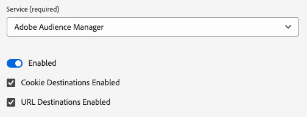
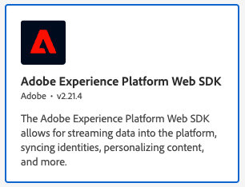
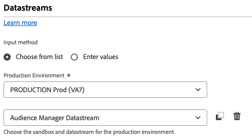
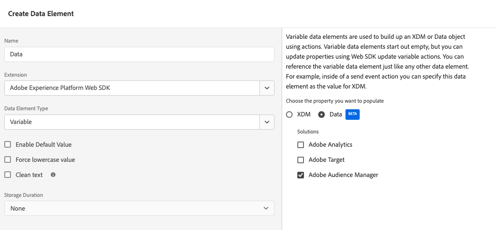
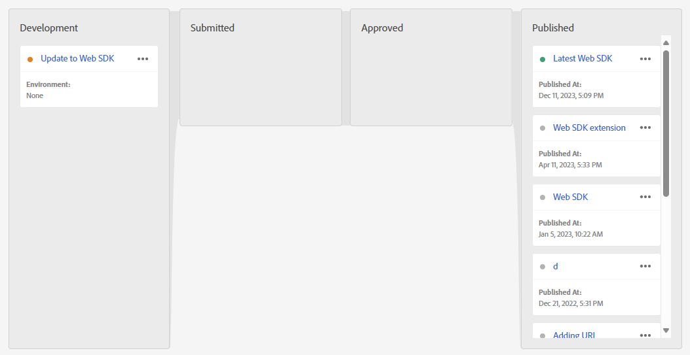

# Audience Managerのデータ収集ライブラリを、Audience Manager タグ拡張機能からWeb SDK タグ拡張機能に更新します

## 対象オーディエンス

このページは、[Audience Manager タグ拡張機能](https://experienceleague.adobe.com/ja/docs/experience-platform/tags/extensions/client/audience-manager/overview)を使用してweb コレクションデータをAudience Managerに取り込むAudience Managerのお客様向けです。 AppMeasurement JavaScript ライブラリを使用しているお客様は、Audience Managerのデータ収集ライブラリを[AppMeasurement JavaScript ライブラリからWeb SDK JavaScript ライブラリ &#x200B;](appmeasurement-to-web-sdk.md)に更新する方法に関するガイドをお読みください。

## この実装パスの利点と欠点

この移行アプローチを使用すると、利点と欠点の両方があります。 各オプションを慎重に検討し、自社に最適なアプローチを選びましょう。

| メリット | 欠点 |
| --- | --- |
| <ul><li>**サイトでコードの変更はありません**：実装には既にタグがインストールされているため、すべての移行の更新はタグインターフェイスで行うことができます。</li><li>**既存の実装を使用**：このアプローチでは、新たに実装する必要はありません。 新しいルールアクションは必要ですが、既存のデータ要素とルール条件を最小限の変更で再利用できます。</li><li>**スキーマは必要ありません**: Web SDKに移行するこの段階では、XDM スキーマは必要ありません。 代わりに、`data` オブジェクトを設定して、データをAdobe Audience Managerに直接送信できます。 Web SDKへの移行が完了したら、組織のスキーマを作成し、データストリームマッピングを使用して該当するXDM フィールドに入力できます。 移行プロセスのこの段階でスキーマが必要な場合、Adobe Audience Manager XDM スキーマの使用が強制されます。 このスキーマを使用すると、組織が将来、独自のスキーマを使用することがより困難になります。</li></ul> | <ul><li>**実装の技術的負債**：このアプローチでは、既存の実装の変更された形式を使用するため、実装ロジックを追跡したり、必要に応じて変更を実行したりすることが困難になる可能性があります。 カスタムコードは、特にデバッグが難しい場合があります。</li><li>**Platformにデータを送信するにはマッピングが必要です**：組織でReal-Time CDPを使用する準備ができたら、Adobe Experience Platformのデータセットにデータを送信する必要があります。 このアクションでは、`data` オブジェクトのすべてのフィールドが、XDM スキーマフィールドに割り当てるデータストリームマッピングツールのエントリである必要があります。 マッピングは、このワークフローに対して1回だけ実行する必要があり、実装の変更は必要ありません。 ただし、XDM オブジェクトでデータを送信する場合は、この手順は必要ありません。</li></ul> |

Adobeでは、Adobe Audience Manager タグ拡張機能を使用して既存の実装がある場合は、この実装パスに従うことをお勧めします。

## Web SDKへの移行に必要な手順

次のステップは、取り組むべき具体的な目標を含んでいます。 各ステップを選択して、その実行方法を詳しく説明します。

+++**1.データストリームの作成と設定**

Adobe Experience Platform Data Collectionでデータストリームを作成するには、次の手順に従います。 このデータストリームにデータを送信すると、データはAudience Managerに転送されます。 将来的には、このデータストリームがデータをReal-Time CDPに転送します。

1. [experience.adobe.com](https://experience.adobe.com)に移動し、資格情報を使用してログインします。
1. 右上のホームページまたは製品セレクターを使用して、**[!UICONTROL Data Collection]**&#x200B;に移動します。
1. 左側のナビゲーションで、**[!UICONTROL Datastreams]**&#x200B;を選択します。
1. **[!UICONTROL New Datastream]**&#x200B;を選択します。
1. 目的の名前を入力し、**[!UICONTROL Save]**&#x200B;を選択します。
1. データストリームを作成したら、**[!UICONTROL Add Service]**&#x200B;を選択します。
1. サービス ドロップダウンメニューで、**[!UICONTROL Adobe Audience Manager]**&#x200B;を選択します。
1. 「**[!UICONTROL Enable XDM Flattened Fields]**」オプションがオフになっていることを確認します。

    {style="border:1px solid lightslategray"}

これで、データストリームがAudience Managerにデータを受け取って渡す準備が整いました。

+++

+++**2.Web SDK拡張機能をタグプロパティ**&#x200B;に追加します

このセクションでは、次のステップで行われる移行作業の大部分に対してタグを準備します。

1. Adobe Experience Platform インターフェイスの左上にあるハンバーガーアイコンを選択し、**[!UICONTROL Tags]**&#x200B;を選択します。
1. 目的のタグプロパティを選択します。
1. タグプロパティの左側のナビゲーションで、**[!UICONTROL Extensions]**&#x200B;を選択します。
1. 上部の&#x200B;**[!UICONTROL Catalog]**&#x200B;を選択すると、使用可能なすべての拡張機能のリストが表示されます。
1. **[!UICONTROL Adobe Experience Platform Web SDK]**&#x200B;拡張機能を検索して選択し、右側の&#x200B;**[!UICONTROL Install]**&#x200B;を選択します。

    {style="border:1px solid lightslategray"}

1. 拡張機能の設定が表示されます。 **[!UICONTROL Datastreams]** セクションを探し、使用しているサンドボックスと、前の手順で作成したデータストリームを選択します。

    {style="border:1px solid lightslategray"}

1. **[!UICONTROL Save]**&#x200B;を選択します。

タグプロパティにWeb SDKがインストールされました。

+++

+++**3.データ オブジェクト データ要素**&#x200B;を作成します

データオブジェクトデータ要素は、Web SDKがデータストリームに送信するために使用するペイロードを設定するための直感的なフレームワークを提供します。 次の手順で更新するほとんどのルールは、このデータ要素を操作します。

1. タグインターフェイスの左側のナビゲーションで、**[!UICONTROL Data Elements]**&#x200B;を選択します。
1. **[!UICONTROL Add Data Element]**&#x200B;を選択
1. データ要素に次の設定を指定します。
   * **[!UICONTROL Name]**: 「データレイヤー」や「データオブジェクト」など、必要なものはすべて
   * **[!UICONTROL Extension]**：[!UICONTROL Adobe Experience Platform Web SDK]
   * **[!UICONTROL Data Element Type]**：[!UICONTROL Variable]
   * チェックボックスは、そのままにしておくことができます。
1. 右側で、次の設定を選択します。
   * プロパティ ラジオ ボタン：**[!UICONTROL Data]**
   * **[!UICONTROL Solution]**：[!UICONTROL Adobe Audience Manager]
1. **[!UICONTROL Save]**&#x200B;を選択します。

    {style="border:1px solid lightslategray"}

タグプロパティには、各ルールの更新に必要なあらゆる情報が含まれています。

+++

+++**4.Audience Manager拡張機能の代わりにWeb SDK拡張機能を使用するようにルールを更新する**

この手順では、Web SDKへの移行に必要な労力の大部分を確認できます。また、導入の仕組みについても把握する必要があります。 一般的なタグルールを編集する方法の例を以下に示します。 実装内のすべてのタグルールを更新して、Audience Manager拡張機能へのすべての参照をWeb SDK拡張機能に置き換えます。

1. タグインターフェイスの左側のナビゲーションで、**[!UICONTROL Rules]**&#x200B;を選択します。
1. 編集するルールを選択します。
1. アクション **[!UICONTROL Audience Manager - Set Variables]**&#x200B;を選択
1. このルール内で設定されたすべてのAudience Manager変数を記録します。 ドロップダウンメニューに設定された変数とカスタムコード内に設定された変数の両方を含めます。
1. [!UICONTROL Action Configuration]を次の設定に変更します。
   * **[!UICONTROL Extension]**：[!UICONTROL Adobe Experience Platform Web SDK]
   * **[!UICONTROL Action type]**：変数を更新
1. 手順3で作成したデータオブジェクトが、右側の&#x200B;**[!UICONTROL Data element]** フィールドのドロップダウンで選択されていることを確認します。
1. Audience Managerのキーと値のペアを、Audience Manager拡張機能で設定した値と同じ値に設定します。
1. Web SDK拡張機能を使用してすべてのルールロジックをレプリケートしたら、**[!UICONTROL Keep Changes]**&#x200B;を選択します。
1. Audience Manager タグ拡張機能を使用して値を設定するアクション設定ごとに、これらの手順を繰り返します。

上記の手順は、値を設定するルールにのみ適用されます。 次の手順は、[!UICONTROL Action Configuration] [!UICONTROL Send Event]を使用するすべてのアクションを置き換えます。

1. Web SDK イベントを送信するルールを選択します。
1. アクションの種類&#x200B;**[!UICONTROL Send Event]**&#x200B;を選択します。
1. [!UICONTROL Action Configuration]を次の設定に変更します。
   * **[!UICONTROL Extension]**：[!UICONTROL Adobe Experience Platform Web SDK]
   * **[!UICONTROL Action type]**：[!UICONTROL Send event]
1. 右側で、アクション設定を次のように変更します。
   * **[!UICONTROL Type]**: **[!UICONTROL Web Webpagedetails Page Views]**&#x200B;を使用してください。
   * **[!UICONTROL Data]**：手順3で作成したデータオブジェクトを選択します。
1. **[!UICONTROL Keep Changes]**&#x200B;を選択します。
1. Audience Managerを使用してイベントを送信するアクション設定ごとに、これらの手順を繰り返します。

+++

+++**5.更新されたルールを公開**

更新されたルールの公開は、タグ設定に対する他の変更と同じワークフローに従います。

1. タグインターフェイスの左側のナビゲーションで、**[!UICONTROL Publishing Flow]**&#x200B;を選択します。
1. **[!UICONTROL Add Library]**&#x200B;を選択します。
1. このタグに「Web SDKにアップグレード」などの名前を付けます。
1. **[!UICONTROL Add All Changed Resources]**&#x200B;を選択します。
1. **[!UICONTROL Save]**&#x200B;を選択します。
1. 公開ワークフローには、ビルド中であることを示すオレンジ色のドットが表示されます。 ドットが緑色に変わると、変更内容が開発環境で使用できるようになります。
1. 開発環境の変更をテストして、すべてのルールが適切に実行され、データオブジェクトに期待される値が入力されていることを確認します。
1. 準備ができたら、ライブラリを承認用に送信し、ステージング用にビルドし、最終的に承認して実稼動用に公開します。

    {style="border:1px solid lightslategray"}

+++

+++**6.Audience Manager拡張機能を無効にする**

タグ実装がWeb SDKに完全に移行されたら、Audience Manager拡張機能を無効にできます。

1. タグインターフェイスの左側のナビゲーションで、**[!UICONTROL Extensions]**&#x200B;を選択します。
1. [!UICONTROL Audience Manager]拡張機能を探して選択します。 右側で、**[!UICONTROL Disable]**&#x200B;を選択します。
1. 上記と同じ公開ワークフローに従って、[!UICONTROL Audience Manager]拡張機能の削除を公開します。
1. 拡張機能を実稼動環境で無効にすると、完全にアンインストールできます。 拡張機能を選択し、右側の3点メニューを選択し、**[!UICONTROL Uninstall]**&#x200B;を選択します。
1. 上記と同じ公開ワークフローに従って、これらの変更を実稼動環境に公開します。

+++

この時点で、Audience Managerの実装はWeb SDKに完全に移行され、将来的にReal-Time CDPに移行する準備が整います。
