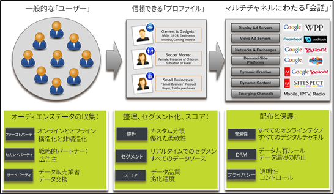

# Audience Manager の概要 {#audience-manager-overview}

Audience Manager は、オーディエンスデータアセットを 1 つにまとめるのに役立ちます。それにより、サイト訪問者について商業的に関連性のある情報の収集や、マーケティング用のセグメントの作成および適切なオーディエンスをターゲットにした広告やコンテンツの提供が容易になります。さらに、堅牢なデータ収集機能、制御機能および保護機能を備えており、タグの導入および管理も簡単です。

Audience Manager を利用すると、データ販売者、エクスチェンジ、または需要側プラットフォームに縛られることがありません。また、Audience Manager はお客様の提携先のデータアセットにまったくとらわれません。複数のデータソースにアクセスできるので、デジタルパブリッシャーは、Audience Manager によって幅広い種類のサードパーティデータやアドビのプライベートデータコープを利用できるようになります。ターゲットオーディエンスに関する正確かつ賢明な意思決定をおこなうために、弊社のパートナーソリューションチームの協力を求めてください。

## DMP（データ管理プラットフォーム）の 3 つの機能 {#dmp-three-functions}

DMP（データ管理プラットフォーム）の機能は、次のように 3 つのカテゴリにまとめることができます。

**データ入力**

Audience Manager は、チャネルとデバイス（Web 分析、CRM、デバイスデータ、e コマースなど）からファーストパーティデータを収集します。

**オーディエンスの作成**

データをオーディエンスプロファイルに統合し、デバイスやチャネルをまたいだ顧客の全体像を提供します。類似モデルを作成、オーディエンスセグメントとプロファイルのグループを構築し、セカンドパーティとサードパーティのデータソースで補完します。

**データ出力**

オーディエンスセグメントを、需要側プラットフォーム（DSP）、キャンペーン管理システム、その他のマーケティングプラットフォームにプッシュして活用します。

## 詳細情報 {#more-information}

詳しくは、次のリソースを参照してください。
* [Audience Manager の概要](https://www.adobe.com/jp/analytics/audience-manager.html)
* [Audience Manager のメリット](https://www.adobe.com/jp/analytics/audience-manager/benefits.html)
* [Audience Manager の機能](https://www.adobe.com/jp/analytics/audience-manager/features.html)

<!--

## History and Background {#history-and-background}

Audience Manager started as Demdex in 2008. It was acquired by Adobe Systems in 2011 and subsequently rebranded as Audience Manager.

## History {#history}

Since 2008, Audience Manager (formerly, [!UICONTROL Demdex]) has been a pioneer in the on-line audience management market. Audience Manager services power dynamic, multi-channel online data strategies. Our platform and services are used by an array of diverse industries from automobiles (AutoTrader), to airlines (American Airlines), and financial services companies (American Express). Audience Manager uses enterprise-level technology to provide the scale, reliability, analytics, and performance to help your business succeed online. Audience Manager integrates with the Adobe Experience Cloud to help you centralize, manage, and take action on your data assets across a growing number of digitally addressable channels.

## Audience Manager and its Data Management Platform (DMP) {#aam-dmp}

Audience Manager helps you manage your data pipeline. Our service is a catalyst that transforms generic users and raw data signals into actual audience segments used for multi-channel marketing efforts. Additionally, Audience Manager provides tools for tag management and audience analytics while simultaneously meeting the privacy and data security needs of clients and consumers.

-->
