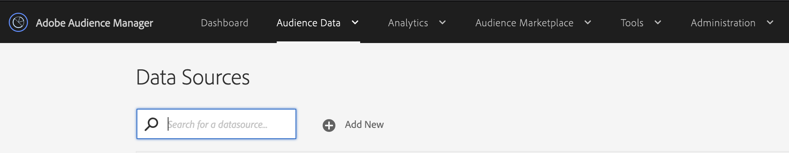
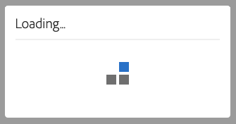

# Audience Manager のアクセシビリティ {#accessibility}

## 概要 {#overview}

アクセシビリティとは、視覚、聴覚、認知、運動など、様々な障碍のあるユーザーが、できる限り労力を費やすことなしに、ソフトウェア製品を使用できるようにする一連の機能を指します。

アドビは、アクセシビリティにおいて業界をリードする企業です。すべてのユーザーにとって利用しやすいリッチで魅力的なコンテンツを作成するよう開発者を促すことで、卓越した Web エクスペリエンスの作成をサポートします。 アドビのアクセシビリティに対する取り組みについて詳しくは、[アドビアクセシビリティ](https://www.adobe.com/accessibility.html)を参照してください。

ソフトウェア製品に見られる最も一般的なアクセシビリティ機能には、キーボード操作、意味構造、前景要素と背景要素の間の十分なコントラスト、支援技術サポート、明確な要素ラベルなどがあります。

[!DNL Audience Manager] を誰にとってもより使いやすいものにするために、アドビでは、複数のアクセシビリティ機能をサポートしています。

## キーボードナビゲーション {#keyboard-navigation}

[!DNL Audience Manager] は、完全なキーボードアクセシビリティをサポートしています。

* `Tab` キーおよび矢印キーで、ユーザーインターフェイスの個別の要素間を移動します。

  

* `Return`（`Enter`）キーおよび `Space` キーで、選択した項目をアクティブ化します。

## アクセス可能なテーブルの並べ替え {#table-sorting}

`Tab` キーを使用して操作するとテーブルヘッダーを選択でき、`Space` キーを押すことで並び順を変更できます。

## テクノロジー支援のサポート {#assistive-technologies}

セマンティックコードおよび [ARIA](https://www.w3.org/WAI/standards-guidelines/aria/) を使用することで、[!DNL Audience Manager] ユーザーインターフェイス内のインタラクティブ要素に、対応するラベル、アクセス可能な名前、その目的と現在の状態の両方を識別する役割を追加しています。

これにより、スクリーンリーダーなどの支援技術で、ラベルおよびその他の情報を読み上げることができ、ユーザーがより簡単にアプリケーションコントロールを操作できるようになります。

Audience Manager ユーザーインターフェイス内のすべてのインタラクティブ要素には、対応するラベルが含まれます。 これにより、スクリーンリーダーなどの支援技術で、ユーザーにラベルを読み上げることができます。

## カラーとコントラスト {#colors-contrast}

[!DNL Audience Manager] ユーザーインターフェイスは、ロービジョンや色覚異常のユーザーがアクセス可能な表示エクスペリエンスを確保するために、アプリケーションで十分なコントラストを提供するよう努力しています。

例えば、画面の読み込みでは、ローディングスピナーが白いモーダルボックス内に含まれ、それらすべてがダークグレーの上に重なります。

## 関連トピックス {#further-reading}

[!DNL Audience Manager] では、製品を誰にとっても使いやすいものにするアクセシビリティを提供するために、これまで以上に努力しています。

[アドビアクセシビリティフィードバックフォーム](https://www.adobe.com/accessibility/feedback.html)を使用して、お気づきの改善提案やアクセシビリティの問題を送信することをお勧めします。 いただいたフィードバックを参考に、[!DNL Audience Manager] を強化していきます。
