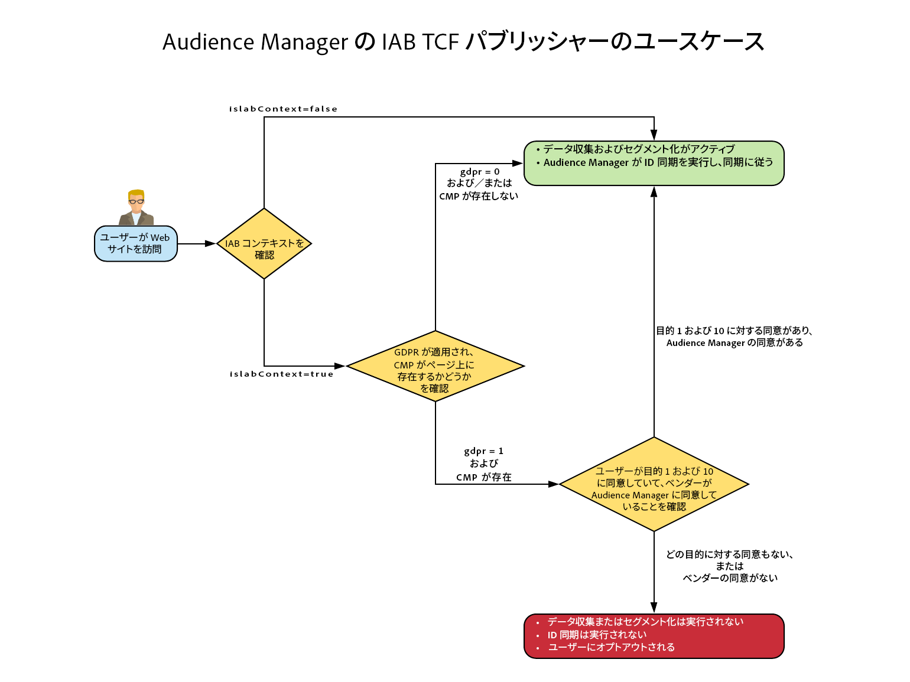
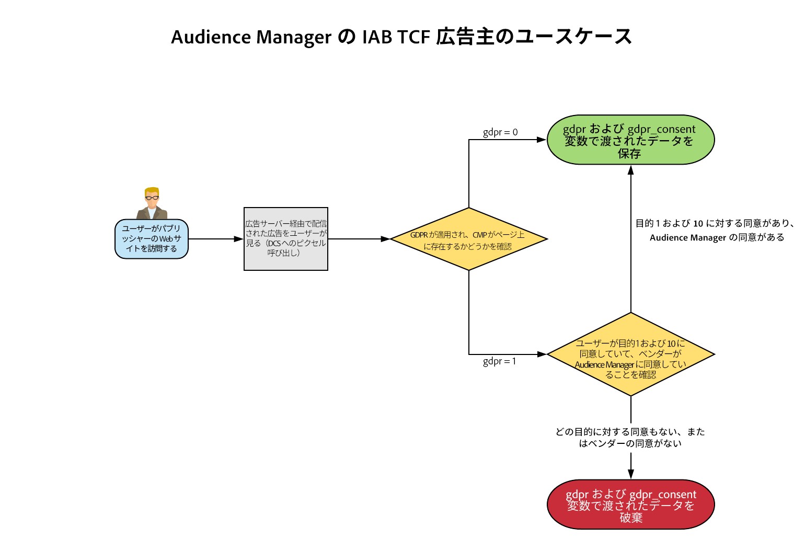

# [!DNL Audience Manager Plug-in for IAB TCF] {#aam-iab-plugin}

## 概要

ユーザーのプライバシー保護対策として重要なのは、個人データの活用方法（例：「目的」）および使用者（例：「会社」）に対するユーザーからの同意の取得です。

アドビでは、[オプトイン機能](https://docs.adobe.com/content/help/ja-JP/id-service/using/implementation/opt-in-service/optin-overview.html)と [IAB Transparency and Consent Framework（TCF）](https://iabtechlab.com/standards/gdpr-transparency-and-consent-framework/)のサポートを通じて、ユーザーのプライバシー選択を管理および伝達する手段を提供しています。

この記事では、IAB TCF をサポートする Audience Manager のユースケースと、Audience Manager での IAB TCF サポートの実装方法について説明します。

>[!IMPORTANT]
>
>Audience Manager は、[IAB TCF](https://iabeurope.eu/tcf-for-vendors/) に登録されています（ベンダー ID 565）。

IAB TCF 用 Audience Manager プラグインは、[オプトイン機能](https://docs.adobe.com/content/help/ja-JP/id-service/using/implementation/opt-in-service/iab.html)を利用します。これは、[Adobe Experience Platform ID サービス（ECID）](https://docs.adobe.com/content/help/ja-JP/id-service/using/home.html)ライブラリの一部です。

## 範囲と制限 {#scope-and-limitations}

Audience Manager を使用しているパブリッシャーまたは広告主は、IAB TCF に従い、ユーザーが選択した内容を Audience Manager に伝えることができます。

>[!IMPORTANT]
>
>IAB TCF の規制は、欧州経済圏内を拠点とする訪問者にのみ適用されます。

Audience Manager は、ユーザのプライバシー選択を尊重し、お客様が利用するすべてのパートナーに対して、プライバシー選択を簡単に伝える手段を提供します。

現在、Audience Manager は以下をサポートしていません。

* モバイルデバイスのワークフロー
* セグメントエクスポートに同意を追加します。

## から へのアップグレード [!DNL IAB TCF v2.0] {#upgrading}

[!DNL Audience Manager Plug-in for IAB TCF] 実装を [!DNL IAB TCF] v1.1 から [!DNL IAB TCF] v2.0 にアップグレードするユーザー、または [!DNL IAB TCF] v2.0 を初めて有効にするユーザーは、以下に説明する前提条件と実装に関する同じガイドラインに従う必要があります。

## 前提条件 {#prerequisites}

>[!IMPORTANT]
>
>Audience Manager は IAB TCF v2.0 をサポートしています。
>
>IAB TCF v1.1 のサポートは、2020 年 8 月 16 日に終了します。
>
> 同意管理のために IAB TCF 用 Audience Manager プラグインを引き続き使用する場合は、サポートを継続するために最新バージョンの [ECID](https://github.com/Adobe-Marketing-Cloud/id-service/releases) にアップグレードする必要があります。
>
> 最新の [ECID](https://github.com/Adobe-Marketing-Cloud/id-service/releases) バージョンにアップグレードした後は、IAB TCF v1.1 の同意文字列はサポートされなくなるので、最新の ECID バージョンにアップグレードする前に CMP を必ず更新してください。

Audience Manager で IAB TCF 用 Audience Manager プラグインを使用するには、次の前提条件を満たす必要があります。

1. Adobe Experience Platform ID サービス（ECID）バージョン 5 以降を使用している。アドビの最新 ECID リリースを[ダウンロード](https://github.com/Adobe-Marketing-Cloud/id-service/releases)してください。
2. [こちら](https://github.com/Adobe-Marketing-Cloud/dil/releases)からダウンロード可能な、Audience Manager [!DNL Data Integration Library]（DIL）バージョン 9.0 以降を使用している。[Audience Manager ドキュメントの DIL](../..//dil/dil-overview.md) をお読みください。Audience Manager の最も簡単な DIL 実装には、[Adobe Launch](https://docs.adobe.com/content/help/ja-JP/launch/using/extensions-ref/adobe-extension/adobe-audience-manager-extension.html) を使用することをお勧めします。
3. また、[!DNL Server-Side Forwarding]（SSF）を使用して Audience Manager にデータを読み込む場合は、最新バージョンの AppMeasurement を使用する必要があります。[Analytics コードマネージャー](https://docs.adobe.com/content/help/ja-JP/analytics/admin/admin-tools/code-manager-admin.html)を使用して AppMeasurement をダウンロードしてください。
4. IAB TCF v2.0 と統合された市販または独自の同意管理プラットフォーム（CMP）を使用し、IAB TCF に登録している。[IAB フレームワーク内の登録 CMP](https://iabeurope.eu/cmp-list/) のリストを参照してください。

>[!WARNING]
>
>IAB TCF v.2.0 をサポートしない同意管理プラットフォーム（CMP）を使用している場合、訪問者が欧州連合にいたとしても、Audience Manager は ID 同期で `gdpr=0` パラメーターを自動的に送信します。GDPR 検証が有効かどうかを判断するには、IAB TCF v2.0 をサポートしていることを CMP（同意管理プラットフォーム）で確認することをお勧めします。

## レコメンデーションと実装方法 {#recommendations}

Audience Manager で IAB TCF サポートを有効にするには、[IAB をオプトインで設定する方法](https://docs.adobe.com/content/help/ja-JP/id-service/using/implementation/opt-in-service/iab.html)に関するドキュメントをお読みください。

これをおこなう最も簡単な方法は、[Adobe Experience Platform Launch](https://docs.adobe.com/content/help/ja-JP/launch/using/overview.html) を使用して、プロパティに [!DNL ECID Opt-in] オプトインを追加することです。Launch 拡張機能のセットアップ方法については、[ECID オプトイン拡張機能](https://docs.adobe.com/content/help/ja-JP/launch/using/extensions-ref/adobe-extension/id-service-extension/overview.html)をお読みください。

## IAB フレームワークを使用する場合のユーザー選択ワークフロー {#user-choice-workflow}

Web プロパティを訪問する際、ユーザーは、パブリッシャーや、パブリッシャーが連携しているサードパーティベンダーによるデータの使用方法について、自分たちが選択した内容を提供することができます。

ユーザーは、グローバルベンダーリストに登録した&#x200B;*サードパーティベンダー*&#x200B;に対し、IAB 目的の&#x200B;*同意*&#x200B;と&#x200B;*正当な利益*&#x200B;の形で選択肢を提供します。

以下の画像は、Web サイトの初回訪問者に表示される CMP ダイアログの例を表しています。このダイアログは、顧客の実装に基づいて、大幅に異なることがあります。


IAB TCF v2.0 に含まれる様々な目的と権限の詳細については、[IAB Europe の透明性および同意フレームワークポリシー](https://iabeurope.eu/iab-europe-transparency-consent-framework-policies/#A_Purposes)を参照してください。

ユーザーは、目的とベンダーの組み合わせに対して、同意または正当な利益（利用可能な場合）を付与できます。例えば、ユーザーは、デバイスへの情報の保存、製品の開発や改善、および CMP によって表示されるすべてのサードパーティベンダーに同意できます。

また、すべての目的に対して同意や正当な利益を与え、CMP によって表示される少数のベンダーに対して同意や正当な利益を与えることもできます。

ユーザーがプライバシーを選択すると、ユーザーが選択した内容が IAB TC 文字列に記録されます。IAB TC 文字列には、承認された目的とベンダーの組み合わせと共に、その他のメタデータ情報（詳しくは [IAB ページ](https://github.com/InteractiveAdvertisingBureau/GDPR-Transparency-and-Consent-Framework/blob/master/TCFv2/IAB%20Tech%20Lab%20-%20Consent%20string%20and%20vendor%20list%20formats%20v2.md#about-the-transparency--consent-string-tc-string)を参照）も含まれます。

IAB TCF に登録されているすべてのベンダーは、IAB TC 文字列を評価し、ユーザーのプライバシー選択に基づいて判断を下します。ユーザーのプライバシー選択は、IAB TCF に登録されているすべてのベンダーで有効であることに注意してください。

## Audience Manager で求められる目的 {#aam-standard-purposes}

Audience Manager は、[IAB Europe の透明性および同意フレームワークポリシー](https://iabeurope.eu/iab-europe-transparency-consent-framework-policies/#A_Purposes)に定義されている次の目的で、IAB TC 文字列に保存されている ユーザーの選択を評価します。また、この目的は、[グローバルベンダーリスト](https://vendorlist.consensu.org/vendorlist.json)でも確認できます。

* **目的 1**：デバイス上に情報を保存し、その情報にアクセスする
* **目的 10**：製品の開発と改善
* **特別な目的 1**：セキュリティの確保、不正の防止、デバッグ。

>[!IMPORTANT]
>
>Audience Manager では、目的 1 および目的 10 に対する同意が必要です。また、Cookie をデプロイして ID 同期を開始または有効化するために、ベンダーの同意が必要です。
>
>[IAB 規制](https://iabeurope.eu/iab-europe-transparency-consent-framework-policies/#Special_Purpose_1__Ensure_security_prevent_fraud_and_debug_)に従い、特別な目的 1（セキュリティの確保、不正の防止、デバッグ）には常に同意するものとし、ユーザーは異議を唱えることはできません。

## Audience Manager の動作は、ユーザーが同意するかどうかによって異なります {#aam-behavior-consent}

2 つの目的（デバイス上のストアおよび／またはアクセス情報、製品の開発と改善）に対するユーザーの同意が IAB TC 文字列に含まれるかどうかによって、Audience Manager の動作は異なります。

また、Audience Manager で作業するすべての宛先が IAB TCF に登録されている限り、それらの宛先に対するユーザーの同意を確認します。

| ユーザーが&#x200B;*同意*&#x200B;した場合、Audience Manager は以下をおこないます。 | ユーザーが&#x200B;*拒否*&#x200B;した場合、Audience Manager は以下をおこないます。 |
|---|---|
| <ul><li>リクエストした Audience Manager のユースケースをすべて実行する。</li><li>ID 同期でサードパーティに同意する（`gdpr = 1` およびコンセントストリングを ID 同期呼び出しで `gdpr_consent` として渡す）。</li><li>広告サーバーピクセルから渡される同意を評価して順守する。</li><li>パートナーが開始した ID 同期に従う。</li></ul> | <ul><li>インスタンスに新しいユーザーデータを保存しない。（パートナー ID、シグナル、特性またはピクセルデータを含む）。</li><li>サードパーティ ID 同期を開始しない。</li><li>パートナーが開始した ID 同期に従わない。</li><li>ユーザーをその他のデータ収集からオプトアウトします。</li></ul> |

## パブリッシャーのユースケース {#publisher-use-case}

IAB TCF 用 Audience Manager プラグインを実装すれば、アドビまたは他のサードパーティベンダーの異なるメカニズムを使用して、Web プロパティ上に同意管理のカスタムコードを保持する必要がなくなります。ユースケースについては、画像と次の手順で説明します。画像の左から開始します。

1. ユーザーが Web プロパティの 1 つを訪問します。最新バージョンの ECID および DIL ライブラリ（[前提条件](/help/using/overview/data-security-and-privacy/aam-iab-plugin.md#prerequisites)を参照）を使用している限り、オプトインフローがトリガーされます。
2. Audience Manager は、IAB フローが適用されるかどうかを確認します（`isIabContext=true`）。[レコメンデーションおよび実装方法](aam-iab-plugin.md#recommendations)を参照してください。
3. Audience Manager は、GDPR が適用されるか（`gdpr = 1`）、Web プロパティで IAB TCF に CMP が登録されているかどうかを確認します。例えば、これが欧州連合からの訪問者に適用されるとします。パブリッシャーは、GDPR フラグを設定する責任を負います。
4. GDPR が適用される場合、Audience Manager は、必要な権限に対し、パラメーター `gdpr_consent` に渡された IAB TC 文字列を確認します。Audience Manager は、デバイスでの情報の保存／アクセス（[IAB TCF 目的 1](https://iabeurope.eu/iab-europe-transparency-consent-framework-policies/#A_Purposes)）、製品の開発と向上（[IAB TCF 目的 10](https://iabeurope.eu/iab-europe-transparency-consent-framework-policies/#A_Purposes)）、および Audience Manager によるデータの保存、処理、アクティベートに関する同意を得る必要があります。
5. IAB TC 文字列が存在し、必要な同意が含まれている場合、Audience Manager は IAB TC 文字列をアドビの[データ収集サーバー](../../reference/system-components/components-data-collection.md)（DCS）に渡します。
6. Audience Manager は、ブラウザーで [demdex cookie](https://docs.adobe.com/content/help/ja-JP/core-services/interface/ec-cookies/cookies-am.html) を設定することによって応答し、サードパーティ ID 同期を開始し、その同期に従います。
7. または、手順 4 で渡された IAB TC の文字列に必要なすべての権限が含まれていない場合、Audience Manager はユーザーデータを収集、処理またはアクティブ化せず、ID 同期を実行または開始しません。さらに、操作する宛先からユーザーをオプトアウトします。

>[!IMPORTANT]
>
>IAB TCF パラメーターを必要とする Audience Manager の宛先パートナーと連携しているけれど、Web サイトに IAB TCF をサポートする CMP がない場合、Audience Manager は ID 同期の際に `gdpr=0` を送信します。つまり、GDPR はこれらのユーザーには適用されません。
>
> それが望ましくない場合は、Audience Manager で IAB TCF 機能を有効にして、適切な IAB TC 文字列を宛先のパートナーに送信する必要があります。




## 広告主のユースケース {#advertiser-use-case}

Audience Manager は、IAB TCF に従って、[ピクセル呼び出し](../../integration/sending-audience-data/real-time-data-integration/pixel-based-data-transfer.md)で渡される同意を評価し、順守します。

ピクセルは、Audience Manager のユーザーによってパートナーページに配置されるか、広告サーバーに配置されて広告レスポンスに含められることがあります。最初のケースでは、パートナーはプログラムによって同意パラメーターを取得し、実行する前にピクセルに追加する必要があります。より一般的な 2 番目のケース（以下で説明します）では、広告サーバーは、サプライ側プラットフォーム（SSP）またはパブリッシャー広告サーバーから受信した同意パラメーターを、すべてのピクセルに受信する同意パラメーターを追加します。

Audience Manager では、ピクセル呼び出しでユーザーの同意を渡すために 2 つのパラメーターを使用します。

* `gdpr` には、0（GDPR 適用対象外）または 1（GDPR 適用対象）を使用できます。
* `gdpr_consent` は、URL で使用できる base64 でエンコードされた GDPR コンセントストリングです（[ の仕様](https://github.com/InteractiveAdvertisingBureau/GDPR-Transparency-and-Consent-Framework/blob/master/TCFv2/IAB%20Tech%20Lab%20-%20Consent%20string%20and%20vendor%20list%20formats%20v2.md#about-the-transparency--consent-string-tc-string)を参照）。インプレッションピクセルのサンプル呼び出しは、次の 2 つのパラメーターのようになります。

```
http://yourcompany.demdex.net/event?d_event=imp&gdpr=1&gdpr_consent=consentstring&d_src=datasource_id&d_site=siteID&d_creative=creative_id&d_adgroup=adgroup_id&d_placement=placement_id
```

ユースケースについては、画像と次の手順で説明します。画像の左から開始します。

1. ユーザーは、広告サーバー経由でインプレッションを提供します。これは、アドビのデータ収集サーバー（DCS）への[ピクセル呼び出し](../../integration/media-data-integration/impression-data-pixels.md)に変換されます。
2. Audience Manager は、GDPR フラグが適用されるかどうかを確認します。適用されない場合、Audience Manager は `gdpr` および `gdpr_consent` に渡されたデータをピクセル呼び出しに保存します。
3. IAB TC 文字列が存在し、必要な権限が含まれている場合、Audience Manager は `gdpr` および `gdpr_consent` 変数で渡されたデータをピクセル呼び出しに保存します。
4. IAB TC 文字列がない、または必要な権限が不足している場合、Audience Manager は `gdpr` および `gdpr_consent` に渡されたデータをピクセル呼び出しから破棄します。



## IAB TCF をサポートするアクティベーションパートナー {#aam-activation-partners}

IAB TCF 用 Audience Manager プラグインを使用すると、ユーザーのプライバシー選択に従い、IAB TC 文字列をアクティベーションパートナーに転送できます。IAB TCF をサポートするアクティベーションパートナーに関する情報は、[デバイスベースの宛先のリストト](/help/using/features/destinations/device-based-destinations-list.md)を参照してください。

## URL の宛先へ送信する URL への同意の追加

IAB TCF v2.0 との Audience Manager 統合では、[URL 宛先](../../features/destinations/create-url-destination.md)に送信される情報に同意を付加し、IAB TCF v2.0 と統合できます。ただし、特定の URL 形式が破損するのを回避するため、Audience Manager はこの処理を自動的に実行しません。

[!DNL URL destinations] に送信するデータに同意を追加する場合は、URL 形式に `${GDPR}` マクロと `${GDPR_CONSENT_XXXX}` マクロを手動で追加し、`XXXX` を宛先パートナー ID に置き換える必要があります。

例：`http://yourdomain.com?gdpr=${GDPR}&gdpr_consent=${GDPR_CONSENT_1234}`。

サポートされている宛先マクロの詳細は、「[定義された宛先マクロ](../../features/destinations/destination-macros.md)」を参照してください。

## デバイス間の同意管理

IAB TCF 用 Audience Manager プラグインは、サイトの訪問者が適切な権限を付与していない場合、リクエストに存在する ID を自動的にオプトアウトします。リクエストに [クロスデバイス ID（CRM ID）](../../reference/ids-in-aam.md)が含まれる場合、Audience Manager は、その[クロスデバイス ID（CRM ID）](../../reference/ids-in-aam.md)にリンクされている最後のデバイスと共に、ID をオプトアウトします。

## IAB 実装のテスト {#test-iab-implementation}

IAB TCF 用 Audience Manager プラグインを正しく実装できているかをテストするには、[オプトインサービスの検証のユースケース 4](https://docs.adobe.com/content/help/ja-JP/id-service/using/implementation/opt-in-service/testing-optin-and-iab-plugin.html#section-64331998954d4892960dcecd744a6d88) を参照してください。

## Audience Manager の IAB およびオプトアウト。優先順位。 {#iab-and-optout}

ユーザーが選択できるもう一つのプライバシーオプションは、すべてのデータ収集をオプトアウトする機能です。アドビはユーザーに対し、[プライバシーの選択肢](https://www.adobe.com/jp/privacy/opt-out.html#customeruse)ページ内でオプトアウトを提供しています。

Audience Manager は、[ドキュメントの別の記事](data-privacy-requests.md#opt-out-requests)で、オプトインのリクエストに対処しています。

>[!IMPORTANT]
>
>同意を拒否した後にすべてのデータ収集をオプトアウトしたユーザーは、オプトインできません。

>[!NOTE]
>
>**優先順位**：ユーザーがグローバルオプトアウトツールを使用してデータ収集をオプトアウトする場合、上記のリンクに記載されているように、オプトインおよび IAB の検証よりも優先されます。

## その他のリソース {#additional-resources}

* [Adobe Experience Platform ID サービスのオプトイン](https://docs.adobe.com/content/help/ja-JP/id-service/using/implementation/opt-in-service/optin-overview.html)
* [IAB Europe GDPR の透明性および同意フレームワーク](https://iabtechlab.com/standards/gdpr-transparency-and-consent-framework/)
* [IAB Europe GDPR の透明性および同意フレームワークの技術仕様](https://github.com/InteractiveAdvertisingBureau/GDPR-Transparency-and-Consent-Framework/blob/master/Consent%20string%20and%20vendor%20list%20formats%20v1.1%20Final.md)
* [IAB TCF プラグイン - ビデオデモ](https://helpx.adobe.com/jp/audience-manager/kt/using/iab-tcf-support-audience-manager-technical-video-implement.html)