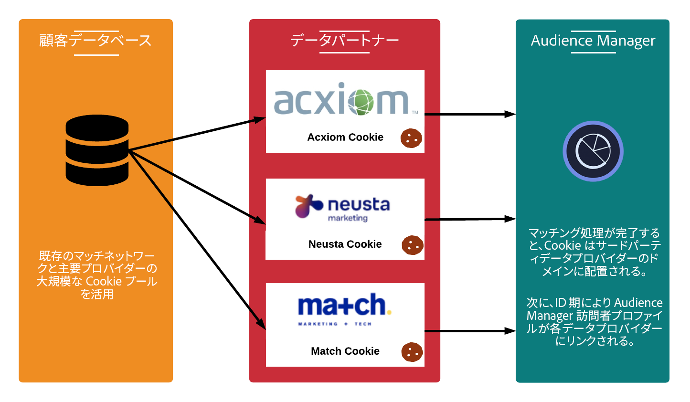

# 収集されるデータのタイプ {#types-of-data-collected}

[!DNL Audience Manager] はファーストパーティ、セカンドパーティ、サードパーティのデータの収集および管理をサポートします。

複数のサイロに格納された顧客情報アセットを解放することは、今日、企業が直面しているデータに関する最大の課題の 1 つです。[!DNL CRM] データベースから、登録システムや広告サーバーなどまで、企業は、貴重なデータを一元化し、顧客／オーディエンス情報を単一の戦略的データアセットとして管理するのに役立つツールを必要としています。[!DNL Audience Manager] は、孤立した顧客情報を解放し、複数のソースからのデータ収集を管理するのに役立ちます。収集されたデータは、データ要素の有効期限（[!DNL TTL]）値に基づいて管理できます。これは、パブリッシャーがすべてのソースのデータの有効期限を制御するのに役立ちます。[!DNL Audience Manager] は、以下のデータタイプの管理を支援するように設計されています。

| データタイプ | データの発生源 |
|---|---|
| **ファーストパーティ** | 顧客。データは、オンライン（Web サイトでの消費者とのやり取り）またはオフラインで収集されます。 |
| **セカンドパーティ** | 戦略的パートナーおよび広告主。 |
| **サードパーティ** | データプロバイダーおよびデータ交換。データには、インテント、デモグラフィック、ソーシャル／ライフスタイル、サイコグラフィックなどの情報が含まれる可能性があります。 |

## ファーストパーティデータ収集 {#first-party-data}

ファーストパーティデータの収集は [!DNL Audience Manager] のメインとなる機能です。コアとなるこの機能は、マーケティングプログラムの土台とするために、または他のデータソースに対してターゲティングもしくはモデリングをおこなうために独自データを使用するお客様（パブリッシャーや広告主）のニーズに応えるものです。

[!DNL Audience Manager] では、クライアントと協力しながらデータ戦略を把握したうえで、その戦略を独自のデータ収集プランに取り込みます。弊社のパートナーソリューションチームはお客様と連携して、サイトや生データのシグナルなどの Web サイト上のユーザーインタラクションを評価します。アドビはこの情報を基に、インベントリの様々なページからユーザーレベルのデータシグナルを取得するための、お客様専用のデータ収集戦略を作成するお手伝いをします。収集されたデータは保存され、定義済みの分類に再マッピングされます。これらはビジネス上のニーズの変化に応じていつでも更新できます。

次の例では、サンプルのショッピングページからどのようなデータ要素を取得できるかを示します。

| 項目 | 説明 |
|---|---|
| 1 | **性別**。買い物客の性別は、通常、名を見ればわかります。この例では、買い物客の名は Mary なので、女性であることがわかります。名前は Audience Manager には保存されません。 |
| 2 | **関心**。買い物かごの品目は、様々な関心を示す場合があります。例では、Mary はフィットネス機器を多く購入しています。 |
| 3 | **住居のタイプ**。配送先や請求先の住所に基づいて、Mary がフィットネス機器を自分用と会社用のどちらで購入したかを推測できます。 |
| 4 | **場所**.場所を特定する際は、[!DNL IP] アドレスよりも郵便番号（[!DNL ZIP] コード）を使用すると信頼性が高くなります。 |
| 5 | **プロモーションの親和性**。プロモーションコードやギフトカードを使用する買い物客はおそらく、最安値を探すバーゲンのプロです。 |
| 6 | **購買力**。郵便番号（[!DNL ZIP+4] コード）と相関する価格データは、特定の場所の購買力を示します。 |

生データの収集後、それらは [!DNL Audience Manager] プラットフォーム内で顧客定義の特性に再マッピングされます。分類もデータマッピングも、データ収集コードを変更することなく、いつでも調整できます。

## セカンドパーティデータ収集 {#second-party-data}

セカンドパーティデータは戦略ビジネスパートナーのデータです（パブリッシャーのデータではありません）。この情報はファーストパーティデータと同様に収集および管理されます。

セカンドパーティデータのシナリオでは、広告主が自身のデータアセットをパブリッシャーに送信し、その情報をパブリッシャーのデータと組み合わせてよりターゲティングされた広告プログラムを展開します。さらに、パブリッシャーは他の広告主と連携することで、オーディエンスプールを拡大することができます。ほとんどの場合、これらの調整においては契約上、[!DNL Audience Manager] のコンテナタグをパートナーサイトに配置して、データの収集および共有を円滑にすることのみに制限されます。

セカンドパーティデータの収集およびリマーケティングの例としては、ある衣料販売店が製品に関するデータを収集し、これらの情報を主要なパートナーと共有するようなケースが挙げられます。この場合、様々なジャケットの色とサイズを選択した消費者向けに、[!DNL Audience Manager] パートナーサイトをまたいで異なる広告を提供できます。

## サードパーティデータ収集 {#third-party-data}

サードパーティデータの情報は、[!DNL Audience Manager] 外部のベンダーによって収集および共有されます。

サードパーティデータは、既存のデータ[!UICONTROL segments]（年齢、世帯収入など）へ適合させたり、これ以外の方法で取得できない必要なデータを入手したり、ファーストパーティおよびセカンドパーティの既知のユーザーベースに対して類似モデリングをおこなうのに使用されます。[!DNL Audience Manager] は様々なサードパーティデータプロバイダーと連携しています。アドビは、お客様がこれらのデータプロバイダーが収集するデータのタイプを理解し、個々のプロバイダーに応じて適切な戦略取引を構築するお手伝いをします。

>[!NOTE]
>
>[!DNL Audience Manager] でサポートされるサードパーティデータプロバイダーの完全なリストについては、[Adobe Audience Finder](https://www.adobe-audience-finder.com/)/を参照してください。

[!DNL Audience Manager] は、利用可能な [!DNL APIs] およびデータセットによっては、他のデータプロバイダーとも連携します。データ収集は、ユーザーがサイトを表示したときにリアルタイムでおこなわれるか、またはユーザーがサイトを退出後、パートナー間で ID 同期がおこなわれ、サーバー間データ転送がおこなわれるアウトオブバウンド方式でおこなわれます。どちらの場合でも、サードパーティデータは弊社のプラットフォーム上で同期されるので、[!DNL Audience Manager] が個々のクライアントまたはドメイン上で独自に同期をおこなう必要がなくなります。これにより、ページからのサーバー呼び出しを減らしながら、リーチを拡大することができます。

## マッチングパートナー  {#match-partners}

クライアントの多くは、サードパーティのデータマッチング企業とパートナー連携しています。これらの企業は登録を伴う各種サイトとつながっており、企業が持つ登録ネットワークに基づき、リアルタイムで顧客データファイルのマッチングをおこないます。

