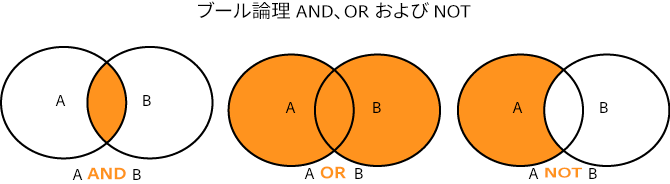

# 特性およびセグメントビルダーのブール式 {#boolean-expressions-in-trait-and-segment-builder}

ここでは、Audience Manager の特性およびセグメントツールでブール式 AND、OR、NOT がどのように使用されるかを説明します。

<!-- 

c_tb_boolean.xml

 -->

**ブール式**

ブール論理は代数の一分野で、いくつかの基本的な式（または演算子）を使用して、ステートメントが真か偽かを判別します。最も一般的な演算子は [!UICONTROL OR]、[!UICONTROL AND] および [!UICONTROL NOT] です。これらの式を組み合わせると、データ要件に合う焦点を絞った特性またはセグメント資格認定ルールを作成することができます。基本的なブール式の動作を以下の図に示します。

  

>[!NOTE]
>
>[!UICONTROL NOT] 演算子は、暗黙の「and」条件を使用します。また、[!UICONTROL AND NOT] と記述されることがあります。

**特性およびセグメントビルダーでのブール式の使用方法**

ブール式で特性およびセグメント資格認定ルールを作成します。[!UICONTROL OR]、[!UICONTROL AND] および [!UICONTROL NOT] を使用して資格認定条件を作成する場合の一般的なベストプラクティスを次の表に示します。

<table id="table_C762872C98F54C4A86A2F1C840A86657"> 
 <thead> 
  <tr> 
   <th colname="col1" class="entry"> 式 </th> 
   <th colname="col2" class="entry"> 用途 </th> 
   <th colname="col3" class="entry"> 認定条件 </th> 
  </tr>
 </thead>
 <tbody> 
  <tr> 
   <td colname="col1"> 
<b> AND</b> 
 </td> 
   <td colname="col2"> 
焦点を絞ったオーディエンス資格認定要件。 
 </td> 
   <td colname="col3"> 
ユーザーは、指定されたすべての特性またはセグメントに属している<i>必要がある</i>。 
 </td> 
  </tr> 
  <tr> 
   <td colname="col1"> 
<b> OR</b> 
 </td> 
   <td colname="col2"> 
視野の広いオーディエンス資格認定要件。 
 </td> 
   <td colname="col3"> 
ユーザーは、指定された任意の特性またはセグメントに属す<i>ことができる</i>。 
 </td> 
  </tr> 
  <tr> 
   <td colname="col1"> 
<b>NOT</b> 
 </td> 
   <td colname="col2"> 
焦点を絞ったオーディエンス資格認定要件。 
 
オーディエンス資格認定要件の定義が困難または非効率的になる複数の条件がある場合に役に立ちます。包含よりも除外の要件に対して検証が容易になることがあります。 
 </td> 
   <td colname="col3"> 
ユーザーは、除外された特性またはセグメントに属す<i>ことはできない</i>。 
 </td> 
  </tr> 
 </tbody> 
</table>

**[!UICONTROL AND] のユースケースの例**

[!UICONTROL AND] 演算子は、特性メンバーシップ要件を簡単に列挙できた場合に役に立ちます。例えば、「expensive camera shoppers」のオーディエンスを作成する必要があるとします。ピクセルモデルでは、カメラおよび価格の数値の値のピクセルを作成してページ上に配置する必要がありました。これに対して、特性では、ブール演算子を適用して両方の条件（カメラ [!UICONTROL AND] 価格）を処理できます。その結果、HTTP 呼び出しの少ない効率的なデータ収集が可能になり、サイト上のユーザーエクスペリエンスを維持するのに役立ちます。

**[!UICONTROL OR] のユースケースの例**

[!UICONTROL OR] 演算子は、幅広いオーディエンス資格認定要件でシグナルを作成する場合に役に立ちます。いくつかの特性またはセグメント資格認定要件がある場合、[!UICONTROL OR] 演算子は、サイト訪問者がこれらの特徴の&#x200B;*いずれか*&#x200B;を示した場合に真と評価されます。[!UICONTROL OR] は、対象となるサイト訪問者の幅広いオーディエンスをすばやく作成する場合に最も役に立ちます。

**[!UICONTROL AND NOT] のユースケースの例**

[!UICONTROL AND NOT] 演算子は、*包含*&#x200B;よりも&#x200B;*除外*&#x200B;でオーディエンスを定義するほうが簡単になる場合に役に立ちます。例えば、セールがあり、訪問者から定価の商品のみを調べる顧客にセグメント化したいとします。すべての定価またはセール価格の商品のシグナルのリストを作成するよりも、セール価格の商品を表示&#x200B;*しなかった*&#x200B;かどうかで訪問者を区別するほうが簡単です。これは、管理上、効率的です。通常、定価で提供している商品よりも、セール価格の商品のほうが少ないからです。ブール値 [!UICONTROL NOT] では、セールシグナルを&#x200B;*示さない*&#x200B;訪問者を定価のオーディエンスメンバーシップの対象にします。一方、[!UICONTROL AND NOT] は [!UICONTROL AND] のユースケースとは反対で、これが、オーディエンスメンバーシップが含有で決まることを示しています（つまり、2 つの明示的に示されたシグナルに基づいて訪問者が区別されます）。

>[!MORELIKETHIS]
>
>* [特性ビルダーでの比較演算子の使用](../features/traits/trait-comparison-operators.md)
>* [特性ビルダーでの演算順序](../features/traits/trait-operator-precedence.md)

