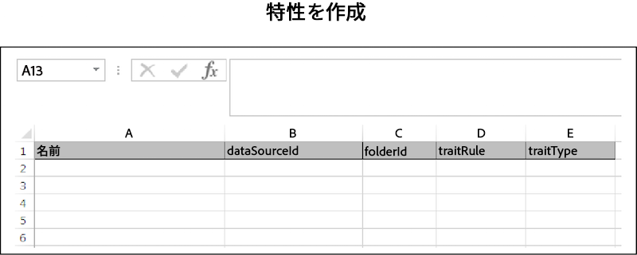

# 一括作成{#bulk-create}

一括作成により、複数のデータソース、派生シグナル、セグメント、特性およびその他の項目を 1 回の操作で作成できます。一括作成のリクエストをおこなうには、以下の手順に従ってください。

>[!IMPORTANT]
>
>Bulk Management Tools は、Adobeで正式にサポートされているサービスではありません。 カスタマーケアを通じたトラブルシューティングとサポートは、ケースバイケースで対応します。

<!-- 

t_bulk_create.xml

 -->

>[!NOTE]
>
>[!DNL Audience Manager] UI で割り当てられる [RBAC グループ権限](../../features/administration/administration-overview.md)は、[!UICONTROL Bulk Management Tools] に対しても適用されます。

>[!CAUTION]
>
>一括作成リクエストではオブジェクトタイプが混在しないようにしてください。各オブジェクトのヘッダーは一意で、結合できません。ワークシートをクリアして、項目ごとに別のリクエストを作成します。

オブジェクトを一括作成するには、「[!UICONTROL Bulk Management Tools]」ワークシートを開いてから、以下の手順に従ってください。

1. 「**[!UICONTROL Headers]**」タブをクリックして、追加する項目の作成ヘッダーをコピーします。
2. 「**[!UICONTROL Create]**」タブをクリックします。
3. 作成ヘッダーを、更新ワークシートの 1 行目に貼り付けます。
4. ヘッダーラベルに基づいて、変更するデータを対応する列に貼り付けるか入力します。
5. ワークシートのツールバーで、更新する項目の作成ボタンをクリックします。これにより、[!UICONTROL Account Information] ダイアログボックスが開きます。
6. 必要な[ログオン情報](../../reference/bulk-management-tools/bulk-management-intro.md#auth-reqs)を入力し、「**[!UICONTROL Submit]**」をクリックします。

ワークシートに「[!UICONTROL Results]」列が作成されます。「[!UICONTROL Results]」列には、成功した操作の JSON レスポンスが返されます。例については[&#x200B; REST API](../../api/rest-api-main/rest-api-main.md) を参照してください。データを入力する前の一括作成ワークシートは、次の例のようになります。ただし、作成オプションのすべてがここに表示されているわけではありません。この例は、完成したワークシートの概要を把握するためのものです。

一括更新でエラーが発生した場合や失敗した場合は、[一括管理ツールのトラブルシューティング](../../reference/bulk-management-tools/bulk-troubleshooting.md)を参照してください。
