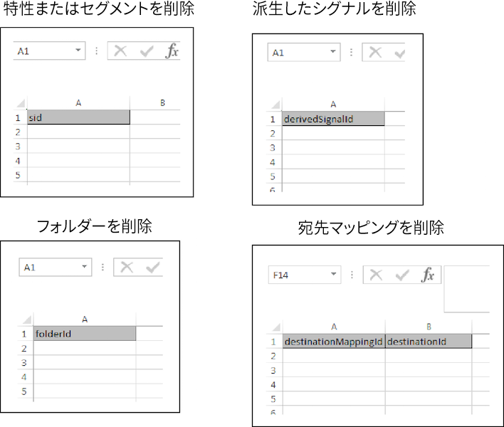

# 一括削除 {#bulk-delete}

一括削除では、複数のセグメント、特性、フォルダー、派生シグナル、データソース、モデル、および宛先を 1 回の操作で削除できます。一括削除リクエストをおこなうには、以下の手順に従ってください。

<!-- 

t_bulk_delete.xml 

 -->

>[!NOTE]
>
>[!DNL Audience Manager] UI で割り当てられる [RBAC グループ権限](../../features/administration/administration-overview.md)は、[!UICONTROL Bulk Management Tools] に対しても適用されます。

>[!NOTE]
>
>宛先にセグメントがマッピングされている場合、宛先マッピングの一括削除は失敗します。宛先を一括削除する前に、ユーザーインターフェイスで宛先からセグメントを削除します。また、特性フォルダーとセグメントフォルダーを削除するには、そのフォルダーが空でなければなりません。

複数の項目を削除するには、[!UICONTROL Bulk Management Tools] ワークシートを開き、以下の手順に従ってください。

1. 「**[!UICONTROL Headers]**」タブをクリックして、追加する項目の作成ヘッダーをコピーします。
2. 「**[!UICONTROL Delete]**」タブをクリックします。
3. 削除ヘッダーを、更新ワークシートの 1 行目に貼り付けます。
4. 削除するオブジェクトの ID を、ヘッダーの下の列に貼り付けるか入力します。
5. 必要な[ログオン情報](../../reference/bulk-management-tools/bulk-management-intro.md#auth-reqs)を入力し、「**[!UICONTROL Submit]**」をクリックします。

   ワークシートに「[!UICONTROL Results]」列が作成されます。「[!UICONTROL Results]」列に、アイテムが削除されたかどうかを表すメッセージ、またはエラーメッセージが返されます。データを入力する前の一括更新ワークシートは、次のようになります。

一括更新でエラーが発生した場合や失敗した場合は、[一括管理ツールのトラブルシューティング](../../reference/bulk-management-tools/bulk-troubleshooting.md)を参照してください。
