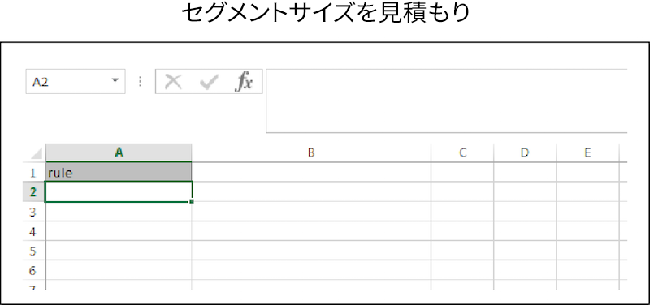

# 一括予測{#bulk-estimates}

一括予測では、セグメントルールに基づきセグメントサイズデータが返されます。一括予測リクエストをおこなうには、以下の手順に従ってください。

<!-- 

t_bulk_estimates.xml

 -->

>[!NOTE]
>
>[!UICONTROL Bulk Management Tools] は、[!DNL Audience Manager] ではサポートされて&#x200B;*いません*。このツールはあくまで情報提供および便宜を目的として提供されています。一括変更については、代わりに [Audience Manager API](../../api/rest-api-main/aam-api-getting-started.md) を使用することを推奨します。[!DNL Audience Manager] UI で割り当てられる [RBAC グループ権限](../../features/administration/administration-overview.md) は、[!UICONTROL Bulk Management Tools] に対しても適用されます。

一括更新をおこなうには、[!UICONTROL Bulk Management Tools] ワークシートを開き、以下の手順に従ってください。

1. 「**[!UICONTROL Headers]**」タブをクリックし、「[!UICONTROL Estimate Segment Size]」ヘッダーをコピーします。
1. 「**[!UICONTROL Estimate]**」タブをクリックします。
1. 予測ヘッダーを、予測ワークシートの 1 行目に貼り付けます。
1. ヘッダーラベルに基づいて、変更するデータを対応する列に貼り付けるか入力します。
1. ワークシートのツールバーで、更新する項目の作成ボタンをクリックします。これにより、[!UICONTROL Account Information] ダイアログボックスが開きます。

1. 必要な[ログオン情報](../../reference/bulk-management-tools/bulk-management-intro.md#auth-reqs)を入力し、「**[!UICONTROL Submit]**」をクリックします。

この操作により、ワークシートに「[!UICONTROL Response]」列が作成され、セグメントの予測サイズのデータが格納されます。データを入力する前の一括予測ワークシートは、次のようになります。

一括更新でエラーが発生した場合や失敗した場合は、[一括管理ツールのトラブルシューティング](../../reference/bulk-management-tools/bulk-troubleshooting.md)を参照してください。

