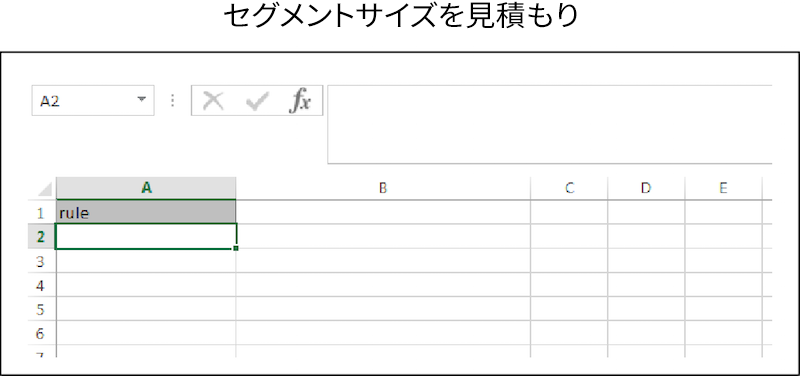

# 一括予測{#bulk-estimates}

一括予測では、セグメントルールに基づきセグメントサイズデータが返されます。一括予測リクエストをおこなうには、以下の手順に従ってください。

>[!IMPORTANT]
>
>一括管理ツールは、公式にサポートされているAdobe製品ではありません。 カスタマーサポートによるトラブルシューティングおよびサポートは、ケースバイケースで対応します。

<!-- 

t_bulk_estimates.xml

 -->

>[!NOTE]
>
>[!DNL Audience Manager] UI で割り当てられる [RBAC グループ権限](../../features/administration/administration-overview.md)は、[!UICONTROL Bulk Management Tools] に対しても適用されます。

一括更新をおこなうには、[!UICONTROL Bulk Management Tools] ワークシートを開き、以下の手順に従ってください。

1. 「**[!UICONTROL Headers]**」タブをクリックして、[!UICONTROL Estimate Segment Size] ヘッダーをコピーします。
2. 「**[!UICONTROL Estimate]**」タブをクリックします。
3. 予測ヘッダーを、予測ワークシートの 1 行目に貼り付けます。
4. ヘッダーラベルに基づいて、変更するデータを対応する列に貼り付けるか入力します。
5. ワークシートのツールバーで、更新する項目の作成ボタンをクリックします。これにより、[!UICONTROL Account Information] ダイアログボックスが開きます。
6. 必要な[ログオン情報](../../reference/bulk-management-tools/bulk-management-intro.md#auth-reqs)を入力し、「**[!UICONTROL Submit]**」をクリックします。

この操作により、ワークシートに「[!UICONTROL Response]」列が作成され、セグメントの予測サイズのデータが格納されます。データを入力する前の一括予測ワークシートは、次のようになります。

一括更新でエラーが発生した場合や失敗した場合は、[一括管理ツールのトラブルシューティング](../../reference/bulk-management-tools/bulk-troubleshooting.md)を参照してください。
