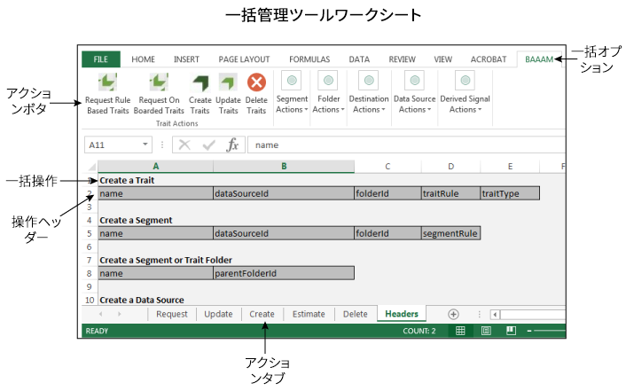

# 一括管理の概要{#getting-started-with-bulk-management}

一括管理ツールを使用すると、複数のオブジェクトを一度に 1 回の操作で作成および管理できます。一括管理ツールを使用して、データソース、派生シグナル、宛先、フォルダー、セグメントおよび特性を処理できます。

<!-- 

c_bulk_start.xml

 -->

>[!NOTE]
>
>[!UICONTROL Bulk Management Tools] は、[!DNL Audience Manager] ではサポートされて&#x200B;*いません*。このツールはあくまで情報提供および便宜を目的として提供されています。一括変更については、代わりに [Audience Manager API](../../api/rest-api-main/aam-api-getting-started.md) を使用することを推奨します。[!DNL Audience Manager] UI で割り当てられる [RBAC グループ権限](../../features/administration/administration-overview.md) は、[!UICONTROL Bulk Management Tools] に対しても適用されます。

## 概要 {#overview}

この機能では、Microsoft Excel スプレッドシートのマクロを使用して、[!DNL Audience Manager] API の認証済みの安全な呼び出しをおこないます。API には、一括変更をおこなうためのメソッドおよびサービスが用意されています。これを使用するにあたって、コーディングや API の使用方法についての知識は必要ありません。ワークシートには特定の一括変更関数を実行するための列見出しとタブがあります。一括変更を実行するには単に、事前定義済みのヘッダーを特定のワークシートに追加し、一括変更する情報を指定し、実行ボタンをクリックします。後はワークシートと API が処理してくれます。

## ダウンロード {#download}

**[こちら](assets/BAAAM_August_2018.xlsm)**&#x200B;で最新のワークシートをダウンロードします。

## 前提条件 {#prereqs}

[!DNL Bulk Management Tools] を使用するには、以下が必要です。

* [!DNL Audience Manager] のユーザー名およびパスワード。お客様が既にお持ちの資格情報です。
* API クライアント ID および秘密鍵。担当のアカウントマネージャーを通して入手できます。
* [!UICONTROL Bulk Management Tools] ワークシート。最新版を入手するには、[ワークシートをダウンロード](/help/using/reference/bulk-management-tools/bulk-management-intro.md#download)してください。

* [!DNL Windows] 上で動作する Excel、または [!DNL macOS X] 上で動作する [!DNL Microsoft Windows] 仮想マシン。[!UICONTROL Bulk Management Tools] が機能するには、32 ビット Excel を使用する必要があります。

## アクションおよび操作 {#actions-ops}

[!UICONTROL Bulk Management Tools]ワークシートは、アクションタブ、アクションボタンおよび「**[!UICONTROL Headers]**」タブで構成されています。「**[!UICONTROL Headers]**」タブには、アクションタブで使用される書式化済みの列ヘッダーがあります。アクションタブには選択した一括操作を実行するためのマクロが用意されています。一括操作を実行するには、該当するアクションタブにヘッダーをまとめてコピーし、ヘッダーデータを入力し、アクションボタンをクリックします。

まずはスプレッドシートを開き、アクションボタンをクリックしてみてください。

次の表は、実行できる操作、および[!UICONTROL Bulk Management Tools]ワークシートを使用して操作できる項目を示したものです。

<table id="table_B9B3E09B692E42BAA52FB32C18B00709"> 
 <thead> 
  <tr> 
   <th colname="col1" class="entry"> アクション </th> 
   <th colname="col2" class="entry"> オブジェクト </th> 
  </tr> 
 </thead>
 <tbody> 
  <tr> 
   <td colname="col1"> 
一括アクションはワークシートの一番下のタブに表示され、次の項目などがあります。 
 
 
     <ul id="ul_49F46B9E00C045D29E40258EB7BDCFBB"> 
      <li id="li_193C41EA19EF4D738FBA037D2BF9B05C">Requests </li> 
      <li id="li_5BE2E13D839F4958AAA5C01B7EFC5096">Update </li> 
      <li id="li_4CCCC739795945DF8C89787F9A67EB88">Create </li> 
      <li id="li_C7D36D2BDF0448CEAF3A5EABE41038E8">Estimate </li> 
      <li id="li_07A3E94326124A3092362D9896EB7732">Delete </li> 
     </ul> 
 </td> 
   <td colname="col2"> 
一括変更できるオブジェクトは、「<b>Headers</b>」タブに配置されており、次の項目などがあります。 
 
 
     <ul id="ul_A7A96F2B1B63430B9A1E1184AC5FA8F2"> 
      <li id="li_E3D9E2E190B04BE685337AC6140C371C"> <a href="../../features/datasources-list-and-settings.md#data-sources-list-and-settings"> データソース</a> </li> 
      <li id="li_B645385E40684FA28770913EAF18CB2C"> <a href="../../features/derived-signals.md"> 派生シグナル</a> </li> 
      <li id="li_9059F8C4A41A410899BDEFC76D3F5949"> <a href="../../features/destinations/destinations.md"> 宛先</a> </li> 
      <li id="li_BB5A445150754E53AA38C78461326932"> <a href="../../features/traits/trait-storage.md#trait-storage"> 特性フォルダー</a>およびセグメントフォルダー </li> 
      <li id="li_7A27DBF64E0945CF8AE8C96E8C6EDA09"> <a href="../../features/segments/segments-purpose.md"> セグメント</a> </li> 
      <li id="li_A4640A34930040DEA8555EAF0AE2A702"> <a href="../../features/traits/trait-details-page.md"> 特性</a> </li> 
     </ul> 
 </td> 
  </tr> 
 </tbody> 
</table>

**一括操作の例**

例えば、複数の特性を一度に作成する方法を見てみましょう。一括操作で複数の特性を作成するには、次の手順に従います。

1. 「**[!UICONTROL Headers]**」タブをクリックし、「[!UICONTROL Create a Trait]」オプション配下のすべてのラベルをコピーします。

2. 「**[!UICONTROL Create]**」タブをクリックし、1 行目の列 A を先頭にラベルをペーストします。
3. 各列ヘッダーに関する情報を入力し、「**[!UICONTROL Create Traits]**」をクリックします。このアクションによって、ログオンするよう指示されます。正常に認証が済むと（後述の[認証要件](../../reference/bulk-management-tools/bulk-management-intro.md#auth-reqs)を参照してください）、ジョブが一括実行されます。ワークシートの左下隅に表示されるジョブステータス通知を確認してください。

>[!NOTE]
>
>大量の要求を処理する場合、ワークシートが低速になり、非アクティブであるように見えることがあります。その場合、そのままにしておきます。一括要求が完了すると、ワークシートは反応するようになります。ワークシートが長時間反応しない場合、[トラブルシューティングのセクション](../../reference/bulk-management-tools/bulk-troubleshooting.md)を参照してください。

## 認証の要件およびオプション {#auth-reqs}

一括変更には認証が必要となります。アクションを選択すると、ログオンするように指示されます。ワークシートでは API 呼び出しがおこなわれるので、秘密鍵が読み込まれるよう設定する必要があります。また、「**[!UICONTROL Domain]**」フィールドを使用することで、ステージング環境／テスト環境で、または実稼動アカウントで一括変更をおこなうことができます。

**API 認証の要件**

API 認証を設定するには、以下のことをおこなう必要があります。

* 秘密鍵をテキスト（.txt）ファイルにコピーし保存する。
* テキストファイルの名前を API クライアント ID にする。例えば、クライアント ID が「Bulk-User」である場合、「Bulk-User.txt」という名前のファイルに鍵を保存します。
* 秘密鍵とワークシートをまとめて同じフォルダーに保存する。

一括変更をおこなう場合、ユーザー名、パスワード、クライアント IDおよびドメインを入力する必要があるものの、API 認証は自動でおこなわれます。

**ドメイン認証のオプション**

ドメイン認証では、一括要求をテストすることも、直接本稼動アカウントに適用することもできます。テスト環境で一括変更をおこなっても、本稼動アカウントには反映されません。本稼動アカウントへの変更は即座に反映されます。「**[!UICONTROL Domain]**」フィールドでは、作業環境に応じて次のアドレスを使用できます。

* テスト：`api-beta.demdex.com`
* 実稼動：`api.demdex.com`

>[!MORE_LIKE_THIS]
>
>* [一括管理ワークシートのダウンロード](assets/BAAAM_August_2018.xlsm)

