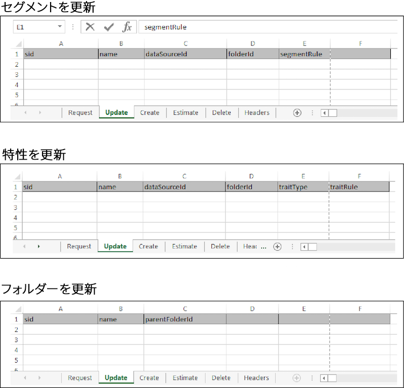

# 一括更新 {#bulk-updates}

一括更新では、複数のセグメント、特性、モデル、データソース、およびセグメントフォルダーまたは特性フォルダーの要素を 1 回の操作で編集できます。一括更新をおこなうには、以下の手順に従ってください。

<!-- 

t_bulk_updates.xml

 -->

>[!NOTE]
>
>[!DNL Audience Manager] UI で割り当てられる [RBAC グループ権限](../../features/administration/administration-overview.md)は、[!UICONTROL Bulk Management Tools] に対しても適用されます。

一括更新をおこなうには、[!UICONTROL Bulk Management Tools] ワークシートを開き、以下の手順に従ってください。

1. 「**[!UICONTROL Headers]**」タブをクリックして、編集する項目の更新ヘッダーをコピーします。
2. 「**[!UICONTROL Update]**」タブをクリックします。
3. 更新ヘッダーを、更新ワークシートの 1 行目に貼り付けます。以下のことに注意してください。

   * フォルダーの更新時には、すべてのヘッダーが必須です。
   * セグメントまたは特性を更新する場合、必要なのはセグメント ID（SID）と、変更が必要なヘッダー要素のみです。使用していないヘッダーは削除してください。

4. ヘッダーラベルに基づいて、変更するデータを対応する列に貼り付けるか入力します。
5. ワークシートのツールバーで、更新する項目に対応する更新ボタンをクリックします。これにより、[!UICONTROL Account Information] ダイアログボックスが開きます。

6. 必要な[ログオン情報](../../reference/bulk-management-tools/bulk-management-intro.md#auth-reqs)を入力し、「**[!UICONTROL Submit]**」をクリックします。

   ワークシートに「[!UICONTROL Results]」列が作成されます。「[!UICONTROL Results]」列には、成功した操作の JSON レスポンスが返されます。例については[ REST API](../../api/rest-api-main/rest-api-main.md) を参照してください。データを入力する前の一括更新ワークシートは、次のようになります。

一括更新でエラーが発生した場合や失敗した場合は、[一括管理ツールのトラブルシューティング](../../reference/bulk-management-tools/bulk-troubleshooting.md)を参照してください。
