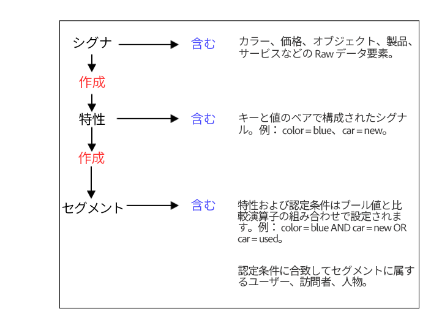

# [!UICONTROL Signals]、 [!UICONTROL Traits][!UICONTROL Segments] {#signals-traits-and-segments}

[!DNL Audience Manager] [!UICONTROL segment]の構成要素、オーディエンスの認定基準の設定に使用される表現、イベント呼び出しでのデータの送信方法について説明します。

## 構成と目的

[!DNL Audience Manager] データは、[!UICONTROL signals]、[!UICONTROL traits]、[!UICONTROL segments]および関連する認定ルールで構成されます。データ要素とルールが組み合わされて[!UICONTROL segments]になります。[!UICONTROL Segments]によって、サイト訪問者が関連グループに整理されます。[!DNL Audience Manager] [!UICONTROL segment] の 3 つの主要な構成要素を次の表で定義します。

| 要素 | 構成 | 例 |
|---|---|---|
| [!UICONTROL Signal] | [!UICONTROL Signals]は [!DNL Audience Manager] における最小のデータ単位で、[ キーと値のペア](../reference/key-value-pairs-explained.md)として表されます。  <ul><li>キーは、データセットを定義する定数です（例：gender、color、price）。</li><li>値は、定数に関連する変数です（例：male/female、green、100）。</li></ul>比較演算子は、キーと値を結合して、それらの間の関係を設定します。 | <ul><li>`product=camera`</li><li>`price>1000`</li><li>`type=digital SLR`</li></ul> |
| [!UICONTROL Trait] | 1 つ以上の[!UICONTROL signals]の組み合わせ。   [!DNL Boolean]式および比較演算子を使用すると、[!UICONTROL trait]認定ルールを作成できます。  [!UICONTROL traits]と[!UICONTROL trait]グループを組み合わせて、詳細な資格認定要件を作成します。 | 例えば、使用可能な[!UICONTROL signals]から、次のような「`High End Camera Browser`」ルールを作成できます：`product=camera AND price>1000` |
| [!UICONTROL Segment] | 共通する一連の属性を共有し、関連する[!UICONTROL traits]の対象として認定されるユーザー。[!DNL Boolean]式を最新性／頻度要件と共に使用すると、[!UICONTROL segment]認定ルールを作成できます。  [!UICONTROL trait]と[!UICONTROL segment]ルールを組み合わせて、詳細な資格認定要件を作成します。 | 例えば、使用可能な[!UICONTROL traits]および[!UICONTROL signals]から、次のような[!UICONTROL segment]ルールを作成できます：`(product=camera AND type=digital SLR) OR (price>1000)` |

以下の図を使用して、[!UICONTROL signals]、[!UICONTROL traits]、および[!UICONTROL segments]間の関係を覚えておいてください。

**ビジュアルツールおよびコードエディターを使用した[!UICONTROL Traits]および[!UICONTROL Segment]ルールの作成**

クライアントは、[!DNL Audience Manager] ユーザーインターフェイスのビジュアルツールおよびコードエディターを使用して、[!UICONTROL traits]および[!UICONTROL segments]を管理します。ビジュアルツールでは、検索機能、ポップアップオプション、ドロップダウンメニューおよびドラッグ＆ドロップ機能を使用して、ルールを作成できます。コードエディターは、上級ユーザーがオーディエンスセグメント化条件をプログラムで開発する手段となります。

**にデータを送信するイベント呼び出し[!DNL Audience Manager]**

イベント呼び出しは、Webサイトから [!DNL Audience Manager] にデータを送信します。この呼び出しには、[!DNL HTTP]リクエスト内の、[!UICONTROL signal]、[!UICONTROL trait]、および [!UICONTROL segment] データが含まれます。イベント自体は 文字列の `/event` に続くすべての部分です。[!DNL URL]次の例に示すように、このプロセスでは、複数の変数を [!DNL Audience Manager] に渡すために必要なイベント呼び出しは 1 つだけです。

`https://<domain>/event?product=camera&price>100`

>[!MORELIKETHIS]
>
>* [セグメント：目的、構成、ルール](../features/segments/segments-purpose.md)

