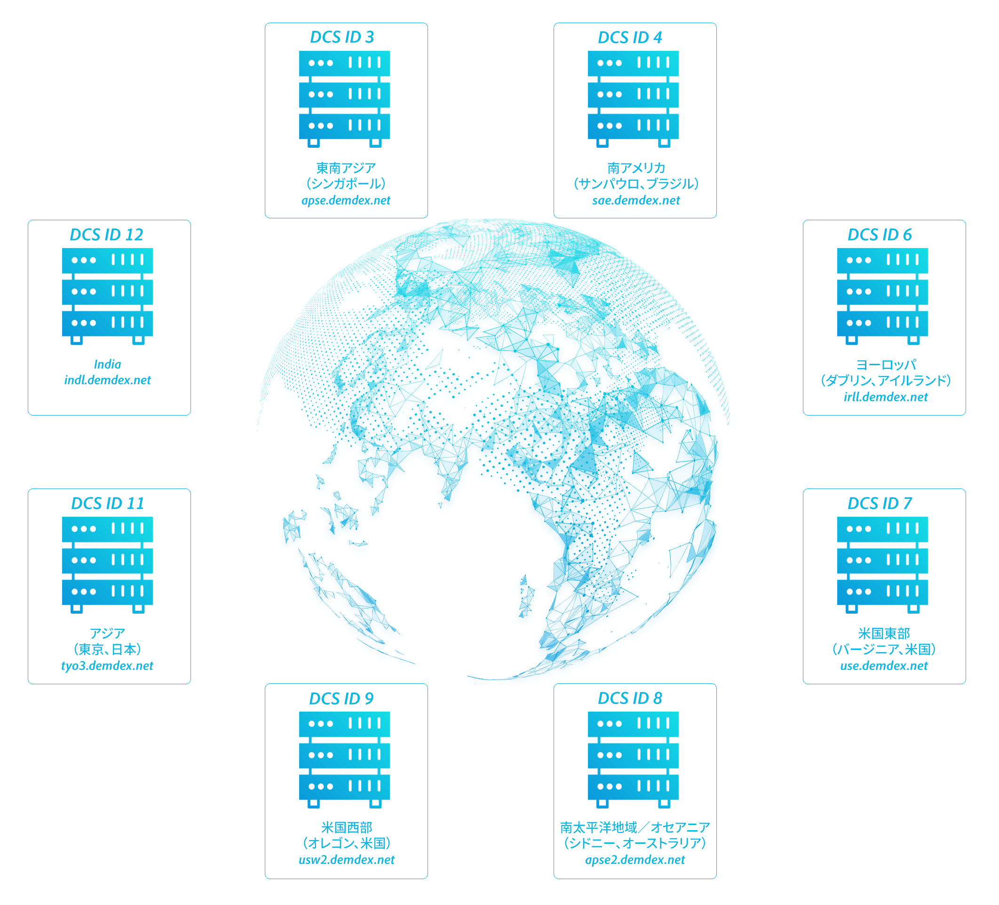

# データ収集コンポーネント {#data-collection-components}

データ収集コンポーネントには、データ収集サーバー、DIL API、インバウンドのサーバーからサーバーへのデータ転送、およびログファイルが含まれます。

<!-- 

c_compcollect.xml

 -->

Audience Manager には次のデータ収集コンポーネントがあります。

* [データ収集サーバー（DCS）およびプロファイルキャッシュサーバー（PCS）](../../reference/system-components/components-data-collection.md#dcs-pcs)
* [データ統合ライブラリ（DIL）](../../reference/system-components/components-data-collection.md#dil)
* [インバウンドのサーバー間通信](../../reference/system-components/components-data-collection.md#inbound-outbound-server)
* [ログファイル](../../reference/system-components/components-data-collection.md#log-files)

## データ収集サーバー（DCS）およびプロファイルキャッシュサーバー（PCS）  {#dcs-pcs}

DCS と PCS は連携して動作することで、それぞれが特性の適合、オーディエンスのセグメント化、およびデータストレージに関連するサービスを提供します。

**[!UICONTROL Data Collection Servers (DCS)] 関数**

[!DNL Audience Manager] で、DCS は以下をおこないます。

* イベント呼び出しから特性データを受け取り、評価します。これには、リアルタイムのセグメント化で使用される情報と、スケジュールされた間隔でサーバー間転送によって渡されるデータが含まれます。
* 適合する特性および[セグメントビルダー](../../features/segments/segment-builder.md)で作成した認定ルールに基づいて、ユーザーをセグメント化します。
* デバイス ID および認証済みのプロファイル ID を作成および管理します。これには、データプロバイダー ID、ユーザー ID、宣言された ID、統合コードなどがあります。
* リアルタイムのイベント呼び出しの前に、ユーザーが既に適合している特性が他にないかを PCS で確認します。これにより、リアルタイムのデータと過去のデータに基づきユーザーを適合させることができます。
* ログファイルへの書き込みをおこない、それらを保存および処理する分析システムに送信します。

**[!DNL DCS]による[!UICONTROL Global Server Load Balancing (GSLB)]**&#x200B;を通じた需要の管理

[!DNL DCS] は地理的に分散された負荷分散型システムです。つまり、[!DNL Audience Manager] はサイト訪問者の地理的な位置に基づき、地域のデータセンターとの間で要求のやり取りをおこなうことができます。この方式では、[!DNL DCS] の応答がその訪問者の情報を保持するデータセンターに直接送信されるので、応答時間の短縮に役立ちます。[!UICONTROL GSLB] では、関連データがユーザーに最も近いサーバーにキャッシュされるので、システムの効率が高まります。

>[!IMPORTANT]
>
>IPv4 を使用するデバイスから発生した Web トラフィックを検出するのは [!DNL DCS] だけです。

イベント呼び出しにおいて、地理的な位置は JSON データの一部として返されるキーと値のペアとして取得されます。このキーと値のペアは `"dcs_region": region ID` パラメーターです。

お客様は、アドビのデータ収集コードを通して間接的に [!DNL DCS] を操作します。また、一連の API を使用して [!DNL DCS] を直接操作することもできます。詳しくは、[データ収集サーバー（DCS）API メソッドおよびコード](../../api/dcs-intro/dcs-event-calls/dcs-event-calls.md)を参照してください。

**[!UICONTROL Profile Cache Servers (PCS)]**

[!UICONTROL PCS] は大規模なデータベースです（基本的には、サーバー側の巨大な Cookie です）。サーバーからサーバーへのデータ転送および [!DNL DCS] から受信したアクティブユーザーのデータを格納します。[!UICONTROL PCS] データは、デバイス ID、認証済みプロファイル ID、およびそれらに関連付けられた特性で構成されます。[!DNL DCS] はリアルタイムの呼び出しを受信すると、[!UICONTROL PCS] を照会して、ユーザーが属する、または適合する可能性がある他の特性がないかを確認します。さらに、セグメントに後から特性が追加された場合、それらの特性 ID は [!UICONTROL PCS] に追加され、特定のサイトやアプリを訪問しなくても、ユーザーは自動でそのセグメントに適合されます。[!UICONTROL PCS] は、最新または過去の特性データを使用して、リアルタイムまたは事後的にユーザーを照合およびセグメント化できるので、[!DNL Audience Manager] は PCS を通してユーザーをより深く把握できます。この動作によって、リアルタイムの適合のみの場合よりも正確で包括的なユーザー像を得ることができます。

お客様が直接 [!UICONTROL PCS] を操作するための UI コントロールは用意されていません。お客様は、データストアおよびデータ転送を担当する役割を通して、間接的に [!UICONTROL PCS] にアクセスします。[!UICONTROL PCS] は Apache Cassandra 上で動作します。

**非アクティブな ID を[!UICONTROL PCS]** からパージ

前述のとおり、[!UICONTROL PCS] にはアクティブユーザーの特性 ID が保存されます。アクティブユーザーとは、過去14 日間に任意のドメインから[エッジデータサーバー](../../reference/system-components/components-edge.md)で確認されたユーザーです。ユーザーは以下の [!UICONTROL PCS] の呼び出しによってアクティブな状態を保ちます。

* [!DNL /event] 呼び出し
* [!DNL /ibs] 呼び出し（ID 同期）

<!-- 

Removed /dpm calls from the bulleted list. /dpm calls have been deprecated.

 -->

[!UICONTROL PCS] では、17 日間非アクティブであった特性はフラッシュされます。ただし、これらの特性は消失するわけではなく、Hadoop に保存されます。その後再度そのユーザーが確認された場合、Hadoop はそれらのすべての特性を [!UICONTROL PCS] に差し戻します。これは通常 24 時間以内におこなわれます。

**その他の [!UICONTROL DCS/PCS] プロセス：プライバシーのオプトアウト**

これらのサーバーシステムは、プライバシーに基づくユーザーのオプトアウトリクエストを処理します。データ収集をオプトアウトしたユーザーの Cookie 情報は、ログファイルで収集されません。アドビのプライバシーポリシーの詳細については、[アドビプライバシーセンター](https://www.adobe.com/jp/privacy/experience-cloud.html)を参照してください。

## データ統合ライブラリ（DIL） {#dil}

[!UICONTROL DIL] は、データ収集を目的としてページに配置されるコードです。使用可能なサービスおよびメソッドについて詳しくは、[DIL API](../../dil/dil-overview.md) を参照してください。

## インバウンドのサーバー間通信 {#inbound-outbound-server}

クライアントとの様々なサーバー間統合によって送信されるデータを受信するシステム。詳細については、[オーディエンスデータの送信](/help/using/integration/sending-audience-data/real-time-data-integration/real-time-tech-specs.md)を参照してください。

## ログファイル {#log-files}

[!UICONTROL PCS] はデータを作成し、ログファイルに書き込みます。これらは、他のデータベースシステムに送信され、そこで処理、レポートおよび保存されます。

>[!MORELIKETHIS]
>
>* [アドビプライバシーセンター](https://www.adobe.com/jp/privacy.html)

