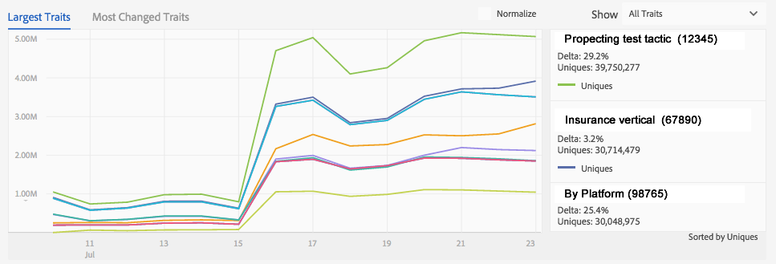

# データ処理のコンポーネント {#data-processing-components}

データ処理のコンポーネントには、Hadoop、Snowflake、SOLR および Tableau などがあります。

<!-- 

c_comproc.xml

 -->

Audience Manager は、データ処理に以下のコンポーネントを使用します。

## Hadoop  {#hadoop}

[!DNL Audience Manager] において、Hadoop は [!DNL Audience Manager] がユーザーに関して把握しているすべての情報が格納されるメインデータベースとなります。例えば、[プロファイルキャッシュサーバー](../../reference/system-components/components-data-collection.md)がユーザーに関するデータが書き込まれたログファイルを作成した場合、そのデータは Hadoop に送信され、そこに保存されます。これ以外の重要な Hadoop の構成要素として、次のようなものがあります。

* **Hive：** Hadoop のデータウェアハウス。Hive は、Hadoop に保存されたデータに対するアドホックのクエリを管理します。

* **HBase：**&#x200B;非常に大規模な Hadoop データベース。インバウンドおよびアウトバウンドのデータ、特性ルール、アルゴリズムモデリング情報を処理および管理し、様々なシステムへのデータの保存および移動に関連する他の多くの機能を実行します。

お客様はこれらのシステムに直接アクセスすることはありませんが、これらのコンポーネントはサイト訪問者に関する重要なデータを保存しているので、お客様はこれらのシステムに間接的に関与しています。

## Snowflake  {#snowflake}

[Snowflake](https://www.snowflake.net/) は巨大なクラウドデータベースです。多くのダッシュボードグラフと、それに関連するグラフ内の各項目の変更率を表示するテキストボックスにデータを提供します。[!DNL Audience Manager] でダッシュボードレポートを参照する場合、[!UICONTROL Snowflake] によって提供されたデータを操作していることになります。

[!UICONTROL Snowflake] によって提供される一般的なダッシュボードレポートには以下のようなものがあります（すべてが網羅されているわけではありません）。

* [Daily Trait Variation レポート](/help/using/reporting/audience-optimization-reports/daily-trait-variation-report.md)
* すべての重複レポート（各重複レポートの情報については、[インタラクティブなレポート](/help/using/reporting/dynamic-reports/dynamic-reports.md)の節を参照してください）
* [未使用シグナルレポート](/help/using/reporting/dynamic-reports/unused-signals.md)

## SOLR {#solr}

SOLR は、Apache が提供するオープンソースのデータベースおよびサーバーシステムです。アドビの膨大なデータセットに対して、堅牢かつ高速な検索機能を提供します。[!DNL Audience Manager] をご使用のお客様は、セグメントの作成時に SOLR が実行されている様子を確認できます。[!UICONTROL Estimated Historic Segment Size] レポートにデータを提供します。SOLR はそのスピードから、これに適しています。例えば、ルールを作成し、新しい特性をセグメントに追加しながら、サイズデータの経過を更新できます。

## Tableau {#tableau}

[!DNL Audience Manager] は、[Tableau](https://www.tableausoftware.com/) を使用して[インタラクティブレポート](../../reporting/dynamic-reports/dynamic-reports.md#interactive-and-overlap-reports)および [Audience Optimization レポート](../../reporting/audience-optimization-reports/audience-optimization-reports.md)のデータを表示します。インタラクティブレポートには特性およびセグメントのパフォーマンスと重複のデータが表示されます。これらのレポートでは、列と行に数値を配置する代わりに、各種の形状、色およびサイズを使用してデータを返します。さらに、個々のデータポイントまたはデータポイントグループを選択して、レポート結果の詳細を調べることもできます。これらのインタラクティブな視覚化手法およびレポートで、大量の数値データをわかりやすく提示することができます。

