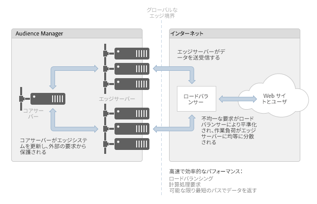

# エッジデータセンターについて {#understanding-the-edge-data-center}

Audience Manager はエッジコンピューティングという分散型トポロジを採用することで、外部ソースによって課される要求を満たします。

## エッジデータセンターの概要  {#edge-data-center-basics}

<!-- 

c_compedge.xml

 -->

エッジコンピューティングにおいては「エッジ」そのものが国の境界を超えるので、インターネット全体に散らばっている要求への応答時間の短縮を図ることができます。つまり、[!DNL Audience Manager] では、要求元に最も近い場所に、動的に処理を振り分けることで、最短のルートでデータを返します。エッジコンピューティングによってサイトのパフォーマンスが確保されることから、Web サイトの優れたユーザーエクスペリエンスを維持できます。エッジデータセンターは、[!DNL Audience Manager] とデータのやり取りをするうえでの主要なゲートウェイとなります。

[!DNL Audience Manager] のエッジデータセンターには次のようなものがあります。

* **コアサーバー：**&#x200B;これらは [!DNL Audience Manager] のメインシステムです。データを更新し、エッジサーバーに提供します。

* **エッジサーバー：**&#x200B;多くの場合、これらはアプリケーションサーバーや Web サーバーです。[!DNL Audience Manager] とインターネットとの間の境界に位置します。[!DNL DCS] や Akamai システムなどのエッジサーバーは通常、[!DNL Audience Manager] で出し入れされるデータおよび要求を処理します。

* **ロードバランサー：**&#x200B;インターネットアプリケーションにつきものの不均等な計算／処理要求を管理します。これらのバランサーは、クラスター化されたサーバーにおいて、あるサーバーがオーバーロードで他のサーバーがアイドル状態となることを回避します。

次の図は、Audience Manager のエッジデータセンター環境を示したものです。

## 地理的な分布およびロードバランシング  {#geo-dist-balance}

詳しくは、[データ収集コンポーネント](../../reference/system-components/components-data-collection.md)の [!DNL DCS] セクションを参照してください。
