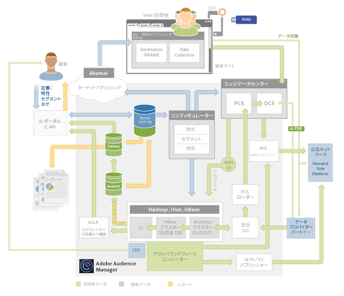

# プラットフォームアーキテクチャ：データフローマップ {#platform-architecture-data-flow-map}

このマップには Audience Manager の主要なシステムが含まれています。Audience Manager コンポーネント内およびコンポーネント間のデータの流れが視覚的に表現されています。

## このマップの読み方 {#compmap}

<!-- 

c_compmap.xml

 -->

このマップでは、グレーのボックスに [!DNL Audience Manager] システムが配置されています。完全に内部システムであるコンポーネントもあれば、[!DNL Audience Manager] と外部の境界上に位置するコンポーネントもあります。[!DNL Audience Manager] をご使用のお客様にとって、内部コンポーネントは通常透過的であるか、またはアクセスできません。ただし、ユーザーインターフェイスまたはデータ統合を通してこれらのシステムと関わる場合もあります。ボックスのエッジにあるシステムは、[!DNL Audience Manager] と外部との間でデータの収集および送信をおこないます。

[!DNL Audience Manager] で出し入れされるデータのタイプは色によって定義されます。グリーンはクライアントデータ、ブルーは顧客データ（サイトを訪れる訪問者）、オレンジはレポートに使用されるデータをそれぞれ示します。

システムの説明と概要については、[ アクション ](../../reference/system-components/components-data-action.md)、[ コレクション ](../../reference/system-components/components-data-collection.md)、[処理](../../reference/system-components/components-data-processing.md)、および[ タグ管理](../../reference/system-components/components-tag-management.md)のデータ セクションを参照してください。

