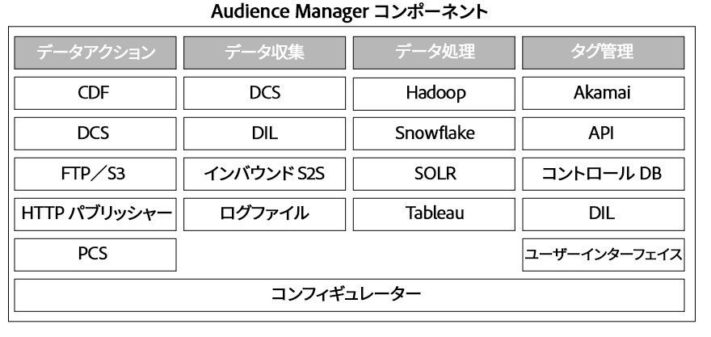

# Audience Manager システムの主要なコンポーネント {#key-components-in-the-audience-manager-system}

Audience Manager のシステムおよびプロセスは、タグ管理、データ収集、データ編成およびデータ操作の 4 つの主要なカテゴリに分類されます。

<!-- 

c_compstack.xml

 -->

次の図は、[!DNL Audience Manager] の主要なコンポーネント、および基盤となるテクノロジー（ハードウェアおよびソフトウェア）を示したものです。プロセスの中には特定の関数を実行するものもあれば、複数の役割を果たすものもありますが、システム全体が連携することによって、タグ管理、データ収集、パフォーマンス分析、他システムとの情報の同期、およびその情報の操作するための機能が提供されます。

