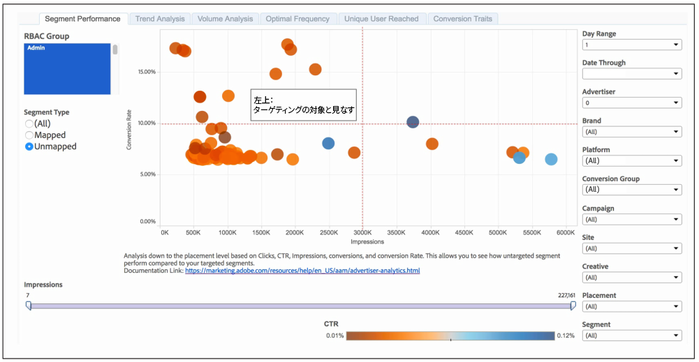

# セグメントパフォーマンスレポート {#segment-performance-report}

[!UICONTROL Segment Performance]レポートは、インプレッションおよびコンバージョン率を使用して、マッピングされたセグメントとマッピングされていないセグメントを比較します。マッピングされたセグメントとは、作成してターゲティングのために宛先に送信したセグメントのことです。マッピングされていないセグメントとは、作成したもののターゲティングのために宛先に送信していないセグメントのことです。レポート内およびレポート間でこれらの異なるセグメントタイプを比較することで、既存のキャンペーンを最適化し、見落としていたセグメントを宛先に送信してターゲティングをおこなうことができます。

## マッピングされたセグメントの結果を読み取る方法 {#read-mapped-segment-results}

マッピングされた[!UICONTROL Segment Performance]レポートには、作成し、ターゲティングのために宛先に送信したすべてのセグメントが表示されます。レポートのマッピングされたセグメントの位置によって、パフォーマンスが高いセグメントや、何らかの調整が必要な箇所について多くの情報が提供されます。

レポートを読み取りやすくするために、以下のサンプルレポートのように、結果を仮想線（赤色）とカテゴリで 4 つのセクションに分けると便利です。

例のラベルと、次の表を参考にして、セグメントのパフォーマンスとその結果への対応を把握します。

<table id="table_A29253B30DFA4CD7B3B7C320DE0BDEA4"> 
 <thead> 
  <tr> 
   <th colname="col1" class="entry"> 位置 </th> 
   <th colname="col2" class="entry"> 配置の意味 </th> 
  </tr> 
 </thead>
 <tbody> 
  <tr> 
   <td colname="col1"> 
 <b>左上</b> 
 </td> 
   <td colname="col2"> 
コンバージョン率は良好です。 
 
インプレッションを増やすとさらにコンバージョンを得られる可能性があります。 
 </td> 
  </tr> 
  <tr> 
   <td colname="col1"> 
 <b>左下</b> 
 </td> 
   <td colname="col2"> 
コンバージョン率が低くなっています。 
 
このセグメントはターゲティングから外すこともできます。このセクションのセグメントは、マッピングされていないセグメント結果のセグメントとの比較に適しています。マッピングされていないセグメントの一部が、現在ターゲティングしているセグメントよりパフォーマンスが高い可能性があります。 
 </td> 
  </tr> 
  <tr> 
   <td colname="col1"> 
 <b>右上</b> 
 </td> 
   <td colname="col2"> 
パフォーマンスが高くなっています。これらのセグメントはそのままにしておきます。 
 </td> 
  </tr> 
  <tr> 
   <td colname="col1"> 
 <b>右下</b> 
 </td> 
   <td colname="col2"> 
コンバージョン率が低く、インプレッションは高くなっています。 
 
このセクションのセグメントはパフォーマンスが低くなっています。このセグメントの予算は、レポートの左上のセクションにあるセグメントに振り向ける必要があります。これにより、インプレッションが減少し、右上のセクションにあるセグメントのコンバージョン率が向上します。また、これらのマッピングされたセグメントを、マッピングされていないセグメントと比較します。マッピングされていないセグメントの一部が、現在ターゲティングしているセグメントよりパフォーマンスが高い可能性があります。 
 </td> 
  </tr> 
 </tbody> 
</table>

## マッピングされていないセグメントの結果を読み取る方法 {#read-unmapped-segment-results}

[!UICONTROL Segment Performance]レポートで、マッピングされていないセグメントを確認すると、これまでターゲティング対象として考えられていなかった新しいセグメントを発見できます。実際、これらのセグメントの一部は、マッピングされているセグメントよりパフォーマンスが高くなる可能性があります。マッピングされていないセグメントがこのレポートの対象となるには、所定の認定基準を満たす必要があります。マッピングされていないセグメントがこのレポートの対象となるための条件は次のとおりです。

* マッピングされているすべてのセグメントの平均よりもコンバージョンが多い。
* マッピングされていないセグメントのうち、コンバージョン率で上位 100 件の中にある。

レポートを読み取りやすくするために、以下のサンプルレポートのように、結果を仮想線（赤色）とカテゴリで 4 つのセクションに分けると便利です。

このレポートでは、左上のセクションにある、マッピングされていないセグメントに注目します。このマッピングされていないセグメントは、他の 3 つのセクションに比べて、コンバージョン率は高く、インプレッションは低くなっています。

>[!NOTE]
>
>7 日と 30 日のルックバック期間は、「**[!UICONTROL Date Through]**」の日付が日曜日の場合のみ有効です。
