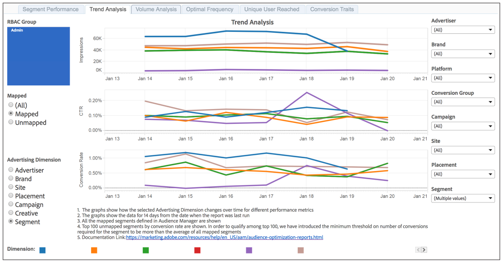

# [!UICONTROL Trend Analysis] および [!UICONTROL Volume Analysis] レポート {#trend-analysis-and-volume-analysis-reports}

これらのレポートは、広告の幅広いディメンションにわたってインプレッション、クリックスルー率およびコンバージョンについてのデータを返します。選択した指標のトレンドやボリュームを比較すると、キャンペーンパフォーマンスの時間的変化を正確に把握することができます。

## [!UICONTROL Trend Analysis] レポートのサンプル {#sample-trend-analysis}

[!UICONTROL Trend Analysis]レポートには、14 日間のデータのみが線グラフで返されます。この例では、レポートにはマッピングされた一連のセグメントについてのインプレッション、クリックスルー、コンバージョンのトレンドが表示されます。

## [!UICONTROL Volume Analysis] レポートのサンプル {#sample-volume-analysis}

[!UICONTROL Volume Analysis] レポートには、選択した日付範囲のデータが棒グラフで返されます。この例では、レポートにはマッピングされた一連のセグメントについてのインプレッション、クリックスルー、コンバージョンが、ボリュームを基準に表示されています。

>[!NOTE]
>
>7 日と 30 日のルックバック期間は、「**[!UICONTROL Date Through]**」の日付が日曜日の場合のみ有効です。

>[!TIP]
>
>マッピングされたセグメントとマッピングされていないセグメントについて詳しくは、[セグメントパフォーマンスレポート](../../../reporting/audience-optimization-reports/aor-advertisers/segment-performance.md)のドキュメントを参照してください。

