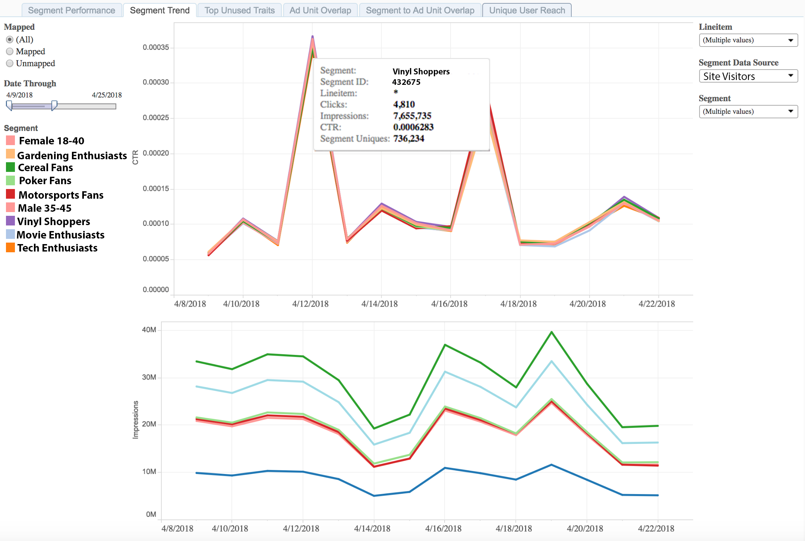

# セグメントトレンドレポート{#segment-trend-report}

セグメントトレンドレポートは、マッピングされたセグメントとマッピングされていないセグメントのインプレッション数およびクリックスルー率の時間的変化に関するデータを返します。

マッピングされたセグメントとは、作成してターゲット設定のために宛先に送信したセグメントのことです。マッピングされていないセグメントとは、作成したもののターゲット設定のために宛先に送信していないセグメントのことです。

選択した指標のトレンドやボリュームを比較すると、オーディエンスの行動の時間的変化を正確に把握することができます。

## ユースケース {#use-cases}

[!UICONTROL Segment Trend] このレポートを使用して、セグメントのパフォーマンスを経時的に検証し、パフォーマンスや尺度に基づいてトレンドを正確に指摘します。

このレポートにより、低下または誤った増加を示す Web プロパティを把握し、必要に応じてトラブルシューティングすることができます。This report is the next step after you identify your audience of interest in the [!UICONTROL Segment Performance] report, to ensure that the strong or poor performance you saw in the [!UICONTROL Segment Performance] tab is consistent over time.

## セグメントトレンドレポートの使用 {#using-the-report}

「**[!UICONTROL Mapped]**」と「**[!UICONTROL Unmapped]」を切り替えて、宛先にマッピングされているセグメントとマッピングされていないセグメントのどちらかを選択します。**「**[!UICONTROL All]**」を選択すると、すべてのセグメントがレポートに含まれます。

Adjust the look-back window with the **[!UICONTROL Date Through]** slider.

**[!UICONTROL Date Through]** スライダーの下で任意のセグメントをクリックすると、そのセグメントのみレポートに残す、または除外するためのオプションが表示されます。

「**[!UICONTROL Line Item]**」ドロップダウンボックスを使用して、情報を求めている、ポートフォリオ内のプロパティを選択します。

「**[!UICONTROL Segment Data Source]**」ドロップダウンボックスで、レポートに表示するセグメントが含まれているデータソースを選択します。

「**[!UICONTROL Segment]**」ドロップダウンボックスを使用して、レポートに表示するセグメントを選択します。

>[!IMPORTANT]
>
>When enabling [!UICONTROL Audience Optimization for Publishers], you must include descriptive metadata for [!UICONTROL Line Item] IDs, as described in Step 3 of [Import DFP Data Files Into Audience Manager](../../../reporting/audience-optimization-reports/aor-publishers/import-dfp.md). By doing this, you assure that the report details the web property as [!UICONTROL Line Item] instead of the [!UICONTROL Line Item] ID.

## 結果の解釈 {#interpreting-results}

[!UICONTROL Segment Trend] レポートは、14日間の間隔でのみ行グラフにデータを返します。この例では、レポートには、一連のマッピングされたセグメントおよびマッピングされていないセグメントについてのインプレッションおよびクリックスルーのトレンドが表示されます。

任意の行の上にマウスポインターを置くと、その特定のセグメントトレンドに関する詳細が表示されます。追加情報については、サンプルレポートの下の表を参照してください。

<table id="table_AFE2540583C34835B04584693ADFD26A"> 
 <thead> 
  <tr> 
   <th colname="col1" class="entry"> 項目 </th> 
   <th colname="col2" class="entry"> 説明 </th> 
  </tr>
 </thead>
 <tbody> 
  <tr> 
   <td colname="col1"> 
 セグメント 
 </td> 
   <td colname="col2"> 
このセグメントに割り当てた名前（英数字）。 
 </td> 
  </tr> 
  <tr> 
   <td colname="col1"> 
 Segment ID 
 </td> 
   <td colname="col2"> 
このセグメントの一意な ID。 
 </td> 
  </tr> 
  <tr> 
   <td colname="col1"> 
 Line item 
 </td> 
   <td colname="col2"> 
このレポートの対象となっている Web プロパティ。 
 </td> 
  </tr> 
  <tr> 
   <td colname="col1"> 
 Clicks 
 </td> 
   <td colname="col2"> 
この特性のメンバーが Web プロパティ内の項目をクリックした回数。 
 </td> 
  </tr> 
  <tr> 
   <td colname="col1"> 
 Impressions 
 </td> 
   <td colname="col2"> 
この特性のメンバーにインベントリが表示された回数。 
 </td> 
  </tr> 
  <tr> 
   <td colname="col1"> 
 CTR 
 </td> 
   <td colname="col2"> 
クリックスルー率。この指標は、クリックで遂行されたインプレッションの割合（パーセント）を示します。クリック数をインプレッション数で除算すると、この指標が得られます。 
 </td> 
  </tr> 
  <tr> 
   <td colname="col1"> 
 Segment Uniques 
 </td> 
   <td colname="col2"> 
過去 30 日間のセグメントメンバーの数。 
 </td> 
  </tr> 
 </tbody> 
</table>
