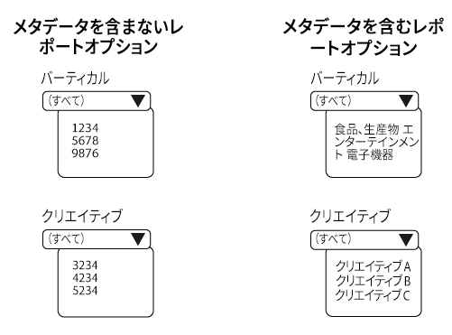
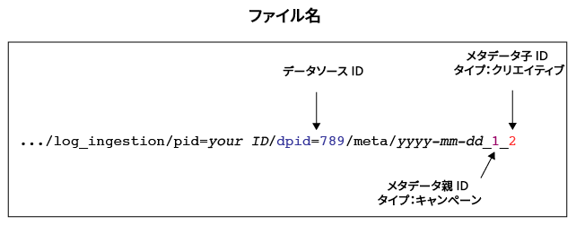
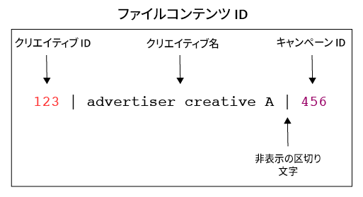

# メタデータファイルの概要とマッピング{#overview-and-mappings-for-metadata-files}

メタデータファイルは、数値 ID を意味のある判読可能な名前と関連付けます。Audience Optimization レポートでは、様々なレポートオプションメニューに理解しやすい名前が表示されます。

## 概要 {#overview}

メタデータの概要とその使用方法。メタデータファイルにはデータファイルが伴っていなければなりません。メタデータファイルには、データファイルの情報に対応するレポートメニューラベルが人間に判読できる形で記載されています。詳しくは、[Audience Optimization レポートおよび実用的なログファイル用のデータファイル](../../../reporting/audience-optimization-reports/metadata-files-intro/datafiles-intro.md).

### メタデータファイルには他のデータに関するデータが含まれる

メタデータには、他の種類のデータに関する情報が含まれています。この仕組みについて理解するために、[!DNL Audience Manager] でのデータの受け取り方法について説明します。

インプレッションまたはクリックイベント中、[!DNL Audience Manager] は URL 文字列（*イベント呼び出し*）でデータを受け取ります。

イベント呼び出しでは、情報が定義済みのキーと値のペアとして整理されています。キーと値のペアの値は、数値データで構成されています。メタデータファイルでは、名前と、ID に対応する読み取り可能なその他の情報が、キーと値のペアに格納されています。

### メタデータは ID を読み取り可能な名前にリンクする

メタデータファイルは、数値 ID を読み取り可能な名前に関連付ける必要があります。例えば、イベント呼び出しで、クリエイティブ ID が `d_creative:1234` のようなキーと値のペアに格納されているとします。メタデータファイルがない場合、このクリエイティブはオプションメニューで 1234 と表示されます。

一方、適切な形式のメタデータファイルがあれば、このクリエイティブを実際の名前（「Advertiser Creative A」など）に関連付けることができます。この名前は、レポート内で読み取ることができます。

### メタデータファイルはいつ必要になるか

まず、[Audience Optimization レポート](../../../reporting/audience-optimization-reports/audience-optimization-reports.md)を使用する場合、メタデータファイルと以下のすべてのパラメーターがイベント呼び出しに必要です。

次に、データを [!DNL Audience Manager] に送信する場合、または統合されていない他のプロバイダーからのレポートにデータを表示する場合に、メタデータファイルが必要です。例えば、[!DNL Audience Manager] は、Google の [DoubleClick Campaign Manager](../../../reporting/audience-optimization-reports/aor-advertisers/import-dcm.md)（DCM）と統合されています。この関係により、[!DNL Audience Manager] はレポートオプションで使用されている名前と説明に ID を関連付けることができます。統合がない場合でもデータは取り込めますが、レポートオプションにはわかりやすい名前ではなく数値 ID が表示されます。

## ファイルのマッピング {#file-mappings}

次の表は、[!UICONTROL Audience Optimization]レポートで使用するデータが格納されるキーと値のペアの一覧です。メタデータファイルを使用する必要がある場合、このキーと値のペアの値に対応する、わかりやすい情報がメタデータに含まれています。これらのキーの値には整数（データ型 INT）しか使用できません。なお、*斜体*&#x200B;の部分には実際の情報が入ります。他の要素は定数またはキーで、変わりません。

>[!IMPORTANT]
>
>[!UICONTROL Audience Optimization]レポートを使用している場合、イベント呼び出しでこれら&#x200B;*すべて*&#x200B;の値が必要です。

<table id="table_B2C8C493080E449CA71C4EF07D9476BD"> 
 <thead> 
  <tr> 
   <th colname="col1" class="entry"> レポートオプション </th> 
   <th colname="col2" class="entry"> メタデータのキーと値のペア </th> 
  </tr> 
 </thead>
 <tbody> 
  <tr> 
   <td colname="col1"> 
広告主 
 </td> 
   <td colname="col2"> 
 <code>d_adsrc = <i>data source ID or integration code</i></code> 
 
データソースの作成時に指定された、広告主のデータソース ID または統合コードです。<a href="../../../features/manage-datasources.md#create-data-source">データソースの作成</a>を参照してください。 
 </td> 
  </tr> 
  <tr> 
   <td colname="col1"> 
ビジネスユニット（BU） 
 </td> 
   <td colname="col2"> 
 <code>d_bu = <i>business unit ID</i></code> 
 </td> 
  </tr> 
  <tr> 
   <td colname="col1"> 
Campaign 
 </td> 
   <td colname="col2"> 
 <code>d_campaign = <i>campaign ID</i></code> 
 </td> 
  </tr> 
  <tr> 
   <td colname="col1"> 
Creative 
 </td> 
   <td colname="col2"> 
 <code>d_creative = <i>creative ID</i></code> 
 </td> 
  </tr> 
  <tr> 
   <td colname="col1"> 
Exchange 
 </td> 
   <td colname="col2"> 
2 つのキーと値のペアを使用できます。 
 
    <ul id="ul_3B3B751A8A134096B0912E81A0983B9D"> 
     <li id="li_57BAC45A7B274AB695945E174A4D8A35"> <code>d_exchange = <i>ID for the exchange that served the ad</i></code> </li> 
     <li id="li_CCDF00DE59D3451C8EF590DD3E1A806D"> <code>d_site = <i>ID for the site an ad served on</i></code> </li> 
    </ul> </td> 
  </tr> 
  <tr> 
   <td colname="col1"> 
広告掲載申込（IO） 
 </td> 
   <td colname="col2"> 
 <code>d_io = <i>insertion order ID</i></code> 
 </td> 
  </tr> 
  <tr> 
   <td colname="col1"> 
プラットフォーム 
 </td> 
   <td colname="col2"> 
 <code>d_src = <i>data source ID</i></code> 
 
これは、メタデータ情報を提供するプラットフォーム（DFA、Atlas、GBM、MediaMath など）のための<a href="../../../features/datasources-list-and-settings.md#data-sources-list-and-settings">データソース</a> ID です。 
 </td> 
  </tr> 
  <tr> 
   <td colname="col1"> 
戦術 
 </td> 
   <td colname="col2"> 
 <code>d_tactic = <i>tactic ID</i></code> 
 </td> 
  </tr> 
  <tr> 
   <td colname="col1"> 
バーティカル 
 </td> 
   <td colname="col2"> 
 <code>d_vert = <i>vertical ID</i></code> 
 </td> 
  </tr> 
 </tbody> 
</table>

## イベント呼び出し ID によるファイル名、コンテンツ、配信パスの生成方法 {#how-ids-shape-file-names}

キーと値のペアで渡される ID から、メタデータファイルの名前とコンテンツを作成できます。この後の各セクションと図で、その仕組みを説明します。これらの例では、キャンペーンのクリエイティブの名前が含まれるファイルを作成していますが、他の組み合わせも可能です。

### イベント呼び出し

この例では、クリエイティブ名を[!UICONTROL Audience Optimization]レポートに表示するためのメタデータファイルを作成します。この作業をおこなうには、イベント呼び出しからクリエイティブ、キャンペーン、データソースの ID を抽出する必要があります。

### ファイル名

ファイル名はクリエイティブ、キャンペーン、データソースの ID に基づいています。イベント呼び出しのキーと値のデータと、ファイル名での使用方法の違いを比較してください。

ファイル名の場合：

* データソースのキーは `dpid` から `d_src` に変わります。

* クリエイティブとキャンペーンの ID は、実際の ID ではなくカテゴリを表しています。

See [Naming Conventions for Metadata Files](../../../reporting/audience-optimization-reports/metadata-files-intro/metadata-file-names.md).

### ファイルコンテンツ

この例では、ファイルコンテンツはイベント呼び出しで渡されたクリエイティブとキャンペーンの ID を表します。ここでの新しい要素は、わかりやすい名前です。処理が完了すると、このファイルに含まれる名前が、[!UICONTROL Audience Optimization]レポートの「Creative」メニューのオプションとして表示されます。

[メタデータファイルのコンテンツの形式](../../../reporting/audience-optimization-reports/metadata-files-intro/metadata-file-contents.md)を参照してください。

### ファイルの配信

ファイルに名前を設定し、データを追加したら、[!DNL Audience Manager] で指定されている Amazon S3 ストレージディレクトリにファイルを送信します。[メタデータファイルの配信方法](../../../reporting/audience-optimization-reports/metadata-files-intro/metadata-delivery-methods.md)を参照してください。

>[!MORELIKETHIS]
>
>* [Audience Optimization レポートのデータファイル](../../../reporting/audience-optimization-reports/metadata-files-intro/datafiles-intro.md)
>* [ピクセル呼び出しを使用したキャンペーンのクリックデータのキャプチャ](../../../integration/media-data-integration/click-data-pixels.md)
>* [ピクセル呼び出しを使用したキャンペーンのインプレッションデータのキャプチャ](../../../integration/media-data-integration/impression-data-pixels.md)

