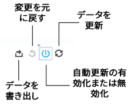

# レポート技術{#report-technology}

インタラクティブレポートの技術的基盤となるソフトウェアとデータ更新スケジュールについて説明します。

<!-- 

c_report_technology.xml

 -->

## Tableau 技術を使用するインタラクティブレポート

[!DNL Audience Manager] は、[Tableau](https://www.tableausoftware.com/) ソフトウェアを使用してインタラクティブレポートにデータを表示します。[!DNL Tableau] により、以下に役立つ視覚的なキューおよびシンボルを[!UICONTROL Delivery and Overlap]レポートで使用できます。

* パフォーマンスが高いまたは低い特性を見つける。
* 個別訪問者の重複が多いまたは少ない特性およびセグメントを見分ける。
* 重複データを使用して、ターゲット設定されたセグメントを作成する。
* 重複の少ない関連特性を特定することでリーチを拡大する。

## データ更新スケジュール

レポートデータは、毎週日曜日に更新されます。更新では、土曜日（前日）から先週の日曜日までのデータを処理します。

## インタラクティブレポートで使用される図形、色、サイズ {#shapes-colors-sizes}

ほとんどのインタラクティブレポートでは、様々なサイズおよび色の図形を使用して結果を表示します。この表示形式は、数値の羅列を細かく調べなくてもデータを視覚的に理解するのに役立つように設計されています。

<!-- 

r_legend.xml

 -->

### レポートの凡例

次の表は、動的レポートで使用する形状、サイズ、色の定義です。

<table id="table_EC180A96E3784FC6B81FCFB546C4A3FA"> 
 <thead> 
  <tr> 
   <th colname="col1" class="entry"> データ要素 </th> 
   <th colname="col2" class="entry"> 説明 </th> 
  </tr> 
 </thead>
 <tbody> 
  <tr> 
   <td colname="col1"> <b>形状</b> </td> 
   <td colname="col2"> 
    <ul id="ul_076773ABD0BB4CE6834ACFA8B3D6AC2E"> 
     <li id="li_BBAB37A6EC1549B48C0E4D3BFAF7062C">円はファーストパーティの特性を表します。 </li> 
     <li id="li_371331AE984A4A999CE0596EA13987E0">正方形はサードパーティの特性を表します。 </li> 
    </ul> </td> 
  </tr> 
  <tr> 
   <td colname="col1"> <b>色</b> </td> 
   <td colname="col2"> 
    <ul id="ul_F5D243297F0C4E5A8EDCBD28A548869E"> 
     <li id="li_332EB873A35440E6BB6093E36A0FAC3D">赤色のシェードは<i>低い</i>重複を表します。 </li> 
     <li id="li_29DFDB1218DF4069B5DCFF841D48EF56">緑色のシェードは<i>高い</i>重複を表します。 </li> 
    </ul> </td> 
  </tr> 
  <tr> 
   <td colname="col1"> <b>サイズ</b> </td> 
   <td colname="col2"> サイズの増減はリーチに比例します（特性またはセグメントのクリックまたは個別ユーザーの数または割合）。 </td> 
  </tr> 
 </tbody> 
</table>

## レポートのアイコンとツールの説明 {#icons-tools-explained}

動的レポートで使用される様々なアイコンおよびツールの検索および使用方法を説明します。

<!-- 

r_icons.xml

 -->

### データアイコンとツール

各動的レポートウィンドウの下部で、次のアイコンとツールを使用できます。次の図は、これらのツールの詳細を示しています。

### Export Data

このツールでは、4 種類の形式でレポートからデータをエクスポートできます。

| エクスポートオプション | データのエクスポート形式 |
|---|---|
| **[!UICONTROL Image]** | 画像（.png）ファイル。レポートデータを元のグラフィック形式でダウンロードして共有する場合に便利です。 |
| **[!UICONTROL PDF]** | PDF ファイル。 |
| **[!UICONTROL Data]** | 新しいブラウザーウィンドウが開き、列と行の数値データとして表示されます。 |
| **[!UICONTROL Crosstab]** | .csv ファイル。 |

### Revert Changes

このツールを選択すると、レポート上で実行した、インタラクティブなクリックによる変更を元に戻すことができます。

### 自動更新

[!UICONTROL Delivery-Performance]レポートと[!UICONTROL Trait-to-Trait Overlap]レポートは、ユーザーのクリックアクションに基づいて応答および変動する動的なレポートです。

例えば、[!UICONTROL Overlap]レポートで複数の広告主を選択するとします。自動更新を有効にすると、チェックボックスをオンにした時点でデータが返されるようになります。この動的動作により、レポートの処理が完了するまで他の広告主を選択できないので、ワークフローが中断される場合があります。このツールを使用して、必要に応じてこの機能を無効化（および再度有効化）します。

### データを更新

更新アイコンをクリックすると、レポートの実行や、データセットのリロードがおこなわれます。自動更新が無効な場合、「Refresh」をクリックするとレポートの実行や更新がおこなわれます。

### 検索ツール

検索は汎用の虫眼鏡アイコンによって表されます（表示されません）。検索フィールドは、画面左側の選択ラベルをクリックするまで非表示となります。次の表は、各レポートの検索ツールの場所を示しています。

| レポート | 検索ツールを表示するには、以下にカーソルを重ねます |
|---|---|
| [!UICONTROL Delivery and Performance] レポート | 「Advertiser Name」ラベル |
| [!UICONTROL Overlap] レポート | 「SID Name」ラベル |
