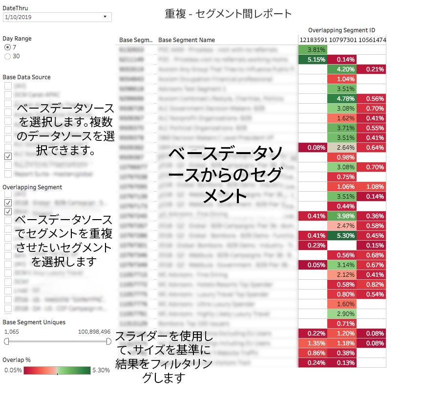

# セグメント間重複レポート {#segment-to-segment-overlap-report}

セグメント間で共有されるユニークユーザー数に関するデータを返します。

>[!NOTE]
>
>Audience Manager の重複レポートは、RBAC の原則に従います。自分が属している [RBAC ユーザーグループ](/help/using/features/administration/administration-overview.md) に基づき、自分がアクセスできるデータソースのセグメントのみを確認できます。

<!-- 

c_segment_segment_overlap.xml

 -->

## 概要

[!UICONTROL Segment-to-Segment Overlap] レポートは、次の場合に役立ちます。

* ニーズに応じて、重複の多いまたは少ないセグメントを特定する。重複の多い特性は、ターゲット設定されたオーディエンスを提供しますが、ユニーク訪問者は少なくなります。重複の少ない特性は、より多数のユニーク訪問者にリーチするうえで役に立つ可能性があります。
* 予期しない重複を検出し、その情報を使用してパフォーマンスの高いセグメントを新しく作成する。

## レポートのサンプル

次の図は、[!UICONTROL Segment-to-Segment Overlap]レポートの概要を示しています。

>[!NOTE]
>
>[!UICONTROL Segment-to-Segment Overlap]レポートは、同じセグメント同士を比較すると、空のフィールドを返します。

## 個々のデータポイントの詳細

個々の点を選択すると、データの詳細がポップアップウィンドウに表示されます。クリック操作で、レポートに表示されるデータが自動的に更新されます。

## セグメント間重複データポップフィールドの定義 {#fields-defined}

<!-- 

r_s2s_data_pop.xml

 -->

[!UICONTROL Segment-to-Segment Overlap]レポートのポップアップには、以下の指標が含まれています。この表のユニーク訪問者数指標は、*リアルタイムユーザー数*&#x200B;を表していることに注意してください。

| 指標 | 説明 |
|---|---|
| **[!UICONTROL Base Segment ID]** | レポート結果に表示されるセグメントの、一意の数値 ID。セグメントの行 ID として表示されます。 |
| **[!UICONTROL Base Segment Name]** | レポート結果行に表示されるセグメントの名前。 |
| **[!UICONTROL Overlapping Segment ID]** | レポートの実行時に選択したセグメントの、一意の数値 ID。セグメントの列 ID として表示されます。 |
| **[!UICONTROL Overlapping Segment Name]** | レポートの実行時に選択したセグメントの名前。レポート結果列に表示されます。 |
| **[!UICONTROL Base Segment Uniques]** | ベースセグメント のユニーク訪問者の数。 |
| **[!UICONTROL Base Segment Uniques]** | 重複しているセグメント のユニーク訪問者の数。 |
| **[!UICONTROL Overlapping Uniques]** | 比較対象のセグメント間で共有されているユニーク訪問者の数。 |
| **[!UICONTROL Overlap %]** | 重複率（％）を取得するために、Audience Manager は次の数式を使用します：重複しているユニーク訪問者数 別 / (ベースとなるセグメントのユニーク訪問者数 + 重複セグメントのユニーク訪問者数 - 重複しているユニーク訪問者数) |

>[!MORELIKETHIS]
>
>* [データスライダーを使用したレポート結果のフィルタリング](../../reporting/dynamic-reports/data-sliders.md)
>* [インタラクティブレポートで使用される図形、色、サイズ](../../reporting/dynamic-reports/interactive-report-technology.md#shapes-colors-sizes)
>* [レポートのアイコンとツールの説明](../../reporting/dynamic-reports/interactive-report-technology.md#icons-tools-explained)
>* [重複レポート：更新スケジュールと最小セグメントサイズ](../../reporting/dynamic-reports/overlap-minimum-segment-size.md)
>* [選択した Audience Manager レポートでのデータサンプリングとエラー率...](../../reporting/report-sampling.md)
>* [重複レポートの CSV ファイル](../../reporting/dynamic-reports/overlap-csv-files.md)