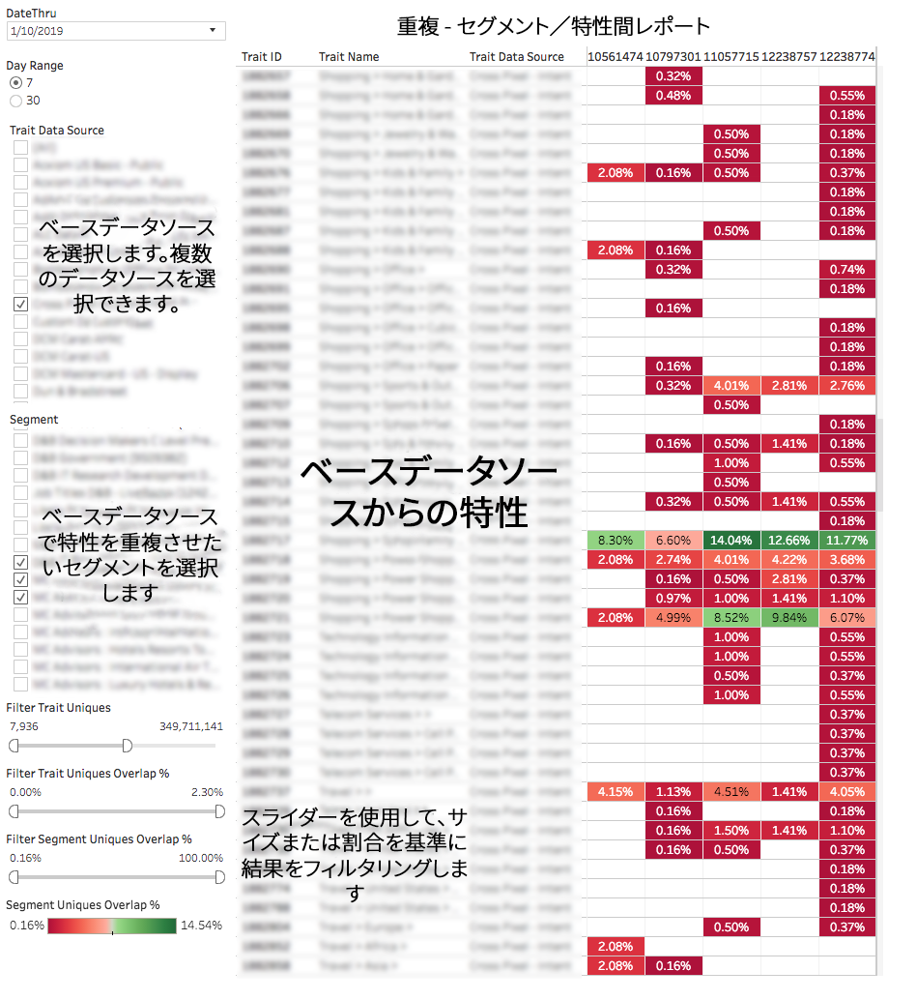
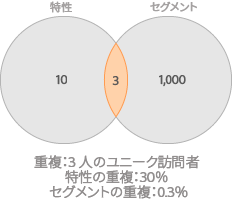

# セグメント／特性間重複レポート {#segment-to-trait-overlap-report}

特定の特性とセグメント全体とで共有されるユニークユーザーの数に関するデータを返します。

>[!NOTE]
>
>Audience Manager の重複レポートは、RBAC の原則に従います。自分が属している [RBAC ユーザーグループ](/help/using/features/administration/administration-overview.md) に基づき、自分がアクセスできるデータソースからのセグメントおよび特性のみを確認できます。

<!-- 

c_segment_trait_overlap.xml

 -->

## 概要

[!UICONTROL Segment to Trait Overlap]レポートは、最適化ツールとして、非常に焦点を絞ったセグメントを作成したり、セグメントリーチを拡大したりするのに役立ちます。例えば、重複の多い、焦点を絞ったセグメントと特性を作成して、特定のオーディエンスにリーチすることができます。ただし、重複が多い場合は、ユニークユーザーが減る（リーチが縮小する）可能性があります。セグメントとの重複が多い特性を削除して重複の少ない特性に置き換えることでリーチを拡大しようとする場合に、このレポートの実行が役に立ちます。

### レポートのサンプル

次の図は、[!UICONTROL Segment-to-Trait Overlap]レポートの概要を示しています。

### 個々のデータポイントの詳細

個々の点を選択すると、データの詳細がポップアップウィンドウに表示されます。クリック操作で、レポートに表示されるデータが自動的に更新されます。

## セグメントと特性の比較 {#comparing-segments-to-traits}

セグメントと特性を比較し、その結果から有意義な情報を引き出す方法について説明します。

<!-- 

c_compare_s2t.xml

 -->

### 特性とセグメントのユニーク訪問者数の比較：例

セグメントと特性を比較して、その結果から何かを結論付けようとするのは、一見意味がないことのように思われるでしょう。セグメントと特性はそもそも異なるものであり、異なるものから引き出されたデータにどのような意味があるのかと思うかもしれません。しかし、ここで比較するのは特性とセグメントではなく、それらが共有するユニーク訪問者の数なのです。共有するユニーク訪問者の数を使用することで共通の値が得られ、これを通してセグメントと特性の比較が可能になります。

次の図は、特性と、それが属するセグメントとの間の関係を示したものです。ここでは、10 人の訪問者を持つ特性と 1,000 人の訪問者を持つセグメントがあります。共有するユニーク訪問者は 3 人です。

ユニーク訪問者数は、これらの異なるオブジェクトのクラスで共有される、共通の定数値です。そのため、これらの間のユニーク訪問者の関係について、次のように判断できます。

* 特性はユニーク訪問者の 30％をセグメントと共有する（3/10 = 0.30）。
* セグメントはユニーク訪問者の 0.3％を特性と共有する（3/1,000 = 0.003）。

### セグメントと特性を比較することで得られる情報

特性とセグメントの間の重複を確認することで、有効な訪問者プールの総数を予測（推定）したり、重複が多すぎる非効率的なセグメントを検出したりできます。

<table id="table_5B211EF95216426299EB20253A5A9C1B"> 
 <thead> 
  <tr> 
   <th colname="col1" class="entry"> ユースケース </th> 
   <th colname="col2" class="entry"> 説明 </th> 
  </tr>
 </thead>
 <tbody> 
  <tr> 
   <td colname="col1"><b>予測</b> </td> 
   <td colname="col2"> 
有効な訪問者プールを判断するには、特性の合計（重複を差し引いた分）とセグメントの合計（重複を差し引いた分）の差分を合計します。 
 
このセグメントと特性の組み合わせでは、最大 1004 人の新しいユーザーにリーチできます。 
 </td> 
  </tr> 
  <tr> 
   <td colname="col1"><b>非効率的なセグメントの検出</b> </td> 
   <td colname="col2"> 
セグメント定義で AND グループに属する特性である場合、その特性を持つユニーク訪問者は既にセグメント内に存在しているので、それ以上セグメントに追加できません。このレポートを使用して、重複は少ないものの関連性の高い特性を検出し、セグメント定義に追加することで、そのセグメントのオーディエンスプールへのリーチを高めることができます。 
 </td> 
  </tr> 
 </tbody> 
</table>

## セグメント／特性間重複レポートのデータフィルターについて {#data-filters-s2t-report}

特性とセグメントの一意の重複割合スライダーがどのように機能するかについて説明します。

<!-- 

r_s2t_sliders.xml

 -->

[!UICONTROL Segment-to-Trait overlap]レポートでは、2 つのスライダーを使用して、特性またはセグメントごとの重複率を基準にデータをフィルタリングできます。

* **[!UICONTROL Filter Trait Uniques %:]**&#x200B;特性とセグメントの間で共有されているユニーク訪問者の割合を基準にデータをフィルタリングします。
* **[!UICONTROL Filter Segment Uniques Overlap %:]**&#x200B;セグメントと特性の間で共有されているユニーク訪問者の割合を基準にデータをフィルタリングします。

### 例

次の図は、特性ユニーク訪問者の割合とセグメントユニーク訪問者の割合の違いを示しています。この例では、特性とセグメントが 3 人のユニーク訪問者を共有しています。比率は次のようになります。

* 特性はユニーク訪問者の 30％をセグメントと共有する（3/10 = 0.30）。
* セグメントはユニーク訪問者の 0.3％を特性と共有する（3/1,000 = 0.003）。

## セグメント／特性間重複データポップフィールドの定義 {#fields-defined}

個別のデータポイントをクリックしたときにポップアップウィンドウに表示される指標について説明します。

<!-- 

r_s2t_data_pop.xml

 -->

[!UICONTROL Segment-to-Trait Overlap]レポートのポップアップには、以下の指標が含まれています。この表のユニーク訪問者数指標は、*リアルタイムユーザー数*&#x200B;を表していることに注意してください。

<table id="table_4AF72754276242FFB11543635B43AD90"> 
 <thead> 
  <tr> 
   <th colname="col1" class="entry"> 指標 </th> 
   <th colname="col2" class="entry"> 説明 </th> 
  </tr>
 </thead>
 <tbody> 
  <tr> 
   <td colname="col1"><b> Segment ID</b> </td> 
   <td colname="col2"> セグメントの一意な数値 ID。 </td> 
  </tr> 
  <tr> 
   <td colname="col1"><b> Trait Data Source </b> </td> 
   <td colname="col2"> 特性の所有者の名前。 </td> 
  </tr> 
  <tr> 
   <td colname="col1"><b> Data Source Type</b> </td> 
   <td colname="col2">特性が属するプロバイダーのタイプを定義します。次のいずれかになります。 
    <ul id="ul_0477C04A33FD4F5D998B98984E6554D3"> 
     <li id="li_50FCA48EDB5843AB8FB6C34ED2C0067D">First-party（自分の特性）。 </li> 
     <li id="li_4F6148EDAEFE43FA8D505944E9FE3855">Third-party（外部のデータパートナー／ベンダー）。 </li> 
    </ul> </td> 
  </tr> 
  <tr> 
   <td colname="col1"><b> Trait ID</b> </td> 
   <td colname="col2"> セグメントの一意の数値 ID。 </td> 
  </tr> 
  <tr> 
   <td colname="col1"><b> Trait Name</b> </td> 
   <td colname="col2"> 特性名。 </td> 
  </tr> 
  <tr> 
   <td colname="col1"><b> Trait Uniques Overlap %</b> </td> 
   <td colname="col2"> 特性がセグメントと共有しているユニーク訪問者の割合。 </td> 
  </tr> 
  <tr> 
   <td colname="col1"><b> Segment Uniques Overlap %</b> </td> 
   <td colname="col2"> セグメントが特性と共有しているユニーク訪問者の割合。 </td> 
  </tr> 
  <tr> 
   <td colname="col1"><b> Overlap Uniques</b> </td> 
   <td colname="col2"> セグメントと特性が共有しているユニーク訪問者の数。 </td> 
  </tr> 
  <tr> 
   <td colname="col1"><b> Segment Uniques</b> </td> 
   <td colname="col2"> セグメントのユニーク訪問者の数。 </td> 
  </tr> 
  <tr> 
   <td colname="col1"><b> Trait Uniques</b> </td> 
   <td colname="col2"> 特性のユニーク訪問者の数。 </td> 
  </tr> 
 </tbody> 
</table>

>[!MORELIKETHIS]
>
>* [データスライダーを使用したレポート結果のフィルタリング](../../reporting/dynamic-reports/data-sliders.md)
>* [インタラクティブレポートで使用される図形、色、サイズ](../../reporting/dynamic-reports/interactive-report-technology.md#shapes-colors-sizes)
>* [レポートのアイコンとツールの説明](../../reporting/dynamic-reports/interactive-report-technology.md#icons-tools-explained)
>* [重複レポート：更新スケジュールと最小セグメントサイズ](../../reporting/dynamic-reports/overlap-minimum-segment-size.md)
>* [選択した Audience Manager レポートでのデータサンプリングとエラー率...](../../reporting/report-sampling.md)
>* [重複レポートの CSV ファイル](../../reporting/dynamic-reports/overlap-csv-files.md)

