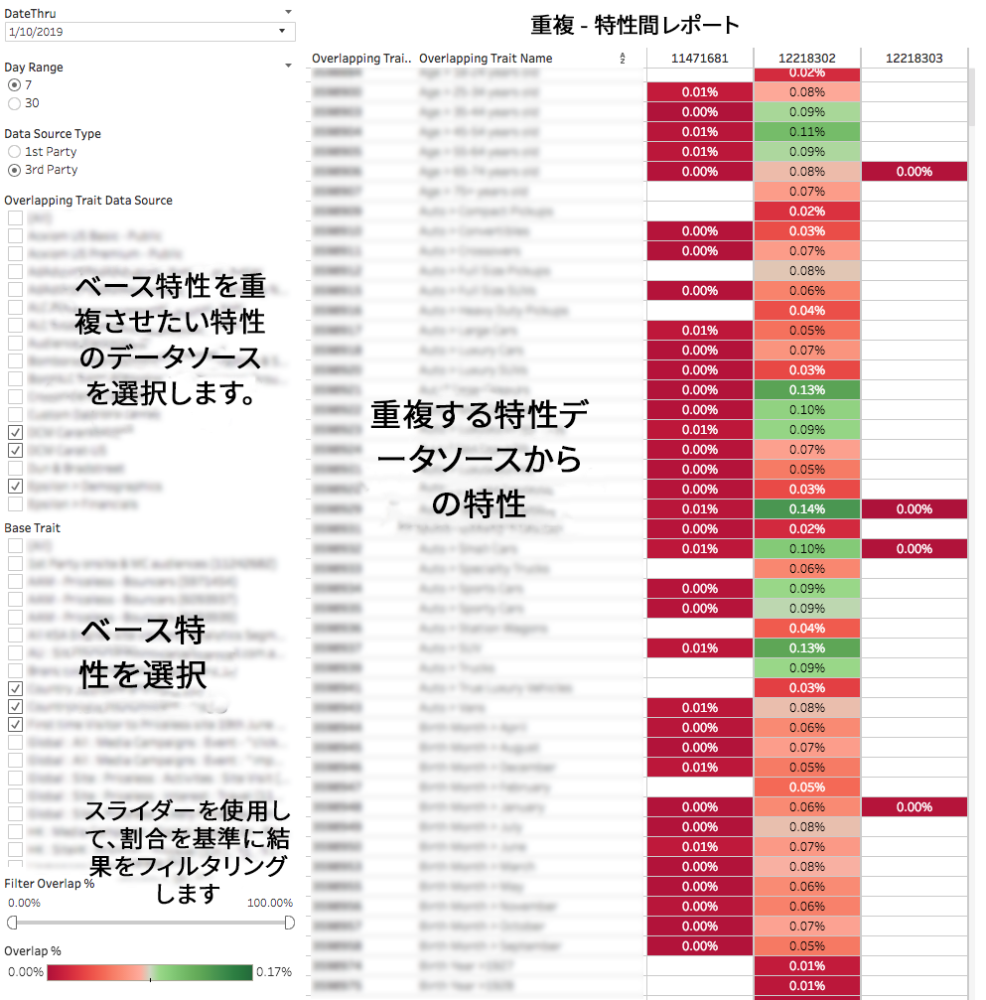

# 特性間重複レポート {#trait-to-trait-overlap-report}

すべてのファーストパーティおよびサードパーティ特性で共有されるユニークユーザーの数に関するデータを返します。

>[!NOTE]
>
>Audience Manager の重複レポートは、RBAC の原則に従います。自分が属している [RBAC ユーザーグループ](/help/using/features/administration/administration-overview.md) に基づき、自分がアクセスできるデータソースからの特性のみを確認できます。

<!-- 

c_overlap_reports.xml

 -->

## 概要

[!UICONTROL Trait-to-Trait Overlap]レポートは、すべての独自特性とサードパーティ特性の間で共有されるユニークユーザーの割合に関するデータを返します。最適化ツールとして、このレポートは以下に役立ちます。

* ニーズに応じて、重複の多いまたは少ないセグメントを作成する。重複の多い特性は、ターゲット設定されたオーディエンスを提供しますが、ユニーク訪問者は少なくなります。重複の少ない特性は、より多数のユニーク訪問者にリーチするうえで役に立つ可能性があります。
* サードパーティ特性データを検証する。類似するファーストパーティ特性とサードパーティ特性の間の重複が非常に多い場合は、データパートナーからの特性が正確で信頼できるものであることを示します。反対に、重複が少ない場合は、サードパーティ特性が、類似するファーストパーティ特性と同じ情報を実際には含んでいない可能性があることを示唆します。
* 特性間の予期しない重複を検出し、その情報を使用して革新的なセグメントを作成する。

## レポートのサンプル

次の図は、[!UICONTROL Trait-to-Trait Overlap]レポートの要素の概要を示しています。

>[!NOTE]
>
>[!UICONTROL Trait-to-Trait Overlap]レポートは、同じ特性同士を比較すると、空のフィールドを返します。

## 個々のデータポイントの詳細

個々の点を選択すると、データの詳細がポップアップウィンドウに表示されます。クリック操作で、レポートに表示されるデータが自動的に更新されます。

## 特性間重複データポップフィールドの定義 {#field-definitions}

個別のデータポイントをクリックしたときにポップアップウィンドウに表示される指標について説明します。

<!-- 

r_t2t_data_pop.xml

 -->

[!UICONTROL Trait-to-Trait Overlap]レポートのポップアップには、以下の指標が含まれています。この表のユニーク訪問者数指標は、*リアルタイムユーザー数*&#x200B;を表していることに注意してください。

<table id="table_A2A0CFC47C1A404994B82E6630E711A2"> 
 <thead> 
  <tr> 
   <th colname="col1" class="entry"> 指標 </th> 
   <th colname="col2" class="entry"> 説明 </th> 
  </tr>
 </thead>
 <tbody> 
  <tr> 
   <td colname="col1"><b> Overlap %</b> </td> 
   <td colname="col2"> 比較対象の特性間での個別重複率（「Overlap Uniques」/「Trait Uniques」）を表します。 </td> 
  </tr> 
  <tr> 
   <td colname="col1"><b> Data Source Type</b> </td> 
   <td colname="col2">特性が属するデータソースのタイプを定義します。次のいずれかになります。 
    <ul id="ul_0477C04A33FD4F5D998B98984E6554D3"> 
     <li id="li_50FCA48EDB5843AB8FB6C34ED2C0067D">First-party（自分の特性）。 </li> 
     <li id="li_4F6148EDAEFE43FA8D505944E9FE3855">Third-party（外部のデータパートナー／ベンダー）。 </li> 
    </ul> </td> 
  </tr> 
  <tr> 
   <td colname="col1"><b> Overlapping Trait ID</b> </td> 
   <td colname="col2"> 重複する特性の一意の数値 ID。 </td> 
  </tr> 
  <tr> 
   <td colname="col1"><b> Overlapping Trait Name</b> </td> 
   <td colname="col2"> 重複する特性の名前。 </td> 
  </tr>
    <tr> 
   <td colname="col1"><b> Trait ID 2</b> </td> 
   <td colname="col2"> ベースデータソース内の特性の一意の数値 ID。 </td> 
  </tr> 
  <tr> 
   <td colname="col1"><b> Trait Name 2</b> </td> 
   <td colname="col2"> ベースデータソース内の特性の名前。 </td> 
  </tr> 
  <tr> 
   <td colname="col1"><b> Overlap Uniques</b> </td> 
   <td colname="col2"> 
重複率を取得するために、Audience Manager は次の数式を使用します。
 
Overlapping Uniques / (Base trait Uniques + Overlapping trait Uniques – Overlapping Uniques)
 </td> 
  </tr> 
  <tr> 
   <td colname="col1"><b> Overlapping Trait Uniques</b> </td> 
   <td colname="col2"> 重複している特性のユニーク訪問者の数。 </td> 
  </tr> 
    <tr> 
   <td colname="col1"><b> Base Trait Uniques</b> </td> 
   <td colname="col2"> ベース特性のユニーク訪問者の数。 </td> 
  </tr> 
 </tbody> 
</table>

>[!MORELIKETHIS]
>
>* [データスライダーを使用したレポート結果のフィルタリング](../../reporting/dynamic-reports/data-sliders.md)
>* [動的レポートで使用される図形、色、サイズ](../../reporting/dynamic-reports/interactive-report-technology.md#shapes-colors-sizes)
>* [レポートのアイコンとツールの説明](../../reporting/dynamic-reports/interactive-report-technology.md#icons-tools-explained)
>* [重複レポート：更新スケジュールと最小セグメントサイズ](../../reporting/dynamic-reports/overlap-minimum-segment-size.md)
>* [選択した Audience Manager レポートでのデータサンプリングとエラー率...](../../reporting/report-sampling.md)
>* [重複レポートの CSV ファイル](../../reporting/dynamic-reports/overlap-csv-files.md)

