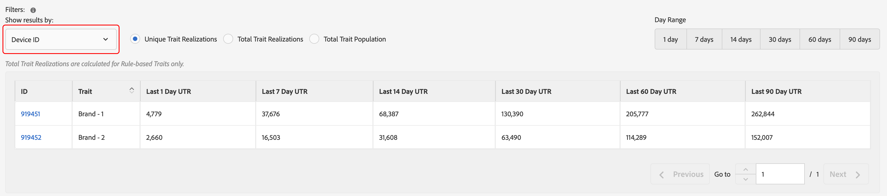
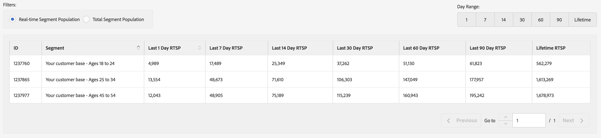

# 一般レポート {#general-reports}

[!UICONTROL General]は、特性、セグメントおよび宛先に関するパフォーマンスデータを返します。

## 概要 {#general-reports-overview}

<!-- 

c_general_reports.xml

 -->

[!DNL Audience Manager] は[!UICONTROL Role Based Access Control]（[!UICONTROL RBAC]）を使用して、[!UICONTROL General]レポートへのユーザーグループ権限を拡張します。ユーザーは、レポートに記載されている特性やセグメントのうち、閲覧する権限のあるものだけを表示できます。[!UICONTROL RBAC] 機能により、社内チームが閲覧できるレポートデータを制御することができます。例えば、様々な広告主アカウントを管理する代理店では、広告主 A のアカウントを管理するチームが広告主 B のレポートデータを閲覧できないように、ユーザーグループの権限を設定することができます。

以下が必要な場合、[!UICONTROL General]レポートを実行します。

* 特性、セグメントまたは出力先でパフォーマンスを確認する。
* 1、7、14、30、60、90 日間隔でインプレッション数（合計および個別）を追跡する。
* 合計および一意の読み込み数を確認する。
* 特性とセグメントのパフォーマンスを比較する。
* 強いまたは弱いパフォーマンス特性およびセグメントを特定したり、需要を分析したり、サードパーティレポートでデータの読み込み／実行を比較したりする。
* データを（.csv 形式で）書き出してさらに分析したり共有したりする。

次の図は、[!UICONTROL General]レポートの主な要素の概要を示しています。

1. 次のオプションを設定します。

   * **Report Type：**&#x200B;目的のレポートタイプ（Trait、Segment、Destination のいずれか）を選択します。

   * **For Dates Through：**&#x200B;レポートの日付範囲を指定します。

2. 名前または ID で、特性、セグメントまたは宛先を検索します。
3. フォルダーのリストで、レポートの対象となる特性、セグメントまたは宛先をドラッグし、右側の「[!UICONTROL Selections]」パネルにドロップします。
4. 書き出し可能な表の形式で表示するレポートを生成します。

## 一般レポートの実行 {#run-general-report}

この節では、[!UICONTROL General]の実行方法と、時間および他のパフォーマンスオプションの設定方法を説明します。

<!-- 

t_run_general_report.xml

 -->

1. **[!UICONTROL Analytics]** ダッシュボードで、「**[!UICONTROL General Reports]**」をクリックします。
1. 「**[!UICONTROL Report Type]**」ドロップダウンリストで、目的のタイプ（特性、セグメント、宛先）を選択します。
1. *（オプション）*&#x200B;当日以外の日付を終了日として指定する場合、日付ボックスをクリックしてカレンダーを表示し、終了日を選択します。
1. 名前または ID で、特性、セグメントまたは宛先を検索します。
1. フォルダーのリストで、レポートの対象となる特性、セグメントまたは宛先をドラッグし、右側の「[!UICONTROL Selections]」パネルにドロップします。
1. 「**[!UICONTROL Run Report]**」をクリックします。

   結果が書き出し可能な表形式で表示されます。列ヘッダーをクリックすると、結果が昇順または降順で並べ替えられます。
1. レポートの上部にある目的のオプションボタンを選択して、データをパフォーマンス（[!UICONTROL Unique Trait Realizations]、[!UICONTROL Total Trait Realizations]、または [!UICONTROL Total Trait Population]）または時間（1 日、7 日、14 日、30 日、60 日、90 日の範囲）を基準にフィルタリングできます。

   >[!NOTE]
   >
   >[!UICONTROL Total Trait Realizations]は[!UICONTROL Rule-based Traits]に対してのみ計算されます。

1. *（オプション）*「**[!UICONTROL Export to CSV]**」をクリックします。これにより、1 日中の範囲の [!UICONTROL Unique Trait Realizations]、[!UICONTROL Total Trait Realizations]、および [!UICONTROL Total Trait Population] が書き出されます。

## 一般レポートの結果の説明 {#general-reports-explained}

[!UICONTROL General Reports]の数字は、[!UICONTROL User Profile Store]から直接生成されます。結果には、これらのレポートの数値が生成されたときに [!DNL Audience Manager] のバックエンドに含まれていたユーザー数が反映されています。

* これらの数値には、過度のトラフィックの訪問者 ID は含まれません。ボットからのトラフィックは、アドビのバックエイドシステムに到達する前にフィルタリングされます。また、一部のボットトラフィックは、バックエンドで毎週実行されるクリーンアップジョブの間に破棄されます。
* [!DNL Audience Manager] UUID で識別されるデータを受信処理を介してオンボーディングする場合、アドビのシステムでアクティブでなくなったユーザーがこれらの ID に含まれていれば、これらの非アクティブな [!DNL Audience Manager] UUID は、[!UICONTROL User Profile Store]に到達せず、報告もされません。
* [!UICONTROL Total Trait Realizations]は[!UICONTROL Rule-based Traits]に対してのみ計算されます。

## 特性に関する一般レポートの結果 {#general-report-results-traits}

一般レポートを実行し、レポートタイプに **[!UICONTROL Trait]** を選択する場合は、次のフィルターを使用できます。

結果を [!UICONTROL Device ID] でフィルタリングする場合：

* [!UICONTROL Unique Trait Realizations] は、選択した期間において、特性を自分のプロファイルに追加した匿名デバイス訪問者の数を表します。
* [!UICONTROL Total Trait Realization] は、選択した期間内の匿名の特性適合数の合計です。
* [!UICONTROL Total Trait Population] は、プロファイルにこの特性がある匿名デバイス訪問者の数を表します。

結果を [!UICONTROL Cross-Device ID] でフィルタリングする場合：

* [!UICONTROL Unique Trait Realizations] は、選択した期間において、特性を自分のプロファイルに追加した認証済み訪問者の数を表します。
* [!UICONTROL Total Trait Realization] は、選択した期間内の認証済みの特性適合数の合計です。
* [!UICONTROL Total Trait Population] は、プロファイルにこの特性がある認証済み訪問者の数を表します。

<!-- 
### Unique Trait Realizations

This metric represents the unique number of [Audience Manager Unique User IDs (UUID)](../reference/ids-in-aam.md) that qualified for the trait in your selected time range. For example, if a user visited your homepage three times on 10/1, you would see one Unique Trait Realization.

### Total Trait Realizations

This metric represents the total amount of trait fires for the trait in your selected time range. For example, if a user visited your homepage, then navigated to your tech news and your sports news sections, they would appear in the General Report as three total trait realizations, and one unique trait realization.

### Total Trait Population

This metric represents the total amount of Audience Manager UUIDs that are currently qualified for the trait. Use this number to understand the total amount of users you could use for segmentation and targeting. Typically, users remain part of a trait for [120 days](../features/traits/create-onboarded-rule-based-traits.md#set-expiration-interval). For example, a user visiting your homepage three times today and never returning afterwards, would remain as a user in this population every day until 120 days from now. At the 120 day mark, they would be removed from the population. Read our [Trait and Segment Qualification Reference](../features/traits/trait-and-segment-qualification-reference.md) for more examples on the difference between Unique Trait Realizations and Total Trait Population.

The illustration below shows the results of running a general report for the Trait report type. -->
<!-- 
 -->

## セグメントに関する一般レポートの結果 {#general-report-results-segments}

一般レポートを実行し、レポートタイプに **[!UICONTROL Segment]** を選択する場合は、次の指標が使用可能です。

### Real-time Segment Population

この指標は、指定した時間範囲内にリアルタイムで認識され、また Audience Manager で認識された時点でセグメントの対象として認定されたユニーク訪問者の実際の数を表します。

### Total Segment Population

この指標は、選択したルックバック期間内にセグメントの対象として認定された Audience Manager UUID の合計数を表します。1 日の「Total Segment Population」は、ターゲティングのための最も正確なユーザーベースを表します。

>[!NOTE]
>
>アクティブ化された宛先のセグメント母集団の内訳を表示するには、「**[!UICONTROL Include Destination Mappings]**」を選択します。

次の図は、Segment レポートタイプの一般レポートを実行した結果を示しています。

## 宛先に関する一般レポートの結果 {#general-report-results-destinations}

一般レポートを実行し、レポートタイプに **[!UICONTROL Destination]** を選択する場合は、次の指標が使用可能です。

**Real-time Segment Population**

この指標は、指定した時間範囲内にリアルタイムで認識され、また Audience Manager で認識された時点でセグメントの対象として認定されたユニーク訪問者の実際の数を表します。

**Total Segment Population**

この指標は、ルックバック期間内にセグメントに属していて、宛先に送信された Audience Manager UUID の合計数を表します。

次の図は、Destination レポートタイプの一般レポートを実行した結果を示しています。

