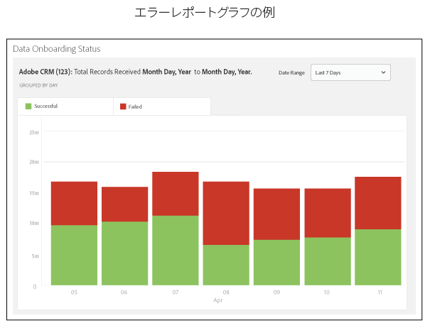
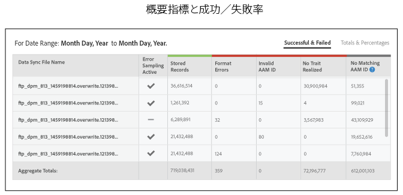
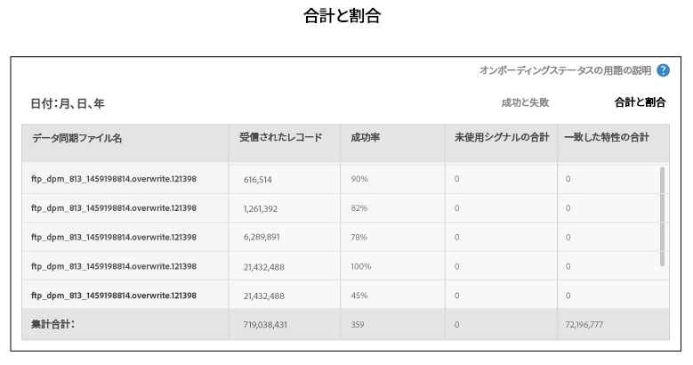
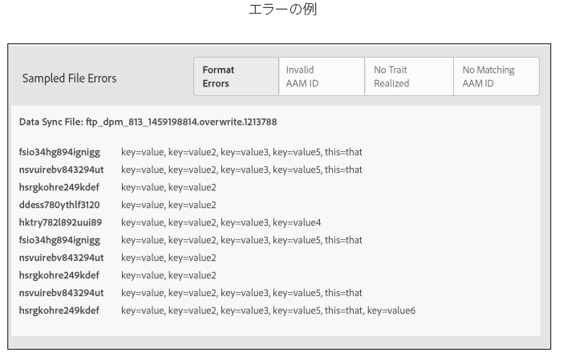
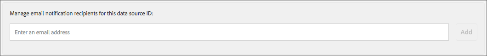

# オンボーディングステータスレポート {#onboarding-status-report-about}

オンボーディングステータスレポートは、受信データソースファイルに格納されているレコードの処理の成功率と失敗率を表示します。このレポートでは、データがインタラクティブな棒グラフで表示され、概要指標が表形式で表示されます。さらに、特定期間のファイルをサンプリングし、エラータイプごとに最も一般的なエラーを表示することも可能です。このレポートは、Analytics／Onboarding Status Report からアクセスできます。また、受信データソースの作成時にも、このレポートが使用可能です。

>[!NOTE]
>
>Audience Manager ユーザーインターフェイスでこのレポートを表示できるのは、管理者権限を持つユーザーのみです。管理者以外のユーザーの電子メールをレポートに追加すれば、アップロードした受信ファイルのステータスを受信者以外のユーザーに通知することができます。[電子メール通知の受信](/help/using/reporting/onboarding-status-report.md#receive-email-notifications)を参照してください。

## オンボーディングステータスレポート：概要 {#onboarding-status-about}

[!UICONTROL Onboarding Status Report]は、受信データソースファイルに格納されているレコードの処理の成功率と失敗率を表示します。このレポートでは、データがインタラクティブな棒グラフで表示され、概要指標が表形式で表示されます。さらに、特定期間のファイルをサンプリングし、エラータイプごとに最も一般的なエラーを表示することも可能です。このレポートは、**[!UICONTROL Analytics > Onboarding Status Report]**&#x200B;で確認できます。また、受信データソースの作成時にも、このレポートが使用可能です。

## エラーレポートとエラーサンプリング {#error-reporting-sampling}

エラーレポートとエラーサンプリングは、[!UICONTROL Onboarding Status]レポートにある 2 つの独立した機能です。

<table id="table_4706D891D4C545E8BF9D8A0CC052CC48"> 
 <thead> 
  <tr> 
   <th colname="col1" class="entry"> 機能 </th> 
   <th colname="col2" class="entry"> 説明 </th> 
  </tr> 
 </thead>
 <tbody> 
  <tr> 
   <td colname="col1"> 
 <b>エラーレポート</b> 
 </td>
   <td colname="col2"> 
エラーレポートには、受信データソースで処理されたレコード数に対する成功率と失敗率が表示されます。このレポートでは、データがインタラクティブな積み重ね棒グラフとして返され、さらにグラフの下に概要指標の表が記載されます。 
 
エラーレポートは自動的に作成されます。このレポートはすべての受信データソースに対して継続的に実行されます。返されるデータは、あらかじめ設定された時間間隔の範囲、またはカレンダーウィジェットから設定されたカスタム時間間隔に基づいています。 
 </td> 
  </tr> 
  <tr> 
   <td colname="col1"> 
 <b>エラーサンプリング</b> 
 </td>
   <td colname="col2"> 
エラーサンプリングでは、データファイルのコンテンツが解析され、エラータイプごとに最も多いエラーの上位 10 件が返されます。受信データファイルでエラーが発生すると、個別のレコードが処理されなくなります。このレポートをトラブルシューティングツールとして活用すると、ファイルエラーを減らし、処理率を向上させることができます。 
 
エラーサンプリングは手動でアクティブ化する必要があります。この機能はアクティブ化から 14 日間実行され、自動的に終了します。エラーサンプリングは、14 日間の有効期間が終了した後で、再度アクティブ化することができます。エラーサンプリングは、<a href="../features/manage-datasources.md#create-data-source">受信データソースの作成</a>時にアクティブ化するか、既存の受信データソースの「<b>Data Source Settings</b>」セクションで「Error Sampling」チェックボックスをオンにします。 
 
エラーサンプリングは計算負荷の高い処理です。そのため、エラーカテゴリごとに最初の 10 件のエラーのみが返されます。受信データソースに含まれるすべてのエラーが返されるようには設計されていません。これらのエラーは、同様のエラーの大きなグループの代表例です。ファイル全体を確認して、このレポートでフラグが設定されているエラーの種類を調べ、ファイルの形式を変更してから、もう一度送信します。 
 
詳しくは、<a href="../integration/sending-audience-data/batch-data-transfer-explained/inbound-file-contents.md">受信データファイルのコンテンツ：構文、変数、例</a>を参照し、受信データソースのデータファイルの形式を適切に設定する方法について確認してください。 
 </td> 
  </tr> 
 </tbody> 
</table>

## エラーレポートの棒グラフ {#error-report-bar-chart}

エラーレポートには、レコード処理の成功率と失敗率が、次の例のように積み重ね棒グラフで表示されます。このグラフはインタラクティブです。バーをクリックすると、グラフの下に当日の概要指標が表形式で表示されます。

## エラーレポートの表 {#error-report-tables}

エラーレポートでは、棒グラフの下に表形式のデータが表示されます。この表は、成功率と失敗率に加えて、合計と割合が表示されます。

**Successful and Failed Records**

このデフォルトのビューでは、レポート内でのすべてのレコードの発生回数と、エラータイプ別のエラーの内訳が表示されます。

**Totals &amp; Percentages**

「**[!UICONTROL Totals & Percentages]**」をクリックすると、処理が成功したファイルの割合がパーセント単位で表示されます。

## 14 日間のエラーサンプリングレポート {#error-reporting-14-days}

エラーサンプリングをアクティブにすると、レポートにはエラータイプごとに上位 10 件のエラーが表示されます。レポートの上部にあるエラータイプボタンをクリックすると、サンプリングされたデータのそれぞれの組が表示されます。

>[!NOTE]
>
>現在のリリースでは、レポートでレコードエラーはハイライト表示されません。ファイルのエラーを検出および修正するには、結果を確認して、[受信データファイルのコンテンツ](../integration/sending-audience-data/batch-data-transfer-explained/inbound-file-contents.md)ドキュメントに記載されている仕様と比較します。

## 電子メール通知の受信 {#receive-email-notifications}

アップロードされたインバウンドファイルのステータスの通知先となる受信者の電子メールアドレスを追加することができます。データソースごとに異なる受信者を選択できます。

## オンボーディングステータスレポートの作成 {#create-onboard-status-report}

[!UICONTROL Sample Error Report]は、データソースのレコードのうち、正常に処理されたものと失敗したものの数を返します。次の手順に従って、[!UICONTROL Sample Error Report]を生成します。

<!-- 

create-onboarding-status-report.xml

 -->

1. **[!UICONTROL Analytics > Onboarding Status Report]** へ移動します。データソースを検索するか、リストから選択します。

2. 日付範囲を選択します。オプションは次のとおりです。

   * 一連の固定レポート期間
   * カスタムの日付範囲を作成できるカレンダーウィジェット

3. 「**[!UICONTROL OK]**」をクリックします。

## オンボーディングステータスレポートの用語と定義 {#report-terms-conditions}

このレポートで使用するラベルと用語のリファレンスガイド。

<table id="table_1D44A2E6B4C847848B818190DD336841"> 
 <thead> 
  <tr> 
   <th colname="col1" class="entry"> 用語 </th> 
   <th colname="col2" class="entry"> 定義 </th> 
  </tr> 
 </thead>
 <tbody> 
  <tr> 
   <td colname="col1"> 
 <b>Data Sync File Name</b> 
 </td> 
   <td colname="col2"> 
選択した受信データソースから Audience Manager が受け取って処理したファイルのリストが表示されます。 
 
ファイル名の形式が適切でない場合、ファイルの処理は失敗します。ファイル名の要件は、このデータを Audience Manager に送信する方式によって異なります。配信方法には Amazon S3 と FTP があります。ファイルに名前を設定する方法については、以下を参照してください。 
 
 
     <ul id="ul_9A32906A14CA41C5AED0E13930DB31BA"> 
      <li id="li_A5A0E6ED711D4002B52092619F87C7D6"> <a href="../integration/sending-audience-data/batch-data-transfer-explained/inbound-s3-filenames.md"> 受信データファイルの Amazon S3 の名前に関する要件 </a> </li> 
     </ul> 
 </td> 
  </tr> 
  <tr> 
   <td colname="col1"> 
 <b>Format Errors</b> 
 </td> 
   <td colname="col2"> 
構文や書式設定の要件を満たさなかったために処理が失敗したレコードの数のリストが表示されます。詳しくは、<a href="../integration/sending-audience-data/batch-data-transfer-explained/inbound-file-contents.md">受信データファイルのコンテンツ：構文、変数、例</a>をでデータのフォーマット方法を参照してください。 
 </td> 
  </tr> 
  <tr> 
   <td colname="col1"> 
 <b>Invalid AAM ID</b> 
 </td> 
   <td colname="col2"> 
形式が適切でない Audience Manager ユーザー ID（UUID）のリストが表示されます。通常、以下に該当する ID を示しています。 
 
    <ul id="ul_8304250E8F0F44918A50CF9D8D8D1F83"> 
     <li id="li_B100B4C2623B4E099E022869A4978357">想定される 38 桁の形式を満たさない。 </li> 
     <li id="li_44E8A9AD13174A20A5742E56ED786634">英字が含まれている。ID は数値のみである必要があります。 </li> 
    </ul> </td> 
  </tr>

<tr> 
   <td colname="col1"> 
 <b>無効なデバイス ID</b> 
 </td> 
   <td colname="col2"> 
形式が適切でないグローバルデバイス ID の数が表示されます。デバイスタイプに基づいた、デバイス ID の適切な形式と使用すべきグローバルデータソースについて詳しくは、<a href="../reference/ids-in-aam.md">Audience Manager で使用される ID の一覧</a>および<a href="../features/global-data-sources.md">グローバルデータソース</a>を参照してください。

  
レポートのエラーサンプリングセクションには、無効なデバイス ID に関する詳細情報（以下など）が含まれています。

   <ul>
    <li>無効なデバイス ID に対応するデータソース ID。</li>
    <li>無効なデバイス ID。</li>
    <li>データソースに基づいた、想定されるデバイス ID のタイプ。</li>
   </ul>
  </tr>

<tr> 
   <td colname="col1"> 
 <b>No Matching AAM ID</b> 
 </td> 
   <td colname="col2"> 
転送された ID のうち、Audience Manager で既存の ID と一致しないものを示します。Audience Manager がまだ ID 同期を実行していない場合、または同期後でも ID が一致しない場合、転送された ID にこのステータスが設定されることがあります。 
 
モバイル ID が一致しない場合、Audience Manager では以下の処理がおこなわれます。 
 
    <ul id="ul_B0D6AF9EB27D4017B35E36824B403879"> 
     <li id="li_D141000A50D3463182CBA4571DCC5373">この ID は引き続き保存され、この ID の同期が試行されます。 </li> 
     <li id="li_2EFCEE716F254ABCBC5FBF749B7564E6">ID を同期できない場合、レポートに「Stored Record」として記録されます。 </li> 
    </ul> 
転送されたファイルにモバイル ID が含まれる場合、この数値は他の指標より重要度がやや低くなることがあります。以降のファイルの成功率と一致率には影響しません。 
 </td> 
  </tr> 
  <tr> 
   <td colname="col1"> 
 <b>No Trait Realized</b> 
 </td> 
   <td colname="col2"> 
Audience Manager で、転送された特性と一致しない特性のリストが表示されます。原因として次のようなものが挙げられます。 
 
    <ul id="ul_43619035AB6641B6949302FB50BDB5B1"> 
     <li id="li_D4C6306BF2B143198108702B309CE8CF">受信データファイルで特性の形式が適切でない。データファイルの書式設定の方法については、<a href="../integration/sending-audience-data/batch-data-transfer-explained/inbound-file-contents.md">受信データファイルのコンテンツ：構文、変数、例</a>を参照してください。 </li> 
     <li id="li_A1C708A007D24EE09B7C629AFC6E43C3">Audience Manager で特性が定義されていない。 </li> 
    </ul> </td> 
  </tr> 
  <tr> 
   <td colname="col1"> 
 <b>Percent Success</b> 
 </td> 
   <td colname="col2"> 
ファイル内のレコードのうち、保存に成功したレコードの割合。「Percent success」= 処理されたレコード数 / ファイル内のレコード数となります。 
 </td> 
  </tr> 
  <tr> 
   <td colname="col1"> 
 <b>Records Received</b> 
 </td> 
   <td colname="col2"> 
受信したレコードの総数。ほとんどの場合、この数は受信データファイルのレコード（行）の総数と一致します。 
 </td> 
  </tr> 
  <tr> 
   <td colname="col1"> 
 <b>Stored Records</b> 
 </td> 
   <td colname="col2"> 
保存に成功したレコードの数。ファイル形式のエラーにより、受信したレコードの一部が Audience Manager で正常に保存されない場合があります。保存されたレコードの数は、受信したレコードの数より少ないことがあります。 
 </td> 
  </tr> 
  <tr> 
   <td colname="col1"> 
 <b>Total Realized Traits</b> 
 </td> 
   <td colname="col2"> 
Audience Manager プラットフォームに保存されるすべての受信ファイルのすべてのユーザーの特性数。 
 </td> 
  </tr> 
  <tr> 
   <td colname="col1"> 
 <b>Total Unused Signals</b> 
 </td> 
   <td colname="col2"> 
レポート内での受信した未使用シグナルの合計数。この合計は、保存に成功したレコードの合計数に基づいています。 
 
詳しくは、<a href="../reporting/dynamic-reports/unused-signals.md">未使用シグナルレポート</a>を参照してください。 
 </td> 
  </tr> 
 </tbody> 
</table>
