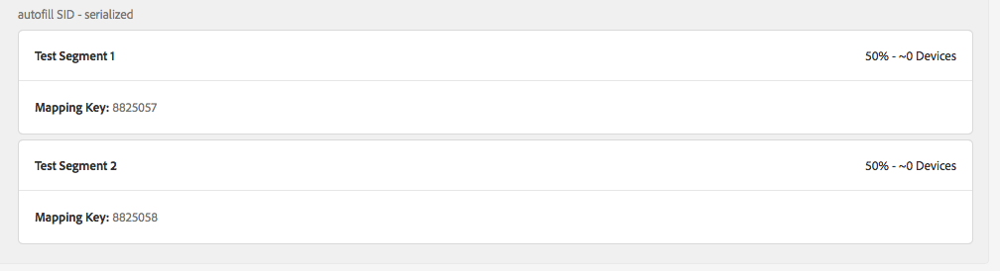

# Audience Lab でマッピングしたセグメントを出力先の詳細ページで確認する必要はありますか？ {#audience-lab-segments-destination-page}

## 質問

一部のテストセグメントを [!UICONTROL Audience Lab] で作成し、出力先にマッピングしています。ただし、出力先の詳細ページで探しても、見つかりません。

この動作は期待されるものですか、それともバグですか？

## 回答

マッピングしたセグメントで、[!UICONTROL Audience Lab] 内で作成されたものは、出力先の詳細ページには表示されません。

例えば、次のスクリーンショットでは、[!UICONTROL Test Segment 1] および [!UICONTROL Test Segment 2] は [!UICONTROL autofill SID - serialized] 出力先にマッピングされます。

セグメントは Audience Lab セグメントテストに表示されます。

ただし、セグメントは、出力先の詳細ページに表示されません。

