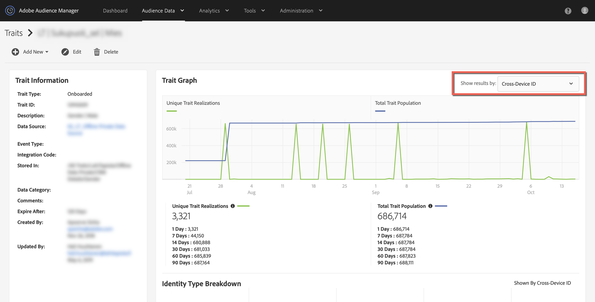

# 10 月 15 日頃にオンボーディングされた特性の母集団が 0 に減ったのはなぜですか？ {#why-did-my-onboarded-trait-populations-drop-to-0-around-october}

## 質問

2019 年 10 月 14 日（PT）頃、デバイス ID グラフのオンボーディングされた特性の母集団が 0 に減っているのに気づきました。これは、以前はもっと多かったものです。なぜこのようなことが起こったのでしょうか？

## 回答

10 月 15 日に、Audience Manager のプロファイル結合ルール機能に対するアップデートが変更され、クロスデバイスデータソースにアップロードされた CRM ID をキーにしたオンボーディングされたデータが、デバイス ID と対照して認識されなくなりました。以前は、Audience Manager は、両方のクロスデバイス ID（または CRM ID）と対照して認識し、関連する Audience Manager UUID（デバイス ID）に対してこれらの認識をコピーしていました。この変更は、特性データの特性と認識されたプロファイルをより正確に反映するためにおこなわれました。

特性認識を表示するには、特性表示の右上隅にあるドロップダウンから「クロスデバイス ID」オプションを選択してください。

